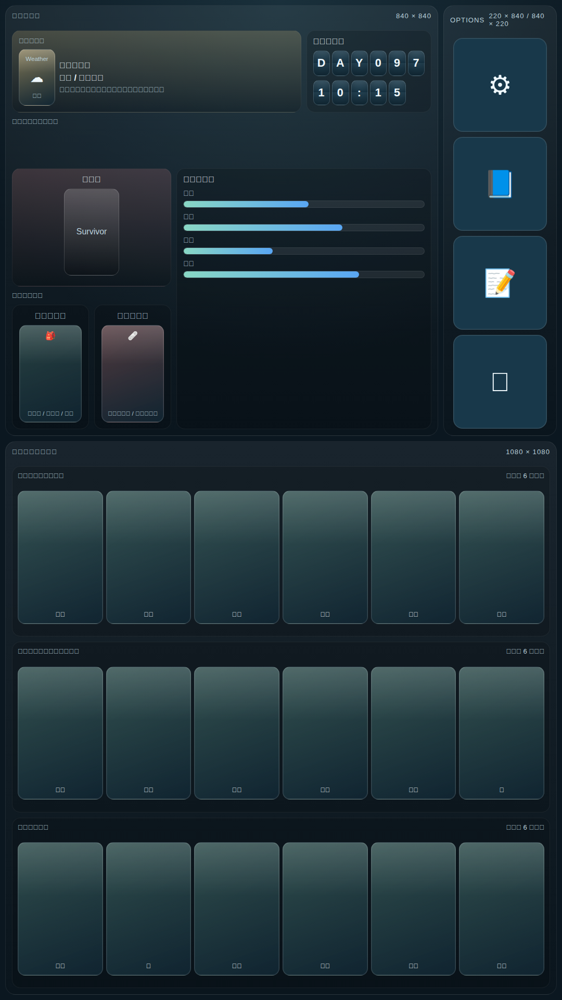
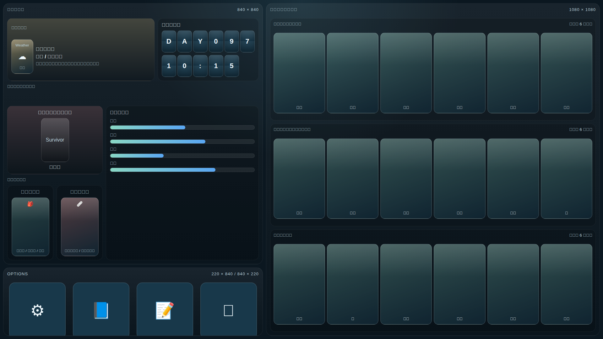

# 画面レイアウト検討

UnmappedIsland のゲーム画面レイアウトを検討するためのモックです。
縦型・横型を 1 つに統合したレスポンシブなスタンドアロン HTML モックです。画面の向きに応じてレイアウトが切り替わります。

## レイアウト概要

| 向き | 解像度 | フィールドエリア | 情報エリア | オプションエリア |
|------|--------|----------------|-----------|----------------|
| 縦型 | 1080 × 1920 | 1080 × 1080（上部全幅） | 840 × 840（左下） | 220 × 840（右下） |
| 横型 | 1920 × 1080 | 1080 × 1080（左全高） | 840 × 840（右上） | 840 × 220（右下） |

## エリア名称定義

画面を構成する各領域の名称と論理的な役割を以下に定義します。

### フィールドエリア (Field Area)

カードを配置する主要な描画領域です。カードゲームでカードを並べる場を「フィールド」と呼ぶことに倣い、この名称を採用しています。

フィールドエリアは縦方向に 3 つのレーンで構成されます。

#### ロケーションレーン (Location Lane) ― 上段

現在いる場所（ロケーション）に存在するものを表すカードを表示するレーンです。
建物・設備・植物などの自然物・隣接ロケーションへの道など、その場所の環境・構造を示すカードが並びます。

#### フィールドアイテムレーン (Field Item Lane) ― 中段

現在のロケーションに置かれているアイテムのカードを表示するレーンです。
プレイヤーが拾ったり使ったりできる、フィールド上のアイテムが対象です。

#### ハンドレーン (Hand Lane) ― 下段

プレイヤーキャラクターが現在手に持っている（所持している）アイテムのカードを表示するレーンです。
カードゲームで手札を「ハンド」と呼ぶことに倣い、この名称を採用しています。

---

### ダッシュボードエリア (Dashboard Area)

フィールドエリア以外の全領域をまとめて指す名称です。
ゲーム情報と操作ボタンを集約します。
**情報エリア**と**オプションエリア**で構成されます。

#### 情報エリア (Info Area)

天候・日時・キャラクター状態をまとめて表示するエリアです。
**天候エリア**・**日時エリア**・**キャラクターエリア**の 3 つのサブエリアで構成されます。

##### 天候エリア (Weather Area)

現在の天候をカード形式で表示するエリアです。
天候カードに気温・視界・乾燥度などの環境情報が示されます。

##### 日時エリア (DateTime Area)

ゲーム内の日付と時刻をカード形式で表示するエリアです。

##### キャラクターエリア (Character Area)

プレイヤーキャラクターの情報を集約するエリアです。
キャラクターカード・装備スロット・ステータスバーが含まれます。

###### 装備スロット (Equipment Slot)

キャラクターカードの下に配置される小カード表示領域です。
キャラクターが装備している品目を示す**装備カード**（例：武器・防具・道具）と、
負っている傷病を示す**怪我カード**が表示されます。

#### オプションエリア (Options Area)

設定・図鑑・ログ・終了などのゲーム操作ボタンを配置するエリアです。

---

### エリア構成まとめ

```
画面
├── フィールドエリア (Field Area)
│   ├── ロケーションレーン       … 上段：ロケーションの環境・構造カード
│   ├── フィールドアイテムレーン  … 中段：ロケーションに置かれたアイテムカード
│   └── ハンドレーン             … 下段：プレイヤーの所持アイテムカード
└── ダッシュボードエリア (Dashboard Area)
    ├── 情報エリア (Info Area)
    │   ├── 天候エリア (Weather Area)
    │   ├── 日時エリア (DateTime Area)
    │   └── キャラクターエリア (Character Area)
    │       ├── キャラクターカード
    │       ├── 装備スロット (Equipment Slot)
    │       │   ├── 装備カード
    │       │   └── 怪我カード
    │       └── ステータスバー
    └── オプションエリア (Options Area)
        └── 操作ボタン（設定・図鑑・ログ・終了）
```

## HTML モック

- [レスポンシブ画面モック](./ScreenLayout_Mock.html)

> **表示方法**：スマートフォンブラウザで開くと、縦向き・横向きの切り替えに追従してレイアウトが変化します。  
> デスクトップブラウザでは、ウィンドウ比率を変更するか、DevTools のデバイスシミュレーターでご確認ください。

## スクリーンショット

### 縦型 1080×1920



### 横型 1920×1080



## デザインメモ

- カラースキーム: ダークテーマ（アクセント `#89d7c4`、ウォーニング `#f1d084`、デンジャー `#ee8e8e`）
- カードはアスペクト比 1:√2（ISO 216 標準）
- ステータスバーはグラデーション表示（飢え / 渇き / 疲労 / 気分）
- フォント: Hiragino Sans / Yu Gothic / Meiryo 系優先（和文）
