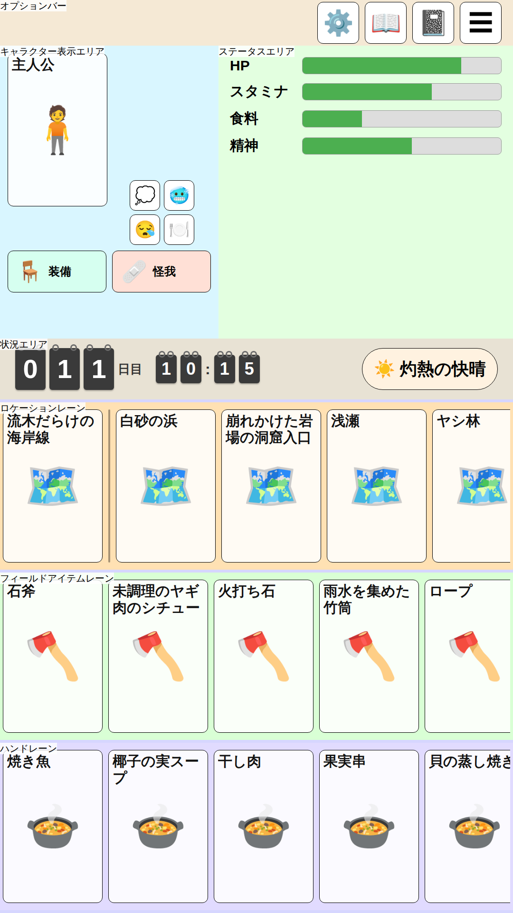
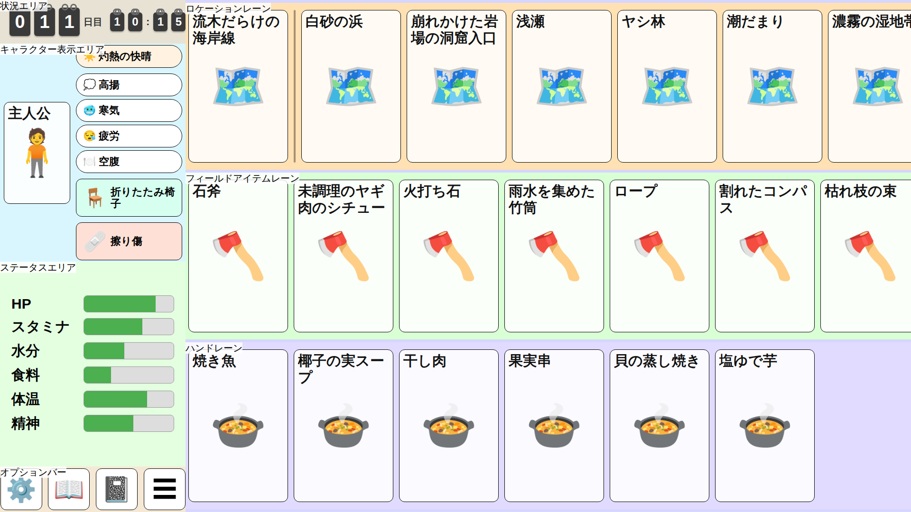

# 画面レイアウト検討

UnmappedIsland のゲーム画面レイアウトを検討するためのモックです。
縦型・横型両対応のレスポンシブなスタンドアロン HTML モックで、画面の向きに応じてレイアウトが切り替わります。

## 設計原則

- **カード基準レイアウト**: 画面を等分して領域を作るのではなく、カード寸法を基準に各エリアの
  寸法を積み上げて決める。カードのアスペクト比は 58:89（ポーカーサイズ）。
- **短辺基準の単位**: 寸法は `u`（= 画面短辺 ÷ 1080、CSS では `vmin` ベース）で定義する。
  縦型・横型どちらも短辺を基準にするため、同一端末ならカードの実寸が画面の向きによらず一致する。
- **フィールドエリア最優先**: ゲームの中心エリアであるフィールドエリアのカードサイズを最大化する。
  カード 210×322u・レーン高 352u はフィールドエリア 3 レーンが横型の画面高（1080u）に
  ちょうど収まる最大値。
- **キャラクターカードはフィールドカード基準**: ポートレイトカードはあくまで補助的な表示なので、
  フィールドカードと同じサイズ（210×322u）とし、縦型・横型で共通にする。
- **親指到達圏**: 縦型では頻繁に操作するフィールドエリアを画面下部に置き、状況エリアをその直上に
  置く。低頻度のオプションボタンをまとめるオプションバーは、通常のフロー内で他のエリアと重ならない
  よう配置する。縦型では画面最上部に、横型ではダッシュボード列の最下部に固定する。
- **レーンは横スクロール**: フィールドエリアはスクロール可能なので、レーンに収まらないカードは
  横スクロールで送ればよく、視界に何枚入るかは厳密に揃える必要はない。縦型では約 4.8 枚、
  横型では約 6 枚が視界に入る（端のカードを見切らせてスクロール可能なことを示す）。
- **現在地カードのピン留め**: 現在地カードはロケーションレーン左端に固定表示し、区切り線を挟んで
  右に移動先候補を並べる。現在地は常にフィールドカードと同サイズでフィールドエリア内に表示される。
- **世界の状況を縦に集約**: 状況エリア（日時・天候）をロケーションレーンの上に隣接させ、
  「時間・天候・現在地」という世界の状況が画面上で縦に並ぶようにする。ただし横型は
  日時のフリップカードだけでダッシュボード列の横幅を使うため、天候は状況エリアとは別の
  帯（天候の帯）に分離し、フィールドエリアへ回せる横幅を最大化する。
- **日時はぶら下げ式フリップカード**: 経過日数（3 桁）と時刻は、卓球のスコアボードのように
  一桁ずつ独立したフリップカードで表示する。各カードは上部の留具のみで吊り下げられ、
  台紙のような外枠は持たない。経過日数と時刻は上下ではなく左右に並べ、状況エリアの横幅を
  活かす。縦型・横型でサイズは共通。タップすると休憩・睡眠など時間経過アクションを選ぶ
  ボトムシートが画面下部から開く。入口の位置によらず、選択操作自体は親指圏で行える。
- **キャラクター表示エリアは上段／下段が独立したレイアウト（縦型）、カード＋縦列（横型）**:
  縦型は上段（キャラクターカード｜条件）と下段（装備｜怪我）を独立したレイアウトとして扱う。
  上段の列幅（ポートレイト幅）に下段が引きずられないよう、下段はグリッドの両列にまたがる
  独立の行にし、装備・怪我はその行の中で幅を均等に分け合う（同じ大きさになる）。横型は
  左にポートレイトカードを置き、右の列に条件ボタンの行・装備ボタン・怪我ボタンを縦に並べる
  （横型はダッシュボード列の横幅が限られ、右の縦列にまとめた方が使い勝手が良いため）。
  条件・装備・怪我はいずれもポートレイトカードに重ねず、通常のフロー内に配置する。
- **条件はラベルなしのアイコンボタン、装備・怪我はアイコン＋ラベルの横長ボタン**: 条件は
  タップで詳細の子ウィンドウを開く想定のアイコンのみのボタン（64×64u）で、複数同時に
  付き得るため折り返して並べる（縦型は2列、横型は1行）。装備・怪我は「装備」「怪我」という
  種別の固定ラベルをアイコンの右に表示する横長ボタンとし、幅は同じ大きさで行・列いっぱいに
  広げる（アイテム名は表示せず、タップ先の子ウィンドウで確認する想定。高さ 88 u は
  アイコンボタンと同じ最小タップ領域）。
- **ボタン群はポートレイトの下端に揃え、余白は頭部側に集約**: ポートレイトカード（322u 高）は
  条件・装備・怪我のボタン群より背が高いため、必ず余白が生まれる。この余白をボタン群の間に
  分散させず、ポートレイトの上部（頭部側）1 か所にまとめることで、ボタン同士が離れて
  浮いて見えることを防ぐ。縦型は条件セルを `align-content: end` で下寄せ、横型は
  `character-display` を `align-items: flex-end` にして右の縦列をポートレイトの下端に揃える。
  キャラクター表示エリア自体にも内側の余白（16u）を確保し、要素が端に張り付かないようにする。
- **ステータスエリアのバーは上寄せ**: 表示するステータスは常に全種類ではなく、変化があった・
  要注意・ユーザーが固定したものだけを表示する可変長リストになる想定。中央寄せにすると
  表示件数が変わるたびにバー群の位置が上下に動いてしまうため、上端に揃えて件数が変わっても
  位置が安定するようにする。

## 寸法トークン

| 要素 | 寸法 (u) |
|------|----------|
| カード | 210 × 322 |
| レーン高 | 352（カード + 上下 15） |
| カード間ギャップ | 12 |
| レーン間・外周マージン | 6 |
| 状況エリア高 | 内容量に応じて自動（フリップカード 88 + 上下パディング 20×2 で約 128） |
| 日時フリップカード | 日数の桁（3 桁）64×88、時刻の桁 44×60（縦型・横型共通） |
| オプションバー高 | 96 |
| ポートレイトカード | 210 × 322（フィールドカードと同サイズ、縦型・横型共通） |
| キャラクター表示エリアの内側余白 | 16 |
| アイコンボタン | 88 × 88（最小タップ領域） |
| 装備・怪我ボタン | 高さ 88（最小タップ領域）、幅は列・セルいっぱいの横長 |
| 条件ボタン | 64 × 64 |

## エリア名称定義

### キャラクターエリア (Character Area)

**キャラクター表示エリア**と**ステータスエリア**で構成します。
両者は縦型では左右、横型では上下に隣接します。

#### キャラクター表示エリア (Character Display Area)

ポートレイトカード（210×322u）と、条件ボタンの行・装備ボタン・怪我ボタンで構成します。
いずれもポートレイトカードに重ねず、通常のフロー内に配置する（ボタンの仕様は設計原則を参照）。

- **縦型**: 上段「キャラクターカード｜条件」・下段「装備｜怪我」の 2 段構成だが、
  上段と下段は独立したレイアウト。1 列目にポートレイトカード、2 列目に条件ボタンの行を
  1 行目の高さいっぱいに配置する（ここまでがグリッドの上段）。下段（装備ボタン・怪我ボタン）
  はグリッドの両列にまたがる独立の行とし、ポートレイト幅に関係なく 2 個で幅を均等に分け合う
  （同じ大きさになる）。
- **横型**: 左にポートレイトカードを置き、右の列（幅はキャラクター表示エリアの残り幅）に
  条件ボタンの行（1 行に横並び）・装備ボタン・怪我ボタンを上から順に縦に並べる。

#### ステータスエリア (Status Area)

HP・スタミナ・水分・食料・体温・精神のうち、表示対象のものだけをバーで表示します。表示対象は
変化があった・要注意・ユーザーが固定したステータスのみで、件数は可変。上端に揃えて表示し、
件数が変わってもバー群の位置が動かないようにします（モックでは 6 種類中 4 種類が該当している
例を示す）。

### 状況エリア (Situation Area)

日時のフリップカード表示（経過日数・時刻を左右に並べる）を表示する帯です。高さは内容量に
応じた自動サイズ（上下パディング 20u）で、縦型・横型共通。縦型では天候チップも同居し、
両者を `justify-content: space-between` で左右に配置して横幅いっぱいに広げる。横型は
ダッシュボード列の横幅をフィールドエリアに極力回すため、天候チップは同居させず日時のみを
表示する。縦型ではフィールドエリアの直上、横型ではダッシュボード列の最上段（ロケーションレーン
の左隣）に置きます。

### 天候の帯 (Weather Row) ※横型のみ

横型限定で、状況エリア（日時）とキャラクターエリアの間に置く天候チップ専用の帯です。
日時と天候を同居させると状況エリアが横幅を取りすぎてフィールドエリアを圧迫するため、
別の帯として切り離しています。縦型は状況エリアの横幅に余裕があるため、この帯は使わず
天候チップを状況エリア内に表示します。

### オプションバー (Options Bar)

設定・図鑑・日記・メニューのアイコンボタン 4 個を置く高さ 96u のバーです。
低頻度の操作なので、通常のフロー内で他のエリアと重ならない位置に固定します。
縦型では画面最上部（キャラクターエリアの直上）、横型ではダッシュボード列の最下部に置きます。

### フィールドエリア (Field Area)

カードを配置する主要な描画領域です。上から**ロケーションレーン**・**フィールドアイテムレーン**・
**ハンドレーン**の 3 レーン（各 352u 高）で構成し、各レーンは独立に横スクロールできます。

#### ロケーションレーン (Location Lane)

左端に現在地カードをピン留めし、区切り線を挟んで移動先候補のロケーションカードを並べます。
横型では画面の横幅を活かし、カード 6 枚分（ピン留め含む）強が視界に入ります。

#### フィールドアイテムレーン (Field Item Lane)

フィールド上のアイテムを表示します。横型ではロケーションレーンと同様にカード 6 枚分強が
視界に入ります。

#### ハンドレーン (Hand Lane)

プレイヤーの手持ちを表示します。上限は 6 枚のため、横型でレーン幅が広がってもカードは
引き伸ばさず、6 枚に満たない・ちょうど 6 枚のときは残りを空白のまま表示します。
6 枚を超えることは起こらない前提ですが、枚数が増えても横スクロールで収容できます。

## 縦型レイアウト（1080×1920u）

| エリア | サイズ (u) |
|--------|-----------|
| オプションバー | 1080 × 96（最上部） |
| キャラクターエリア | 1080 × 616 |
| 状況エリア | 1080 × 約 128（内容量に応じた自動高） |
| フィールドエリア | 1080 × 1080（下端、カード 4.8 枚分の横幅） |

画面が 9:16 より縦長の端末では、余剰の高さをキャラクターエリアが吸収します。

## 横型レイアウト（1920×1080u）

左にダッシュボード列、右にフィールドエリアを置きます。天候を状況エリアから切り離した分、
フィールドエリアにカード 6 枚分強の横幅（1380u）を確保でき、ダッシュボード列は縦型より
かなり狭くなります。

| エリア | サイズ (u) |
|--------|-----------|
| ダッシュボード列 | 540 × 1080（上から状況エリア・天候の帯・キャラクター表示・ステータス・オプションバー 96） |
| フィールドエリア | 1380 × 1080（カード 6 枚分強の横幅） |

ダッシュボード列内の状況エリア・天候の帯は内容量に応じた高さ、キャラクター表示エリアは
右の縦列の内容量で決まる高さ（条件ボタンの行＋装備ボタン＋怪我ボタン、約 352u）、残りを
ステータスエリアが吸収します。`.dashboard-column` は `min-width: 0` を指定し、キャラクター
表示エリアなどの内容量で横幅が突っ張らないようにしている点に注意（`flex: 1` な列が中身の
最小幅で止まってしまう既知の挙動の回避）。画面が 16:9 より横長の端末では、余剰の幅を
ダッシュボード列が吸収します。

## エリア構成まとめ

```
画面（[縦型] 上から）
├── オプションバー（アイコンボタン×4）
├── キャラクターエリア
│   ├── キャラクター表示エリア（上段・下段は独立レイアウト）
│   │   ├── 上段: ポートレイトカード｜条件ボタンの行（2列で折り返し）
│   │   └── 下段: 装備ボタン｜怪我ボタン（アイコン＋ラベルの横長ボタン、幅は均等）
│   └── ステータスエリア（バー×6）
├── 状況エリア（日時フリップカード・天候チップ）
└── フィールドエリア（カード 4.8 枚分）
    ├── ロケーションレーン（現在地ピン + 移動先候補）
    ├── フィールドアイテムレーン
    └── ハンドレーン

画面（[横型] 上から。ダッシュボード列とフィールドエリアは左右並び）
├── 状況エリア（日時フリップカードのみ）
├── 天候の帯（天候チップ）
├── キャラクターエリア
│   ├── キャラクター表示エリア（ポートレイトカード＋右の縦列）
│   │   ├── ポートレイトカード
│   │   └── 右の縦列: 条件ボタンの行（1行に横並び） → 装備ボタン → 怪我ボタン
│   │       （装備・怪我はアイコン＋ラベルの横長ボタン、幅は均等）
│   └── ステータスエリア（バー×6）
├── オプションバー（アイコンボタン×4）
└── フィールドエリア（カード 6 枚分強。ハンドレーンのみ上限 6 枚で余白を残す）
    ├── ロケーションレーン（現在地ピン + 移動先候補）
    ├── フィールドアイテムレーン
    └── ハンドレーン
```

## HTML モック

- [レスポンシブ画面モック](./ScreenLayout_Mock.html)

> **表示方法**：スマートフォンブラウザで開くと、縦向き・横向きの切り替えに追従してレイアウトが変化します。  
> デスクトップブラウザでは、ウィンドウ比率を変更するか、DevTools のデバイスシミュレーターでご確認ください。

## スクリーンショット

### 縦型 1080×1920



### 横型 1920×1080



## デザインメモ

- 本モックは領域分割と寸法の検証を目的とし、装飾はカードの角丸程度に留める
- 各エリアとレーンには `position:absolute` のラベルを重ね、背景色を変えて境界を視認しやすくする
- ゲーム本体（Phaser）で実装する際も、本ドキュメントの `u` 単位の寸法トークンをそのまま用いる
