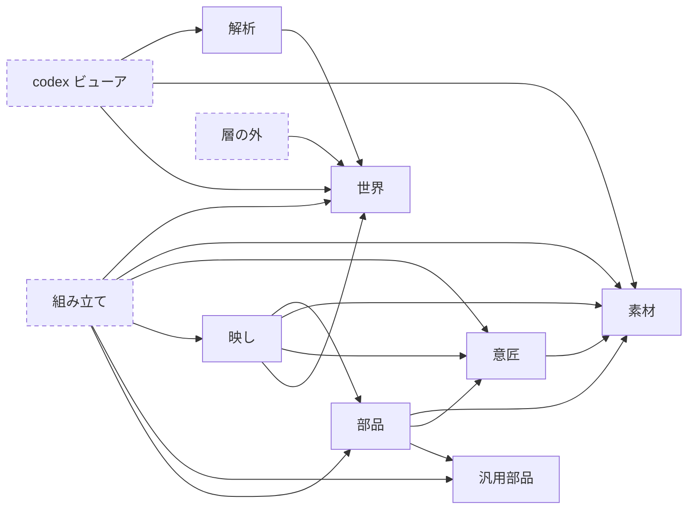

# コードの構造

`src/` のコードがどこに属し、何を知ってよいかを決めます。**新しいファイルをどこへ置くかは、
下の表のどれに答えるかで決まります。** 各機能の設計理由はそれぞれの設計文書にあり、本書は
置き場所と境界だけを扱います。

## 1. 構成要素と置き場

**この表が置き場の唯一の記載場所です。** **組み立て・層の外・codex ビューアは層ではありません**
（2節）。残りが層です。

| 名前 | 答えること | 知ってはいけないもの | 置き場 |
|---|---|---|---|
| **世界** | 何が在り、何が起きるか。**プレイヤーに見えていない土地・物も含む** | 画面のことば全部・Phaser・解析・codex ビューア | `src/domain/`（`src/loader/` が定義を読み、`src/locale/` がことばを与える） |
| **映し** | 世界のうち、**プレイヤーに映っている分**。今の断面と、遅れて見せる変化 | Phaser・矩形・ミリ秒・解析・codex ビューア | `src/game/view/` |
| **意匠** | それを**どんな色・絵・寸法で**見せるか | 世界の状態・Phaser・解析・codex ビューア | `src/game/looks/`（色・寸法・領域・時間の見せ方） |
| **素材** | **どのファイルがどの絵か** | 画面の寸法・色・Phaser・解析・codex ビューア | `src/art/` |
| **汎用部品** | Phaser の足りない分・間違っている分を埋める表示物 | **このゲーム**——語彙も寸法も配色も。解析・codex ビューア | `src/ui/` |
| **部品** | Phaserの表示物を**作る・持ち続ける・触らせる** | 世界の語彙（レシピ・スロット名・プロパティ名）・解析・codex ビューア | `src/game/ui/` |
| **解析** | 宣言を**どう読むか**。答えは必ず近似になる（5節） | 効果・条件の木そのもの（読み上げ口だけを使う）・codex ビューア | `src/analysis/` |
| **組み立て** | どの部品をどこへ置き、映しの答えを誰へ渡すか | 解析・codex ビューア。**それ以外の層はすべて知ってよい唯一の場所**（2節） | `src/main.ts`・`src/game/DeviceScreen.ts`・`src/game/*Scene.ts`・`src/game/ui/*Window.ts` |
| **層の外** | **層のどれでもないコード** | Phaser・解析・codex ビューア | 横断の道具（`src/util/`・`src/game/errorReport.ts`）、保存と起動時の入力（`src/save/`・`src/scenario/`・`src/game/launchSeed.ts`）、外から材料を受け取る口（`src/asset-pack/`。[`AssetPack.md`](./engine/AssetPack.md)） |
| **codex ビューア** | 定義YAMLを型・プロパティ・操作の単位で辿って読ませる別ページ | Phaser（ゲームの画面を持たない） | `src/codex-viewer/` |

**`src/` 直下と `src/game/` 直下がこの表に出そろっていることは、自動テストが数えます**
（`tests/architecture/layers.test.ts`）。置き場を1つ足したのに表へ書き忘れると落ちます。唯一の
例外は `src/assets/`（データファイルはコードではないので、どの行にも属しません）。

**「知ってはいけないもの」は規約で、自動テストが見張っているのはその一部です。** どこを見張って
いるかは同じテストの `PHASER_FREE`・`ANALYSIS_FREE`・`VIEWER_FREE` が持ちます——ここへ書き写すと、
一致を誰も検査しない2つ目の一覧が増えるので置きません。

**解析と codex ビューアは、行自身を除くどこからも見えません。** 解析を知ってよいのは codex ビューア
だけで（5節）、codex ビューアは逆にどこからも見えません——**宣言をどう見せるかの語彙が、ドメインや
ゲームの契約へ混ざらないようにするため**です。

**層の外**に並ぶものは性質が違います。**それでも同じ行に居るのは、どれも「何を知ってよいか」で
位置が決まらないから**であって、似ているからではありません。

**映し**は、世界を写した像です。行動のたびに作り直され、時間のかかる行動では tick ごとの断面として
控えられます（`RecordedView`）。「何が出ていて、その上の操作が何を意味するか」を答え、**描きません**。

**部品**が持ってよい状態は「**今見せているもの**」だけです。「次に何を見せるべきか」は映しが答えます。

**ディレクトリが置き場です。ただしこれはコードの話で、データファイルはどこにも属しません**——絵・定義
YAML・表示文字列・シナリオはすべて `src/assets/` 以下に置き、それを読むコードだけが置き場を持ちます。
`public/` はこれと別で、**ビルドが素通しで配るファイル**（アセットパックのZIPなど、取得しに行かれる
配布物）だけを置きます。バンドルへ入るなら `src/assets/`、URLのまま配るなら `public/` です。

- **`src/domain/wrappers/` は映しではありません。** 1つの `WorldObject` を世界の語彙で読み書きする
  型付きの窓（`ObjectWrapper`）で、`explore`・`travel` のように世界を書き換えます。
  映しは `src/game/view/` だけです。
- **汎用部品は意匠を引きません。** 既定値が要るものは自分で持ち、起動時に外から差し替えます
  （`src/ui/labels.ts` の `setLabelDefaults`）。引数で受け取れるものは引数で受け取ります。
- **ウィンドウは部品と同じ場所に置きます。** 組み立てでありながらPhaserの表示物そのものでもあるため、
  シーンのように独立させても持ち出せません。
- **契約（`CardContent`・`LaneCell`・`StatusContent`・`PropertyTab`）は部品側が定めます。**
  「バーに何を渡せば描けるか」は部品の都合そのものだからです。映しはこれを**型として**輸入します
  （`cardFace` だけは値として輸入しますが、Phaserを持ち込みません）。

## 2. 依存の向きと、層ではないもの

**ノードは1節の表の行そのもの**で、食い違っていないことは自動テストが数えます
（`tests/architecture/layers.test.ts`）。破線の枠は層ではないもの。`層の外` はどこからでも使えるので、
入ってくる矢印は描いていません。

**置き場はノードに書きません**——1節の表が唯一の記載場所で、ここへ写すと一致を誰も検査しない
2つ目の一覧が増えます。**矢印も依存してよい主な向きで、実際の import の全数ではありません。**
どこへ依存してよいかを決めるのは1節の表の「知ってはいけないもの」で、図はその向きを読みやすく
したものです。

意匠は映しからも部品からも参照されます（札の色は映しが選び、その色で描くのは部品）。

**組み立て・層の外・codex ビューアを層と呼ばないのは、層どうしを分けている「何を知ってよいか」で
位置が決まらないから**です。組み立ては解析を除く全部の層を知ってよく、層の外はどの層からも使われ、
codex ビューアはゲームの画面を持たない別ページとして層の並びの横に居ます（ゲームを消してもこちらは
動きます）。**どれも**並びの中に居場所がありません。

起動（`src/main.ts`）が組み立ての一番外側で別の層ではないのも同じ理由で、知ってよい範囲が組み立てと
まったく同じだからです。層として並べると一番上に太いものが乗っているように見えますが、上下ではなく
結線です。

**この境界は自動テストが見張ります**（`tests/architecture/layers.test.ts`）。禁じた先へ import で到達
できないことを、間に何本挟まっていても辿って確かめます。契約を**型として**輸入するぶんは数えません
（型はビルドで消えるので、Phaser もゲームも付いてきません）。

組み立ては Phaser の中に居るのでそのままでは自動テストにかけられません。そこで**順序そのものに意味が
ある判断は、Phaser に触らない側へ出します**——1回の操作を運ぶ手順（`src/game/view/operationSteps.ts`）と、
経過を実時間で再生する刻み（`src/game/view/elapsePlayback.ts`）。組み立てに残るのは「その1つずつを
どう見せるか」だけになります。

## 3. 迷ったときの判定

- **映しか意匠か**: 「何が出ているか」なら映し、「どう見せるか」なら意匠。カードがどのインスタンスを
  映しているかは映し、その枠を何色で描くかは意匠。
- **映しか部品か**: **座標・ミリ秒・Phaserの表示物を持つなら部品**。同じ振る舞いでも、判断だけを
  切り出せるなら映しへ置きます（例: 何がどこへ飛ぶかは `cardMotionPlan`、実際に毎フレーム寄せるのは
  `CardTable`）。
- **意匠か素材か**: 「どのファイルがどの絵か」は素材（`src/art/`）。ゲーム画面の寸法・色は意匠。
  前者は codex ビューア（`src/codex-viewer/`）も使うので、ゲームの中に置きません。
  宣言された語（天気など）ごとの見せ方も意匠が持ちます（`looks/rainStyle.ts`）——WorldCodex は
  表示に関わる値を一切持たない方針だからです（[`Localization.md`](./engine/Localization.md)）。
- **意匠に置くか、部品の中に置くか**: **色は、使う部品が1つでも意匠（`looks/theme.ts` の `COLOR`）へ
  置きます**。配色は画面全体の調和で決まるので、1箇所で見渡せること自体に値打ちがあります。
  **寸法・時間・濃さは、その部品の外が知る必要があるものだけ**意匠（`SIZE` と `looks/` の話題別
  モジュール）へ置き、部品の中で閉じるものは部品が持ちます——隣り合う部品との関係でだけ効くので、
  見渡す必要がありません。ただし**2箇所以上が一致していないと壊れる値は、利用者が何であれ意匠**です。
- **枠や桟の数をどちらが決めるか**: **ワールドの宣言が決めるなら映し**（スロットの `cell_count` や
  レシピの要求から並べる `view/slotCells`）、**画面の寸法が決めるなら部品**（発見物の4枠は探索のタブの
  幅そのもの、`ui/laneCells`）。
- **世界か映しか**: 見えていない土地の状態を扱うなら世界。
- **汎用部品か部品か**: **このゲームを消しても1文字も変わらないなら汎用部品**。名前で決めません
  ——`Button` は汎用に見えて、押されたときの濃さを意匠から直に引いています
  （`COLOR.pressedShade`）。寸法・配色・ゲームの語彙のどれか1つでも抱えていれば、部品です。
  **見るのはクラス自身が参照しているものだけです。** `Button.ts` はスロットボタンの紙のテクスチャキー
  （`SLOT_BUTTON_PAPER_TEXTURE`）も置いていますが、読むのは `BootScene` と `PlayScene` で、`Button` は
  触りません。同じファイルに居ることは、そのクラスがゲームを知っている証拠になりません。

### 定義は読んでよい。読んで判断してはいけない

定義（`src/domain/` のうち、ロード後に書き換わらないもの）は読み取り専用です。映しや部品が読んでも
壊れる不変条件が無いので、**公開範囲を絞ること自体は目標になりません**。何を公開する必要があるかは
どんな画面を作るかで決まり、論理的な線は引けません——枠を描くなら `cellCount` は要るし、発見テーブルを
見せるなら `pick` の中身が要ります。

引ける線は「**読んだ値で誰が判断するか**」の側です。

- **宣言をそのまま形にする**のは映しの仕事。`cellCount` が3なら枠を3つ——ここでは何も決めていません。
- **読んだ値から答えを組み立てている**なら、その答えは映しのものではありません。ドメインが操作として
  提供するか（ドラッグして入るかはドラッグ型の操作が答える）、解析が近似として持つか（5節）のどちらかです。

公開を増やすときは、**格納の形ではなく問いの形**で足します（`visibleSlotGlobalIds`・`artSuffixes()`・
`describe(names)`・`read(reader)`・`SlotDef.cellCountPolicy`）。画面が増えれば口も増えますが、増えるのは口の実装であって、
定義の内部が1つずつ剥がれていくことにはなりません。

定義とインスタンスのどちらへ訊くかも、これで決まります。

> **答えにインスタンスの状態が要るならインスタンスへ、型だけで決まるなら定義へ訊く。**

だから `PropertyValue.alert` はインスタンスにあり（どの値で判定するか——実体値か実効値か——を
呼び出し側に決めさせない）、名前・ゲージの宣言・タグの有無は `property.def` から直に読みます。
インスタンスに定義への素通しを生やすと、この線がぼやけます。`WorldObject.def`・`Slot.def`・
`PropertyValue.def` はいずれも公開で、素通しは持ちません。

## 4. Phaser をやめるとどうなるか

**書き換えるのは部品・汎用部品・組み立てだけです。** 残りはどれも Phaser を知ってはいけない側なので、
判断も語彙もそのまま残ります。

部品の中でも、規則を抱えているもの（掴んだと見なす閾値、点がカード本体か隙間か、押し続けの間隔）は
Phaser に依っていません。書き換えの前に映しへ寄せられる分がどれかは、そのときに見直します。

汎用部品（`src/ui/`）は逆に**Phaser にだけ依っています**。9patch がCanvasレンダラで描かれない、
日本語が折り返されない、`pointerup` が押し始めた場所と無関係に届く——Phaser の足りない分・
間違っている分を埋めるものが多く、Phaser をやめれば役目ごと消えます。

## 5. 解析（`src/analysis/`）——近似の置き場所

**定義を読んで数値を導く側**です。収支レポート（[`stats/balance.yaml`](../stats/balance.yaml)）と
クラフトネットワークがこれを使います。世界を動かさずに「1個手に入れるのに何分か」を答えるので、
遊びの本体からは切り離されています。

**ここに置く理由は、答えが必ず近似になるから**です。実行時のオブジェクトが1つも無い文脈で
数値を出すには、居ない相手のぶんを何かで埋めるしかありません——祖先（置かれている土地）の値、
重ねる相手（武器）の値、条件つきの増減が同時に成立するか、抽選の重みを確率と見なしてよいか。
どれも定義の側は答えを持っておらず、**「そう置いた場合」を決めた側だけが答えられます**。

その仮定をドメインへ置くと、3つとも壊れます。定義クラスは本来の宣言より解析のほうが長くなり、
解析だけが要る内部が公開され、そして**近似が「定義がそう言っている」ように見えてしまいます**。

| | ドメイン（`src/domain/`） | 解析（`src/analysis/`） |
|---|---|---|
| 答えること | **宣言に何が書いてあるか** | **それをどう読むか** |
| 例 | `range` は 0〜24、`pick` の候補は3つで重みはこれ、`add: {child: {…}}` がある | 24へ届くのに25 tick、重み70は確率0.553、隣に炉が在れば焼ける |

境界の向きは**解析 → ドメインの一方通行**で、[`tests/architecture/layers.test.ts`](../tests/architecture/layers.test.ts) が
import を辿って見張ります。**型として輸入するのも数えます**——`StaticValueResolver` を引数に取った
時点で、その仮定はドメインの契約になってしまうからです。

### 効果の木は、読み上げてもらう

解析はプロパティの増減も産出も知りたいのですが、効果の木（`ActiveEffect`）を外へ出すと
カプセル化が崩れます。そこでドメインは**読み上げ口だけ**を持ちます（`EffectReader`）。

- ドメインが言うこと: 「`self` の `blood` へ 0 を代入する」「`pick` の候補が5つあって、重みは
  これとこれ」——宣言そのままで、確率も期待値も出しません。
- 解析がすること: 重みを確率へ直し、分岐を直積で畳み、値域の端を割ったかを判定する。

読み上げのメソッドは動詞ごとに分かれていて、`read` は抽象です。**動詞を1つ足したときに読み手が
黙って取りこぼさない**ようにするためで、実装を書かない効果はコンパイルが通りません。

#### 入れ子も、読み下せる宣言として渡す

`pick` の候補や `all`/`any`/`not` の子のように、読み上げの途中でさらに読み下すものがあります。
ここで木のクラス（`ActiveEffect`・`ConditionNode`）を渡すと、読み手は読むだけでなく**適用**（`apply`）や
**評価**（`evaluate`）までできてしまいます。渡すのは `read` だけを持つ宣言
（`EffectDeclaration`・`ConditionDeclaration`）で、**入れ子をどう畳むかは読み手が決めます**。

木そのものを組み立てるのはドメインとローダーだけで、
[`tests/architecture/layers.test.ts`](../tests/architecture/layers.test.ts) が読み手からの輸入を
見張ります（どこを見るかは同テストの `TREE_READERS`）。
