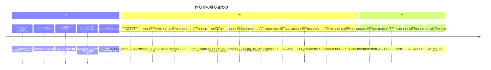
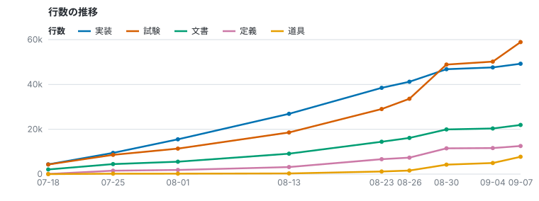
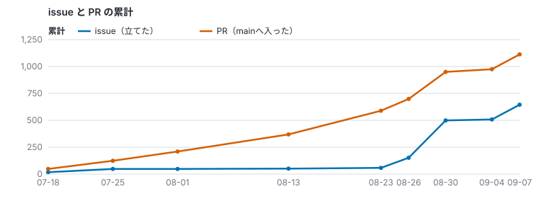
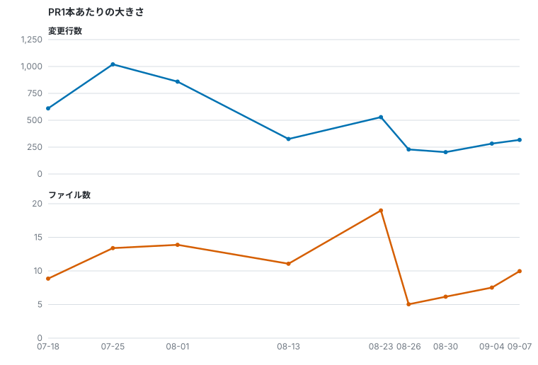
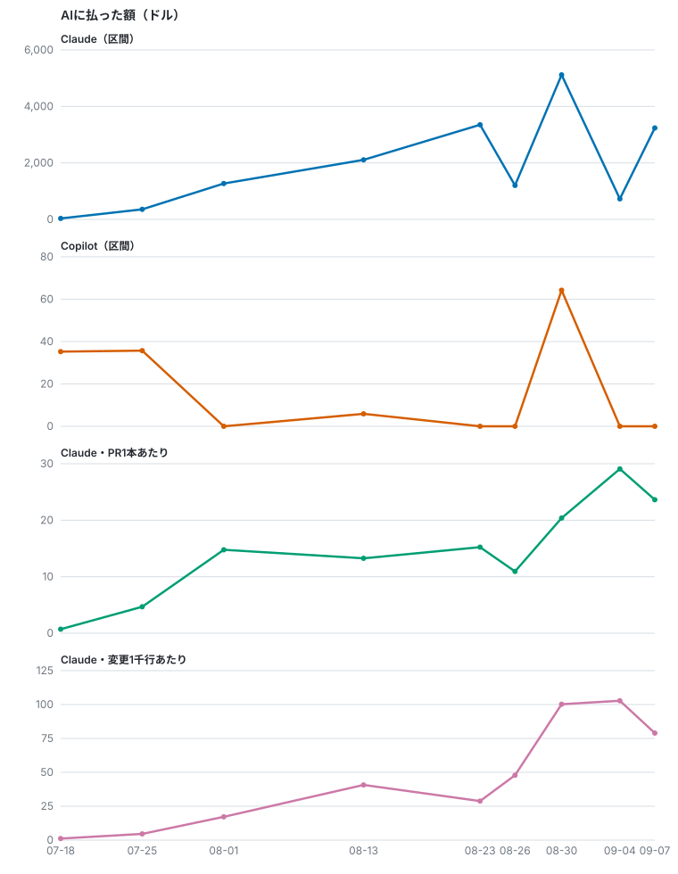
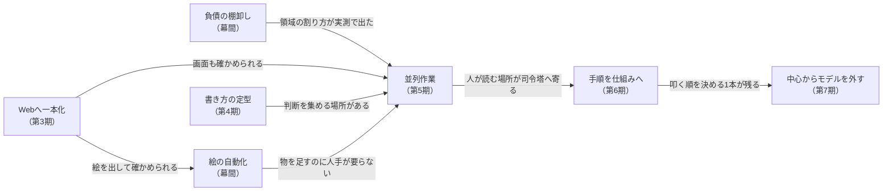

# ここまでの育ち方

**このリポジトリは 2026-07-13 に始まり、8週間で 2,863 コミットになりました**（2026-09-07 時点）。その間に**作り方そのものを6回変えています**。

**今の仕組みは [`ParallelAgents.md`](./ParallelAgents.md) にあります。** この文書は、**そこへどうやって辿り着いたか**だけを扱います。

## 一目で



## 何を減らそうとして変えてきたか

**変えてきた動機は、どれも「人間の手数を減らして、同時に流せる量を増やす」ことです。**
減らす相手は毎回違いました。

| 変えたこと | 減らしたかった手数 |
| --- | --- |
| issue を書いて割り当てる → チャットで詰める（第2期） | **1往復ごとに issue を書き直す手間。** 細かい訂正がその場で返せて、判断が要るところは相談できる |
| Unity → Web（第3期） | **人間がGUIを操作しないと進まないこと。** エージェントに渡せるのがコードだけだった |
| 絵を人手 → 自動（幕間） | **物を1つ足すたびに絵を作る手数** |
| 書き方を定型にする（第4期） | **「これは決まったことか」を毎回訊かれること** |
| 並列作業（第5期） | **1本ずつ順番に流すこと。** 待っている間、人間も待つ |
| 司令塔の手順を仕組みへ（第6期） | **決着したPRを人が読んで振り分けること** |
| レビューを別セッションへ、次いで出す側へも（第6期） | **司令塔が全PRの差分を読むこと。** ただし差し戻しの往復は司令塔を通るので、**手前にもう1回**足した |
| 司令塔を廃してデーモンにする（第7期） | **司令塔を立て直し、現在地を引き継がせること。** 文脈が埋まるたびに人が渡していた。落ちれば全部止まるのも、1本に集まっていたため |

**「AIが確かめられない」ことを潰したのも、このうちの1つでした**——確かめられないものは人間が
確かめるしかないので、そこがそのまま人間の手数になります。ただし**全部がそこから来たわけでは
ありません。** 上の表のうち、確かめられるかどうかの話なのは Web への一本化（の一部）と、
書き方の定型だけです。

## 規模の推移

**この表と下の図は手で埋めません。** `npm run stats:history`（[`scripts/historyStats.mjs`](../scripts/historyStats.mjs)）に
日付を渡すと、そのまま出ます。

```
npm run stats:history -- --svg docs 2026-07-18 2026-07-25 2026-08-01 2026-08-13 2026-08-23 2026-08-26 2026-08-30 2026-09-04 2026-09-07
```

**測っているのは、その日の最終コミット（日本時間）の状態です。** 行数は `git grep -c ''`。置き場は
C#期とTS期をまたぐので、**両方を合併した1つの式で数えています。**

| 列 | C#期（〜07-25） | TS期（07-25〜） |
| --- | --- | --- |
| 実装 | `Assets/Scripts/**.cs` | `src/**.ts`（`*.test.ts` を除く） |
| 試験 | `Tests/**.cs` | `tests/**.ts` ＋ `src/**.test.ts` |
| 文書 | `Documents/**.md` | `docs/**.md` ＋ `.claude/` 直下の `*.md` |
| 定義 | `Assets/StreamingAssets/**.yaml` | `public/**.yaml` → `src/assets/**.yaml` ＋ `tools/**.json` |
| 道具 | — | `scripts/`・`.claude/`・`tools/` の、実行されるものとその型 |

**`道具` は、リポジトリの運用を回すプログラム**——盤面のデーモン、使用量を集める道具、
セッションのフック、絵を出す道具。**本番のプログラムではないので `実装` とは別の列**ですが、
**書かれた量としては数えます。** 拡張子の一覧は
[`historyStats.mjs`](../scripts/historyStats.mjs) の `TOOL_EXTENSIONS`。

**どこへ数えるかは、置き場ではなく中身の性質で決めています。** 絵のレシピ（`tools/**.json`）は
置き場が道具と同じでもデータなので `定義` へ、運用の取り決め（`.claude/` 直下の `*.md`）は
文書なので `文書` へ入ります。**`.claude/decisions/` は判断の履歴なので、どの列にも数えません**
——文書とは別のもので、分ける必要が出たときに分類を作ります。`.github/**` も入っていません。

| 日 | 実装 | 試験 | 文書 | 定義 | 道具 | issue | PR | 1PRあたり | Claudeのコスト | 文書と実装が同じPR |
| --- | --: | --: | --: | --: | --: | --: | --: | --: | --: | --: |
| 07-18 | 4,337 | 4,300 | 2,074 | 63 | 0 | 18 | 48 | 8.9ファイル / 610行 | $34（1本 $0.7） | 29% |
| 07-25 | 9,473 | 8,596 | 4,472 | 1,527 | 180 | 48 | 124 | 13.4ファイル / 1,020行 | $356（1本 $4.7） | 32% |
| 08-01 | 15,523 | 11,381 | 5,532 | 3,490 | 1,556 | 48 | 210 | 13.9ファイル / 859行 | $1,270（1本 $14.8） | 62% |
| 08-13 | 26,906 | 18,583 | 9,113 | 6,772 | 3,085 | 51 | 369 | 11.1ファイル / 326行 | $2,108（1本 $13.3） | 69% |
| 08-23 | 38,494 | 29,038 | 14,909 | 13,242 | 5,162 | 58 | 589 | 19.0ファイル / 529行 | $3,351（1本 $15.2） | 60% |
| 08-26 | 41,213 | 33,622 | 17,099 | 13,976 | 5,590 | 152 | 699 | 5.0ファイル / 229行 | $1,203（1本 $10.9） | 44% |
| 08-30 | 46,805 | 48,879 | 22,286 | 18,919 | 8,231 | 499 | 950 | 6.2ファイル / 203行 | $4,880（1本 $19.4） | 47% |
| 09-04 | 47,607 | 50,186 | 23,035 | 19,040 | 8,963 | 508 | 975 | 7.5ファイル / 283行 | $1,165（1本 $46.6） | 32% |
| 09-07 | 49,244 | 58,907 | 26,430 | 20,206 | 11,763 | 642 | 1,108 | 9.4ファイル / 298行 | $3,037（1本 $22.8） | 53% |

**PR は `main` へ入った累計**（マージコミットと squash の両方を数え、`main` へ直接 push した分は
入りません）。**1PRあたりと「同じPR」の割合は、1つ上の行からの区間の平均**です。

**08-30 から 09-04 までの区間は、ほとんど止まっています**（下の「幕間（08-31〜09-03）」）。PRが
25本しか増えていないのに額が積まれているので、**この行の「1本あたり」だけは他の行と比べられません**——止まっている
あいだも走りっぱなしのセッションが残り、コストは開始から最終更新までへ均して割り当てられます
（[`scripts/usage/README.md`](../scripts/usage/README.md)「数字の限界」）。

**コストは [`stats/usage/`](../stats/usage) から引いています**（集め方と限界は
[`scripts/usage/README.md`](../scripts/usage/README.md)）。**クラウドのセッションも手元も入った額**で、
括弧の中はその区間に `main` へ入ったPR1本あたり。**手元の分だけは換算値**（ローカルの記録は金額を
持たないので、実測した係数を掛けている。±15%ほどの幅）で、クラウド側は実額です。

**過去の時間は、測り直さずに持ち越しています。** 手元の記録は古いものから消えるので、**一度測った
時間は取り直すと痩せます**（実際に、取り直しただけで8月頭の3日ぶんが $285 減りました）。
[`timeline.py`](../scripts/usage/timeline.py) に境目を渡すと、それより前は既にある集計の値を
そのまま持ち越します。**この表で測り直したのは 08-30 以降**です。

**最後の行は、その日の最終コミットに追いつきません**——測る対象にこの文書自身が入るので、
書いた時点ではまだコミットされていない分だけ小さく出ます。**同じ日付で数え直すと、値は少し
増えます。**



**横軸は実際の日数で取ってあります。** 右端が詰まって見えるのは、08-23 以降を細かく測っている
ためです。

### issue の数とPRの数は、成果ではなく方式の記録

**issue が 08-23 の58件から08-30の499件へ跳ねているのは、仕事が9倍になったからではありません。**
この日から**タスクをissueで配り始めた**（第5期）ためで、数はやり方の名残です。**多いほうが良い
ものではありません。**



**PRの数も、単独では読めません。** 07-25 の週は1本あたり **13.4ファイル・1,020行**でしたが、
並列化してからは **5〜6ファイル・200〜230行**です。**1本が3〜4分の1になっているので、本数が
増えたぶんがそのまま量ではありません。** 1つのタスクを1セッションが持つ形にしたことで、PRの
粒が「1セッションで片付く大きさ」に揃ったのがこの列です。



**08-23 の山**（19.0ファイル・529行）は、負債の棚卸しで見つかった置き場の直しが1本に固まった
ぶんです。**その次の区間で5.0ファイル・229行まで落ちる**のが、並列化でPRの粒が揃ったところです。

**表の最後の区間（09-04〜09-07）では 9.4ファイル・298行へ戻っています。** この区間の133本を、
**盤面を作り直すもの**（`.claude/**`・`scripts/**`・`.github/**` を触る50本）と**それ以外**（83本）で
割ると、**10.0ファイル・431行 対 9.0ファイル・217行**。
**行数は倍近く違うのに、ファイル数はほとんど変わりません。**
**ファイル数が戻ったのが何によるかは、測れていません。**

### PR1本あたりの値段は、レビューを出した区間で倍になった



**上2段が区間の合計、一番下が `main` へ入ったPR1本あたり**です。8月に入ってからの1本あたりは
**$11〜$15** の間を動いていましたが、**08-27〜08-30 の区間で $19.4** へ跳ねています。
**レビューを別のセッションへ出したのがこの区間**（08-29 21:38）で、日ごとに見ると
**08-28 の $10.8 から 08-30 の $26.7** まで上がりました（第6期の「往復1周の値段」）。

**その後も下がっていません。** 司令塔を廃した後（第7期）の 09-05〜09-07 は、日ごとに
**$30.6・$24.7・$26.4**。**1本 $167 の司令塔が丸ごと消えても、1本あたりは 08-30 の水準のまま**です
——消えたぶんは、下の内訳で別のところへ移っています。

**Copilot は桁が2つ違います。** 全期間で **$141** に対し、Claude は **$17,404**（2026-09-07 時点）
——**1%を切ります**（下の「Copilot に使ったクレジット」）。

### 試験は最初から実装とほぼ同じ量ある

07-16 に `Tests/` とCIが同時に入り、**8月末までは**どの時点でも試験は実装の7割〜同量です（追い越した
後は下の節）。**跳ねた日はありません**——TS移行でも、[PR #166](https://github.com/gooyyu1/UnmappedIsland/pull/166) の本文が
「**C#実装（Domain/Loader、約4,600行）と NUnit テスト（約7,600行）を TypeScript/Vitest へ
移植した**」と述べているとおり、**移行は量の断絶ではなく置き換え**です。

**だから「試験が増えたことが並列化の前提になった」とは言えません。** 試験は並列化の5週間前から
CIで回っていて、**1人のエージェントに書かせるときにも同じだけ要ります**（この点は後述）。

### 8月末に試験が実装を追い越したのは、相手が実装の外へ出たから

**08-26 と 08-30 のあいだで、試験の行数が実装を追い越します。** 実装も止まってはいません——1日
あたり 948行（08-01〜08-13）・1,159行（〜08-23）・1,187行（〜08-30）と、少しずつ速くなって
います。**同じ区間で試験は 600行/日 → 1,046行/日 → 2,834行/日。** 伸びの差はここで開きました。

試験を**何を相手にしているか**で割ると、こう伸びています。**この内訳は手で測ったもの**で、
`npm run stats:history` からは出ません（測ったのは 2026-09-07）。同梱の中身を試す置き場だけは
リポジトリ自身が名前を持っており（[`tests/architecture/testKinds.test.ts`](../tests/architecture/testKinds.test.ts)
の `BUNDLED_CONTENT`）、残りはここで相手を見て割りました。

| 試験が相手にしているもの | 08-13 | 08-23 | 08-26 | 08-30 | 09-07 |
| --- | --: | --: | --: | --: | --: |
| コード（`src/**.ts`） | 13,930 | 19,612 | 21,765 | 27,168 | 30,753 |
| 同梱の中身（`src/assets/` のYAML・絵・対応表） | 4,403 | 9,022 | 11,066 | 17,998 | 20,649 |
| 盤面の道具（`scripts/`・`.claude/`） | 0 | 0 | 0 | 2,453 | 5,887 |
| 文書（`docs/`） | 250 | 404 | 791 | 1,260 | 1,618 |

**各列の合計は、上の表の `試験` と一致します。**

**追い越しの区間（08-26〜08-30）で増えた試験 15,257行の行き先**を、それまでの厚み（実装1行に
0.49行）を基準にして割るとこうなります。

- **実装の外を相手にする分が 9,854行（65%）** — 同梱の中身 6,932・盤面の道具 2,453・文書 469。
- **コードを試す分のうち、従来の厚みで説明できる分が 2,740行（18%）。**
- **コードを試す分が厚くなった分が 2,663行（17%）。**

**3分の2は、`実装` の列が数えない相手のものです。** `実装` は `src/**.ts` しか数えないので、
世界の中身をYAMLで書けば `定義` の列へ、運用を回す道具を書けば `道具` の列へ入ります。
**一方で `試験` の列は `tests/**` を全部数えるので、相手がどこにあっても1つの数へ乗ります。**
この区間で**同梱の定義は 1.6倍・盤面の道具は 2.7倍**に伸びており（実装は 1.1倍）、増えた定義1行には
試験が1.7行、道具1行には試験が0.9行付いています（分母は上の表の相手ごとの範囲で、列そのものでは
ありません）。**`実装` だけを見ていると、この伸びはどこにも出てきません。**

**残る3分の1は、コードを試す分が厚くなったぶんです。** 実装1行あたりの試験は、区間ごとに
**0.49行（〜08-23）→ 0.79行（〜08-26）→ 0.97行（〜08-30）→ 1.47行（〜09-07）**。**厚くなった
理由は測れていません。** 同じ時期に起きたのは、実装を足したPR1本あたりの実装が **199行
（08-13〜08-25）→ 82行（08-25〜08-31）→ 68行（09-05〜09-07）** へ小さくなったことと、08-28 に
[`CLAUDE.md`](../CLAUDE.md) へ「再現手順を最初にテストへ落とす」が入ったことです。

## 何にいくら掛かっているか

**上の表が時系列の合計なら、こちらは何に使ったかの内訳です。** 出どころは
[`stats/usage/by_agent_kind.tsv`](../stats/usage/by_agent_kind.tsv)（**2026-09-05〜09-07**——種別は
セッションのタグで決まるので、タグが揃った範囲だけです）。**司令塔を廃した後**の内訳になります。

| 種別 | 件数 | コスト | 割合 | 1件平均 |
| --- | --: | --: | --: | --: |
| task（issue を担当した作業） | 96 | $1,643.47 | 56% | $17.12 |
| bridge（このPCで人間が開いたもの。相談役を含む） | 18 | $754.23 | 26% | $41.90 |
| review（PRレビュー） | 150 | $377.52 | 13% | $2.52 |
| untagged（タグの無いもの） | 4 | $105.42 | 4% | $26.36 |
| chore（周期で起きる係） | 4 | $30.27 | 1% | $7.57 |
| probe（仕組みを試すだけのもの） | 4 | $1.78 | 0% | $0.44 |

**読みどころは3つ。**

- **司令塔の行が消えました。** 盤面を回しているのはシェル（デーモン）なので、**中心にモデルの
  コストがありません。**
- **消えた分は、人間の側のセッションへ移りました。** `bridge` が **26%** で、1本 **$41.90** は
  タスクの2.4倍です。**判断と相談が、専用の長いセッションから人間との対話そのものへ移った**のが
  この行です。
- **レビューは安く、タスクは高くなりました。** レビュー1本 **$2.52**、タスク1本 **$17.12**。
  タスクの側では、**PRを出す前の一次レビュー（サブエージェント）が1本あたり1.4回**立っており
  （134回 / 96本）、**1回 $0.96**（`cost_sub_usd` が $127.98）です。

**金額は各セッションの実額で、按分しているのは主エージェントとサブエージェントの内訳だけ**です
（[`scripts/usage/README.md`](../scripts/usage/README.md)「数字の限界」）。**監視係はこの表にも、上の時系列にも出ません**
——Routine で立ったセッションはセッションの一覧に載らず、集計はその一覧から作っているためです。
**抜けているのは 09-07 01:56 以降の毎時1本ぶん**なので、額としては小さく収まります。

### 司令塔が居た頃の内訳（2026-08-25〜08-31）

**比べる相手として、当時の測定をそのまま残します。** イベントの生データはこのPCに残っておらず、
**落とし直したのは 08-30 以降だけ**なので、司令塔期の内訳はもう測り直せません。

| 種別 | 件数 | コスト | 割合 | 1件平均 |
| --- | --: | --: | --: | --: |
| task（issue を担当した作業） | 249 | $2,909.51 | 49% | $11.68 |
| commander（司令塔） | 7 | $1,172.01 | 20% | $167.43 |
| review（PRレビュー） | 277 | $971.95 | 16% | $3.51 |
| issue（同じ作業。タグの付け方が違う） | 56 | $404.78 | 7% | $7.23 |
| untagged（タグの無いもの） | 34 | $368.60 | 6% | $10.84 |
| その他（grammar・adviser・bridge・held） | 6 | $107.78 | 2% | $17.96 |

**司令塔はたった7本で20%**でした。1本 **$167.43** はタスクの14倍で、**1本が長く走り続ける**
ためです。**この重さが、第7期で中心からモデルを外した理由です。**

## Copilot に使ったクレジット

**Copilot の分は GitHub の使用レポートから**（[`stats/usage/copilot_by_day.tsv`](../stats/usage/copilot_by_day.tsv)。
下の表はその写しで、`$` は**割引前の額**＝使った量の値段です）。**動いたのは11日だけ**でした。

| 日 | クレジット | 割引前 | 枠を超えた課金 |
| --- | --: | --: | :--: |
| 06-20 | 85 | $0.85 | |
| **07-13** | **3,101** | **$31.01** | **あり** |
| 07-14 | 136 | $1.36 | |
| 07-17 | 204 | $2.04 | |
| 07-20 | 1,759 | $17.59 | |
| **07-21** | **1,812** | **$18.12** | **あり** |
| 07-25 | 2 | $0.02 | **あり**（全額） |
| 08-03 | 11 | $0.11 | |
| 08-04 | 501 | $5.01 | |
| 08-06 | 76 | $0.76 | |
| **08-27** | **6,424** | **$64.24** | **あり** |

**Copilot の合計は $141**（14,110クレジット）。**Claude は全期間で $17,404**（2026-09-07 時点）
なので、**Copilot はその1%を切ります**。枠に収まった分は請求されないので、**実際に払ったのは
$0.48** だけでした。

**動いた日は、Copilot のコミットが入った日とほぼ一致します**（`copilot-swe-agent[bot]` 名義で
07-13 に31本・07-14 に22本・07-18 に2本・07-20 に10本・**07-21 に67本**・08-04 に3本・08-07 に4本）。

## 第1期（07-13〜07-21）issue を Copilot に割り当てる

**始まりは Unity 2D の Android アプリ**でした。C# のスクリプトと `Assets/` の骨組みがあり、`.github/copilot-instructions.md` が初日に置かれています。

**やり方**: issue を書いて Copilot に割り当て、上がってきたPRを見る。1つの issue に1本のブランチが立ち、**1本のPRで終わります。**

**この形の重さは、初日の画面まわりにそのまま出ています。** 07-13 だけで画面まわりのPRが**9本**上がりました。

| PR | 何が起きたか |
| --- | --- |
| #19 13:39 | 「キャラクターゾーンとステータスバーを左右配置に変更」（issue #18） |
| **#21 13:55** | **「#18 が壊した画面レイアウトを復旧」**——カレンダーが幅を占め切って天気タイルが約17px に、天気カードの高さがキャラクターゾーンを約44px に潰し、パネルの境界を内容がはみ出していた |
| #25・#27 | 向き別指定の統合、エリア名整理とレイアウト比率修正 |
| **#29 15:59 → 18:54** | **「全面的な作り直し」。3時間かけて、マージされずにクローズ。** 本文は「これまでの実装は複雑なCSS Gridの回避策に頼っていて、読み解くのも保守するのも難しかった」と述べている |

**壊す → 直す → 作り直す → 捨てる**が半日で1周しています。**直すたびに issue を書き直すのは人間**なので、この1周は丸ごと人間の手数でした。

**割り当ては 07-21 まで続いています**（`copilot/` から `main` へ入ったPRは 07-13 に12本・07-14 に5本・07-18 に1本・07-20 に5本・**07-21 に24本**）。C#領域のカプセル化、`containers.yaml` の整理、CIの整備まで幅広く任せています。**画面だけを任せていたわけではありません。**

### 枠は2回尽きていて、どちらの日も使用レポートに出ている

**Copilot は枠を2回使い切っています**（上の「Copilot に使ったクレジット」で、枠を超えた課金が
立っている日）。

- **1回目は初日の 07-13。** 使用レポートでは、この日から**月の枠が 1,500 から 7,000 へ変わって
  います**。**上位プランへ変えたのもこの日**です——当事者の証言では「1か月分を4時間ほどで
  使い切った」。
- **2回目は 07-21。** ここから 08-01 のリセットまで枠は残っておらず、07-25 のわずかな分は割引が
  1円も掛からず全額課金されています。

**2回目が、PRの空白と一致します。** `copilot/` からのPRが途切れているのは2箇所です。

| 途切れ | 長さ | 月をまたぐか |
| --- | --: | --- |
| 07-14 17:54 → 07-18 11:34 | 3.7日 | またがない |
| **07-21 23:06 → 08-04 12:10** | **13.6日** | **またぐ（08-01 のリセットを挟む）** |

**長いほうが枠切れです。** 短いほうは枠が残っている時期なので、割り当てなかっただけです。

**戻ってからは 08-04 のYAML修正1本と 08-07 のCI修正2本だけで、実装の割り当て先としてはここで
終わります。** 08-28 に Copilot CLI として戻るまで（第6期）、書いていたのは Claude だけです。

> **注**: この期の判断のうち、**モックの壊れ方に手を焼いたこと**は当事者の証言です。**枠切れと上位プランへの変更は使用レポートに出ています**（リポジトリからは読めません）。リポジトリから読めるのは**PRの本数・題・時刻・空白の長さ・クローズされた事実**までで、上の表はその範囲で裏付けが取れたものだけを並べています。

## 第2期（07-14〜）Claude とチャットで文法を詰める

**07-14 22:53、`claude/japanese-instruction-6nfcpe` という1本のブランチが立ち、07-20 22:38 までに
そこから43本のPRが `main` へ入りました。** 1つのブランチにPRを積み続ける形は、**1つのチャットが
続いている**ことの跡です。

**ここで宣言の文法が形になりました。** 順に、効果システムの設計 → 世界記述YAML仕様書 →
`effects` を対象キーの辞書型へ → `modify` を self/parent/child で共通化 → `accumulate`・
passive/active・`on_zero` の導入 → YAML定義ドキュメントを文法リファレンスへ、と積み上がっています。

**issue を書いて渡す形との違いは、往復の細かさです。** issue では1往復が「issue を書く →
PRを見る」になり、**言い直しのたびに文章を書き直すのは人間**でした。チャットでは訂正がその場で
返せて、**自分だけでは決められないところを相談しながら決められます。** 文法のように「どちらでも
動くが、後で全部に効く」判断が続く仕事では、ここが効きました。

**第1期と第2期は重なっています。** 07-14 から 07-21 までの8日間は、Copilot への割り当てと
チャットが並走していました。**片方へ乗り換えた日はありません。**

## 第3期（07-25〜）Unity を捨て、Web へ一本化する

**07-25 に Vite + TypeScript + Vitest の足場が入り（`2e7fad80`）、同じ日に Unity プロジェクトを
丸ごと削除しました（`3455c3d2`）。** `src/domain` も同じ日に生まれています。

**理由は、Unity が GUI 操作を前提にしていることです。** シーンやプレハブの組み立て、実行、
確認が Unity エディタの中にあり、**エージェントに渡せるのはコードだけ**でした。残りは全部
人間の手に残るので、**どれだけ書かせても、そこで詰まります。**

**移行先を選ぶときには、画面表示を確かめられるかを調べています。** ただしそれは**選定の条件**で
あって、移行そのものの理由ではありません。結果として、次の2つが同時に手に入りました。

- **画面を実ブラウザで撮れるようになりました**（`run` skill が移行の直後 07-25 に project skill として入ります）。**壊れたことがその場で分かります。**
- **試験と画面が、同じ実行環境に載りました。** 領域の試験は 07-16 からCIに載っていましたが、**画面はその外**で、HTMLモックを見張るものは何もありませんでした。移行で試験の量は増えていません（上の表）——増えたのは**試験が届く範囲**です。

**移植にはサブエージェントを並べています。** メインのエージェントが規約を書き、それをサブへ
徹底させる形です。[PR #166](https://github.com/gooyyu1/UnmappedIsland/pull/166) の本文が、
「TypeScriptコーディング規約を `Documents/Engine/CodingConventions.md` に新設（**複数エージェント
での並行移植でもスタイルが揃うよう**、機械的検査で担保できない規約のみを明文化）」と書いています。
**1本のPRで247ファイル・18,573行の追加と17,273行の削除**が入りました。

**「規約を先に書いて、書く相手を増やす」形は、ここが最初です。** 後の並列作業（第5期）で
`.claude/parallel-work.md` がやっていることと、狙いは同じです。

## 幕間（07-30〜08-15）絵を自動で作れるようにする

**期の区切りとは別に、ここが通っていないと全部が止まります。** 物を1つ足すたびに絵が要るので、
**絵だけ人手だと、コンテンツの追加がそこで詰まります。**

| 日 | 何をしたか | それで何ができるようになったか |
| --- | --- | --- |
| **07-30** | ComfyUI の手順を skill にし、Flux と SDXL を比べて **SDXL に統一** | エージェントが**自分で絵を出せる**ようになった。Flux を捨てたのは**生成画像が非商用**だから（SDXL 1.0 base は OpenRAIL++-M で商用可）。1枚8〜12秒 |
| 07-31 | レーン背景のシームレス化・9patch 化を、生成の後処理として作り込む | 出た絵を**そのまま使える形**にするところまで自動になった |
| **08-05** | **Qwen Image Edit を導入**（`tools/comfyui/qwen_edit.py`） | **既存の絵から派生**できるようになり、アートスタイルが揃った。**SDXL が持っていない被写体・構図**も作れる。1枚80〜110秒 |
| **08-15** | 生データを別リポジトリ **[UnmappedIsland-art-raw](https://github.com/gooyyu1/UnmappedIsland-art-raw)** へ分ける | **同じ入力の絵は二度生成しない。** 後処理を詰め直すだけなら ComfyUI が要らない |

**絵の枚数**: 07-31 に14枚 → 08-15 に131枚 → 08-30 に178枚（`src/assets/**` の画像。`docs/ui` の画面写真は数えていません）。

### なぜ「生データを別リポジトリへ」が効いたか

**生データは1枚1.2MB前後で、207枚・244MBあります**（[UnmappedIsland-art-raw](https://github.com/gooyyu1/UnmappedIsland-art-raw)・08-30）。本体へ入れると clone が重くなり、**セッションを
立てるたびにその重さを払う**ことになります。本体に入っているのは後処理を通した178枚・39MBです。

分けたことで、`build.py` は**生成の前に置き場へ訊き、同じ入力の絵が既にあれば ComfyUI へ投げません。**
Qwen Image Edit は1枚90秒〜15分かかるので、**後処理を1行直すたびにそれを払うかどうか**の差になります。

### 選び方の軸

- **Flux を捨てたのはライセンス**（非商用）。**絵が綺麗かどうかでは選んでいません。**
- **Qwen を足したのは、SDXL では出せない被写体があったから。** skill には「**SDXLが持っていない被写体は、
  何枚振っても出ない**」と実例つきで書いてあります——**振り直しで解決しないものを、振り直しで解決しようと
  しない**ための記録です。
- **生データを分けたのは、確かめ直す速さのため。**

## 第4期（08-13〜）書き方を定型にする

**08-13 に `DocumentStyle.md`** が入り、見出し・節番号・概要の定型・**実装状況と確定度の表記**が決まりました。

**変えた理由**: 文書が9千行に達し、**どれが決まったことで、どれが検討中なのかが読み分けられなくなった**ためです。ドキュメント先行で書いた設計は、実装済みの節と未実装の節が**同じ断定調で並びます。**

**読み分けられないと、エージェントは毎回訊きに来ます。** ここで入った `【確定】` の印が、後に
**人間の判断を集める仕組み**（確定待ちの issue）の土台になります——**「覆すには人間の判断が要る」と
宣言できる場所**が、先に必要でした。

## 幕間（08-22〜08-23）積み上がった負債を棚卸しする

**これは作り方の変更ではなく、それまでに積み上がった技術的負債の整理です。** 40日で実装が
3.7万行まで伸び、**宣言がどこに置かれているか・何という名前かが、書いた順の都合で決まった
まま**になっていました。

**08-22、`src` 配下の宣言を全部棚卸ししました**（`review/placement/`）。対象は **229ファイル / 約37,200行 / 宣言 4,178件**。1件ずつ「そこに居るのが適切か」を5段階で判定しています。翌 08-23 には**名前だけを見る調査**（`review/naming/`）も独立の観点として立ちました。

**やり方**: 1つのセッションが複数のサブエージェントへ領域を割り、結果を1箇所へ集める。**読むだけの作業なので衝突しません。** 第3期の移植と同じ形を、調べる側で使っています。

**負債の整理として始めたものが、副産物を2つ残しました。**

- **領域を6つに割ると、1タスクの編集がだいたい1領域に収まる**（この実測が、当時の所有権の地図になりました。**この地図は後に捨てています**——ファイルの衝突にしか効かず、主題で並ぶ文書には軸が合いませんでした）。
- **名前の妥当性は、他の観点の補足に混ぜると拾われない**（27件が実際にそうなりました）。だから独立の観点として立て直しています。

**1つ目が、翌日の担当の割り方にそのまま使われました。** ただし**そのために調べたのではありません**——
数え終わって初めて、割り方が実測で出ていることに気づいた順です。

## 第5期（08-23〜）並列作業へ移行する

**08-23、価値観と取り決めを文字にしました。**

| 入れたもの | 何のために |
| --- | --- |
| `.claude/policies.md` ＋ 読み込むフック | **同じ問いを二度訊かない。** セッションは毎回まっさらなので、判断を置いておく場所が要る |
| `.claude/parallel-work.md` | 担当の割り方・PRの型・段の分け方 |
| **確定待ちの issue**（#656） | **チェックを付けるだけで答えになる**形で判断を集める |
| **司令塔の現在地**（#732、08-24） | いま何が走っているかを1箇所に置き、司令塔を引き継げるようにする |

**ここで issue の役割が変わりました。** それまでの issue は「Copilot へ渡す仕事」で、始まってから
1か月（08-13 まで）で51件しかありません。**タスクを配る器にしてからの1週間で、270件以上
増えています**（上の表）。

**08-25 に見張り（`watch-prs.sh`）が入り、司令塔がシェルで待つ形になりました。** それまでは各セッションに自分のPRを見張らせていましたが、**見張りは自分を起こす道具を要求し、それらは自動承認できない**ので、そのまま人間のタップになっていました。

この日1日で、**同じ形の穴が5つ**見つかっています——どれも「気づけない」形をしていました。塞いだ結果は [`ParallelAgents.md`](./ParallelAgents.md) の10節にあります。

## 第6期（08-28〜）司令塔の手順を仕組みへ出す

**並列で流せるようになった後、残った人間の手数は司令塔の側にありました。** 見張りが決着を出しても、
**振り分け・マージ・後片付け・レビューは人が順に叩く**ままだったからです。

| 日 | 入れたもの | 出した手数 |
| --- | --- | --- |
| **08-28** | `.github/extensions/session-bootstrap`・`copilot-setup-steps.yml` | **Copilot CLI にも同じ既定（価値観の読み込み・自動整形）が載り、2つ目のエージェントが同格になった。** 見張りと待ちの道具も、エージェントを選ばない `scripts/agent/` へ集約 |
| 08-28 | 生成物の作り直しワークフロー（#1010・#1015） | **古い生成物のまま `main` に入ったら、ワークフローが作り直して push する** |
| **08-29** | `board.sh`・`dispatch-task.sh`・`merge-and-close.sh`（#1039） | 司令塔が毎回同じ順で叩いていた手順を3本へ畳んだ。**マージから issue の確認・セッションの畳み・本体の追随まで、判断のない部分が1コマンドになる** |
| **08-29** | `needs-user-review.sh`・`dispatch-review.sh` ＋ `.claude/review-prompt.md` | **関門とレビューが機械で引けるようになった。** 宣言文法や `【確定】` の印に触るPRは自動で止まり、レビューは専用セッションへ出て結果がPRのコメントで返る——**司令塔が差分を読まずに振り分けられる** |
| **08-30** | `【確定】` の射程・中身・出どころ・権限の規約と検査（[#1185](https://github.com/gooyyu1/UnmappedIsland/issues/1185)） | 印の中に**ユーザーが判断していないものが混ざる**経路を塞いだ。第4期で入れた印を、**機械で守れる形**へ作り直したもの |
| **08-30** | PRを出す前の一次レビュー（[#1358](https://github.com/gooyyu1/UnmappedIsland/pull/1358)）と、観点の唯一の一覧 [`.claude/review-criteria.md`](../.claude/review-criteria.md) | **外のレビュアーと同じ観点を、外へ出す前にサブエージェントへ1回通す。** 往復の回数を手前で削る |
| **08-30** | 導出値を文書へ書き写さない側へ倒す（[#1419](https://github.com/gooyyu1/UnmappedIsland/pull/1419) ほか） | **同じ数値・同じ一覧を各PRが上書きし合うのを止める** |

**この期の変更には、確かめられるかどうかの話が1つもありません。** 減らしているのは、
**決着したものを人が読んで次へ渡す手数**だけです。

**ただし、2つ目のエージェントは数に入っていません。** 同格にした前日（08-27）に Copilot は8月の枠を
使い切っており、**08-28 以降に Copilot 名義で入ったコミットは1本だけ**です。**この期に書いているのは、
実質 Claude だけ**になります。

### 司令塔は「全部は読まない」つもりで、全部読んでいた

**08-29 に気づいたのは、司令塔が上がってきたPRを結局すべて読んでいたことです。** 読まない建前でしたが、
**通してよいかを決めるには中身を見るしかありません。** 読んだ分だけ司令塔の文脈が埋まり、**後の判断が
痩せます。**

**そこでレビューを別のセッションへ出しました**（08-29 21:38）。司令塔が受け取るのは「通してよい」か
「直しが要る」かの1行だけになります。仕組みは
[`ParallelAgents.md`](./ParallelAgents.md) 6節にあります。

### 差し戻しは想定より多く、往復はすべて司令塔を通った

| 測ったもの | 値 |
| --- | --- |
| レビューを立てたPR | **136本** |
| 立てたレビューのセッション | **277本** |
| PR1本あたりの投入 | **平均 2.04回 / 中央値 1回** |
| 2回以上になったPR | **57本（42%）** |
| 最多 | [PR #1298](https://github.com/gooyyu1/UnmappedIsland/pull/1298) の**11回**（うち「直しが要る」が7回） |

**（08-29 21:38〜08-31 00:08。レビューのセッションは1回の投入につき1本立ち、使い回しません。）**

**この往復が、そのまま司令塔の手数になります。** 差し戻しは司令塔が受け取って元のセッションを起こし、
直ったらまたレビューを立てる——**1周ごとに司令塔を2回通ります。** 負荷を下げるために出した仕組みが、
**往復の回数だけ負荷を戻していました。**

### 立てたセッションの2/3がレビューになった

| 日 | タスクのセッション | レビューのセッション | `main` へ入ったPR |
| --- | --: | --: | --: |
| 08-29 | 65 | 8 | 66 |
| 08-30 | 130 | 262 | 104 |

**08-29 は、立てたセッションの数と入ったPRの本数がほぼ1対1です**（65対66）。**08-30 は、立てた数が
入った本数の約4倍**（392対104）。**増えた319本のうち254本がレビュー**です。

**この増え方は、時間あたりの本数には出ません**（08-29 11:03 に契約を最上位プランへ変えており、
同時に流せる本数が増えているため）。**見るべきは1本あたりの値段です。**

### 往復1周の値段は、タスク1本の3割

**差し戻しが1周増えるたびに、レビューのセッションが1本立ちます**（**$3.51**。上の「司令塔が居た頃の
内訳」）。**タスク1本が $11.68** なので、**往復が3周でタスク1本ぶん**の値段になります。

**上の277本のうち、141本が2周目以降**です（136本のPRに277本）。**レビューに掛かった $971.95 の、
おおよそ半分が差し戻しの往復**にあたります。

**この $3.51 に、司令塔の側の手数は入っていません。** 差し戻しは司令塔が受け取り、直す側を起こし、
もう一度レビューを立てる——**1周ごとに司令塔を2回通ります**（司令塔は1本 $167.43 と、タスクの14倍）。
**往復1周の本当の値段は、$3.51 より大きく**なります。

**1本を `main` へ入れるまでの値段は、2日で2.5倍になりました。**

| 日 | Claudeのコスト | `main` へ入ったPR | 1本あたり |
| --- | --: | --: | --: |
| 08-28 | $810 | 75 | **$10.8** |
| 08-29 | $1,212 | 66 | **$18.4** |
| 08-30 | $2,775 | 104 | **$26.7** |

**レビュアーを出したのは 08-29 21:38 なので、丸一日が入っているのは 08-30 だけ**です。**1日ずつなので
他の変更も混ざります**——プランを変えて同時に流せる本数が増えたこと（08-29 11:03）、一次レビューが
08-30 18:25 から入ったこと。

### だからレビューは外さず、手前へもう1回足した

**11回の往復は、レビュアーが厳しすぎたのではなく、PRにそれだけ抜けがあったということです。** それまでは
同じ点検が司令塔任せで、**素通ししていた分がここで表に出ました。** 品質の側では効いているので、
**レビューを外すのではなく、往復のコストを手前で削ります。**

**08-30、PRを出す側が、出す前にサブエージェントへ同じ観点で読ませる形にしました**
（[#1358](https://github.com/gooyyu1/UnmappedIsland/pull/1358)）。観点の一覧
[`.claude/review-criteria.md`](../.claude/review-criteria.md) は1つで、**出す側とレビュアーが同じものを
読みます**——外で見つかるものを、外へ出す前に1回通すためです。

**この一次レビューの値段は、1回 $1.0**（当時の内訳で、task の `cost_sub_usd` が60回で $60.47。
タスク1本の8%）。**外のレビュー1周（$3.51）の3割**です。

**下は 2026-09-07 に測り直した値です**（PRは**最初のレビューが立った時刻**で列へ振り分け、
そのPRに立ったレビューを全部数えています。第7期の列は、司令塔が居なくなった後の同じ測り方）。

| | 一次レビューの前 | 後 | 第7期（09-05〜09-07） |
| --- | --: | --: | --: |
| 最初のレビューが立ったPR | 98本 | 38本 | 103本 |
| PR1本あたりの投入 | 平均 2.37回 | 平均 1.68回 | 平均 1.46回 |
| 2回以上になったPR | 52% | 37% | 32% |
| 最多 | 11回 | 6回 | 5回 |

**「後」の列は、当時 1.21回・16% と出ていました。** 予告どおり**低く出る側に偏っていた**もので、
**その後に立った2周目を数え入れると 1.68回・37%** になります。**それでも「前」の 2.37回からは
落ちており、時間を置いた第7期でも 1.46回のまま**です。**一次レビューで削れた往復は、戻って
いません。**

### 導出値の写しが、コンフリクトを生んだ

**自動で回り始めた結果、コンフリクトが大量に出ました。** レビュー待ちのPRが増えて同時に開いている
本数が伸びたことも効いていますが、**当たっている場所は文書です。**

**同じ導出値・同じ一覧が、文書のあちこちへ書き写されていました。** レビュアーがその更新漏れを指摘する
ようになった結果、**同じ数値を各PRが上書きし合います。** AIは判断の根拠を残したがるので——数えた件数、
対象キーの一覧、相互参照——散らばっている分だけ、別々のタスクが同じ行で当たります。

**08-30、導出値は文書に書かない側へ倒しました。** 数え上げは唯一の一覧を指す形へ直し（この日 `main` へ
入っただけで14本）、`stats/` から書き写した数値には出どころの印を付け、**下位桁が主張に効いていないなら
粗さ（`±`）を書けるようにしています**（[`docs/diagnostics/README.md`](./diagnostics/README.md)）——
**厳密一致のままだと、定義を触るPRが結論に効かない桁まで書き直す義務を負い、同じ行でぶつかります。**

**コンフリクトの解決は、レビューの往復とも噛み合いました。** リベースのたびに差分が変わるのでレビューを
1周やり直すことになり、08-30 には例外を1つ置いていました——直前の周で「通してよい」が出ていて、その後の
差分がリベースの解決だけなら、一次レビューだけでマージしてよい、というものです。

**09-07、この例外は取り下げました。** 過去のPRで測ると、機械では解けずに人が解いていた解決はどちらも
解き方以外を動かしており——生成物の数値が動いたもの、両側の書き換えがどちらの版にも無い文へ畳まれた
もの——「外が読んだ中身とマージする中身が同じ」という前提が成り立っていませんでした。
**コンフリクトを解いた周も、外のレビューを1本立てます。**

## 幕間（08-31〜09-03）枠が尽きて止まる

**この4日間に `main` へ入ったPRは5本だけ**で、09-01 と 09-02 は1本も入っていません。
**Claude の使用量の枠を使い切って動けなくなった**ためです。

**この間、設計の側は止まっていません。** 次の期の方針は、リポジトリの外で別のAIと詰めていました
（当事者の証言。**リポジトリから読めるのはコミットの空白だけ**です）。だから 09-04 は、
**設計が既に一揃いある状態から始まります**——`.claude/board-design.md` は立った当日のうちに、
「状態の持ち方」「機械ループの実行基盤」「使用量による自動の手綱」まで積まれています。

**上の表で 08-30〜09-04 の区間だけ「1本あたり」が跳ねているのは、この空白です。**

## 第7期（09-04〜）盤面を回す中心から、モデルを外す

**第6期の終わりに残っていたのは、司令塔そのものでした。** 手順はスクリプトへ畳んであるのに、
**それを叩く順を決めるのは1本の長いセッション**で、差し戻しの往復は1周ごとにそこを2回通ります。
**1本 $167.43 はタスクの14倍**（上の「司令塔が居た頃の内訳」）で、**引き継ぎ・文脈・可用性が
全部そこへ集まっていました。**

**09-04 23:28、盤面を作り直す設計の置き場ができます**（`.claude/board-design.md`）。向かう先は
**「中心は機械的な処理だけに絞る。判断が要るものは非同期の別エージェントへ切り離す」**。

| 日 | 入れたもの | 出した手数 |
| --- | --- | --- |
| **09-05** | [`daemon.sh`](../scripts/agent/daemon.sh)＋[`board-move.mjs`](../scripts/agent/board-move.mjs)（[#1517](https://github.com/gooyyu1/UnmappedIsland/pull/1517)） | **司令塔の機械の部分がシェルになった。** 盤面を受けて手の並びを返すのは純粋な関数なので、単体で試せる。`watch-prs.sh` は同じPRで消えた |
| 09-05 | ラベルの付け外しを GitHub Actions へ（[`board-labels.yml`](../.github/workflows/board-labels.yml)） | **判定は push で自分から消える。** 偽になるべき状態を、自分では消えない場所に置かない |
| **09-05** | 差し戻す相手を `Claude-Session` のトレーラで引き、名乗り忘れをCIで止める | **誰が書いたPRかを、盤面が本文を読まずに引ける。** 本文の脚注は書き直した拍子に落ちる |
| 09-05 | レビューが止めるのをブロックだけに絞り、残りは `[スメル] ` として通す | **申し送りを中心が読んで総合判断するのをやめた。** 急がない懸念は置き場を決めて後段が拾う |
| **09-06** | 棚卸し・分析係・価値観を畳む係を「周期で起きる係」として1つの表と1つの手へ（[#1595](https://github.com/gooyyu1/UnmappedIsland/pull/1595)・[#1658](https://github.com/gooyyu1/UnmappedIsland/pull/1658)・[#1681](https://github.com/gooyyu1/UnmappedIsland/pull/1681)） | **判断の要る仕事が、中心から非同期の係へ出た。** 係を足すときに書くのは表の1行と渡すプロンプトだけ |
| 09-06 | 仕事を人へ返す道（[#1564](https://github.com/gooyyu1/UnmappedIsland/pull/1564)）と、層で切った所有権の地図を捨てる（[#1565](https://github.com/gooyyu1/UnmappedIsland/pull/1565)） | **止めたい理由ごとに仕組みを割り当てた。** 錠は同時に1本しか動かせない資源だけに残る |
| **09-07** | デーモンを起こす監視係を、**デーモンに依らない** Routine で毎時立てる（[#1705](https://github.com/gooyyu1/UnmappedIsland/pull/1705)） | **落ちたら起きる。** 盤面の中の仕組みで見張ると、落ちたときに見張りも立たない |
| 09-07 | 盤面を、人が読める issue へ周期で書き出す（[#1718](https://github.com/gooyyu1/UnmappedIsland/pull/1718)） | **手元で `board.sh` を叩けなくても、スマホから現在地が読める** |

**この期が減らしたのは、司令塔を立て直して現在地を引き継がせる手数です。** 仕組みは
[`ParallelAgents.md`](./ParallelAgents.md) にあります。

### 中心を外した分は、消えずに人間の側へ移った

**内訳から司令塔の行が消えました**（上の「何にいくら掛かっているか」）。デーモンはシェルなので、
**中心にモデルのコストがありません。**

**それでも1本あたりの値段は下がっていません。** 09-05〜09-07 は日ごとに **$30.6・$24.7・$26.4**
（末日は測った時点でまだ走っているセッションがあるので、下側の値）で、司令塔が居た 08-30 の
**$26.7** と同じ水準です。**移った先は `bridge`**——このPCで人間が開いた
セッションが**全体の26%**、1本 **$41.90** です。**判断と相談は、専用の長いセッションから、人間との
対話そのものへ移りました。**

**これは中心を外したことの帳消しではありません。** 司令塔は**居ないと盤面が止まる**1本でしたが、
`bridge` は**人間が話したいときにだけ立つ**ので、**単一障害点ではありません。** 値段が同じでも、
落ちたときに何が止まるかが違います。

### 判断が要らないものだけを、中心に残す

**中心が賢くなるほど、そこは引き継ぎ・文脈・可用性の単一障害点になります。** だから
[`board-move.mjs`](../scripts/agent/board-move.mjs) は**盤面を受けて手の並びを返すだけ**で、
GitHub も CCR も触りません。

**判断が要るものは、全部そこから出してあります。**

| 元は司令塔がやっていたこと | 今どこに居るか |
| --- | --- |
| 差分を読んで通してよいか決める | 🔬 レビュアー（PR1本につき1セッション。第6期で出した） |
| 未整理の issue を配れる形にする | 📋 棚卸し役（周期で起きる係） |
| 申し送りを読んで手を打つべきものを選ぶ | 📊 分析係（同上） |
| 受け取った判断を既定へ畳む | 🧭 価値観を畳む係（同上。諾否はチェックボックスの issue で受ける） |
| 落ちていないか見る | 🫀 監視係（Routine で毎時。**デーモンの外**） |

**周期で起きる係が使ったのは $30.27**（全体の1%）です。**係を足す値段が安いことが、判断を中心から
出し続けられる条件**になっています。

## 段はどう積み上がったか

**並列作業は、それ以前の段が作ったもの全部の上に立っています。** ただし、**すべての段が一列に
並んでいるわけではありません**——書き方の定型（第4期）は、Webへ一本化したこと（第3期）とは
独立に、文書が積み上がったことから来ています。



- **人間がGUIを操作しないと進まないなら、何本流しても人間の速さで進みます。** 第3期はこれを外しました。
- **絵が人手のままなら、並列にしても詰まります。** 物を1つ足すたびに絵が要るので、**そこだけ人間を通すと、何本流しても待ち行列が1本に戻ります。**
- **確定と暫定が読み分けられなければ、判断を集められません。** どれが訊くべきことかが決まりません。
- **領域の割り方が分からなければ、担当を配れません。** 6分割は思いつきではなく、229ファイルを数えた結果です。**ただし、そのために数えたのではありません**——負債の棚卸しの副産物です。
- **並列にして初めて、司令塔の手数が全体の上限になりました。** 第6期はそこを削っています。
- **手順を畳んでも、叩く順を決める1本は残ります。** 第7期はそこからモデルを外しました。**畳んでおいた
  からこそ外せた**ので、この2つは順に並びます。

### 1人でも要るものと、並列で初めて要るもの

**上の図が言っているのは順番だけで、「前の段は並列のために在った」という意味ではありません。**

**試験・画面を確かめる道・絵の自動化は、エージェントに書かせる時点で要ります**——1人でも同じです。
試験に至っては並列化の5週間前（07-16）から回っており、**並列化が試験を始めさせたのでは
ありません**（**量は動いています**——実装1行あたりの試験は並列化のあとで厚くなり、盤面の道具を
試す分は並列化そのものが生みました。上の「8月末に試験が実装を追い越したのは、相手が実装の外へ
出たから」）。

**並列で初めて要ったのは、[`ParallelAgents.md`](./ParallelAgents.md) 1節の4つ**——衝突しないこと・
判断を集めること・品質が揃うこと・失敗が見えることです。試験がここに関わるとすれば量ではなく、
**壊れたときの届く先**のほうです。1人なら次の一手で気づくものが、同時に走っていると、気づく前に
他の作業がその上へ積まれます。だから並列で足したのは試験そのものではなく、**人を通さずに必ず走る
こと**（CIの許可リストを外し、どのファイルを触っても4つの検査が走る）と、**揃わない所を検査に
変えること**（同 10節）です。

## 変えなかったもの

**作り方は6回変わりましたが、変えていない軸が2つあります。**

- **書く前に仕様を書く。** Claude Code が最初に書いたのは 07-14 22:47 の「効果システム設計ドキュメント」で、次が「世界記述YAML仕様書」（07-15 00:11）です。今も仕様書が実装の拠り所です。
- **人間は決めるだけ。** Copilot に割り当てていた頃から、**書くのは機械で、決めるのは人間**という分担は変わっていません。変わったのは**決めさせ方の手数**だけです——issue を書いて割り当てる形から、**チェックを1つ付ける形**まで下がりました。

### 「文書が先」はウォーターフォールではない

**先に書くのは、その機能の仕様だけです。** 書いたらすぐ実装へ移り、次の機能でまた書きます。
**全部の設計を終えてから実装に入ったことはありません。**

表の右端の列がそれです。**文書と実装（試験を含む）を1本のPRの中で触った割合は、07-25 までが
3割、それ以降は4〜7割**で、**どの区間でも0になりません。** 設計を全部終えてから実装へ移る形なら、
文書だけの期と実装だけの期に分かれるので、この列は両端でほぼ0になり、混ざる区間が生まれません。

**割合が上がるのは 08-01 の区間から**で、Unity 期（29%・32%）とWeb期（44〜69%）の境目に当たります。
**低いほうでも3割は混ざっている**ので、段階が分かれていた時期があるわけではありません。

第2期の43本のPRが、この形の最初の実例です。「効果システムの設計」の次が「`modify` 効果を
self/parent/child で共通化」、「レシピシステムの設計」の次がその実装、という並びになっています。
