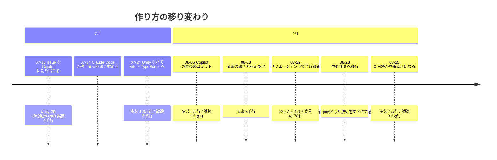
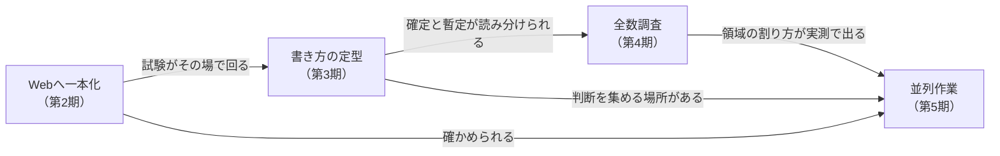

# ここまでの育ち方

**このリポジトリは 2026-07-13 に始まり、6週間で 2,161 コミットになりました。** その間に**作り方そのものを4回変えています**——変えるたびに、前のやり方では回らなくなった理由がありました。

**今の仕組みは [`ParallelAgents.md`](./ParallelAgents.md) にあります。** この文書は、**そこへどうやって辿り着いたか**だけを扱います。

## 一目で

## 規模の推移

**測ったのは `git grep -c ''`（行数）で、当時の置き場に合わせています**（文書は `Documents/Design/` → `docs/`、定義は `Assets/StreamingAssets/` → `public/` → `src/assets/world-codex/` と動いています）。

| 日 | 実装 | 試験 | 文書 | 定義（YAML） |
| --- | --: | --: | --: | --: |
| 07-18 | 4,238 | 0 | 1,852 | 58 |
| 07-25 | 13,368 | 215 | 4,105 | 1,483 |
| 08-01 | 15,468 | 11,209 | 5,521 | 1,573 |
| 08-13 | 26,179 | 17,572 | 8,336 | 2,681 |
| 08-23 | 37,426 | 28,325 | 14,181 | 5,446 |
| 08-26 | 40,470 | 32,394 | 16,877 | 6,050 |

**試験が7月末に0から1.1万行へ跳ねています。** ここが折り返しで、**以後は試験が実装とほぼ同じ速さで伸びています**——後述のとおり、これが並列化の前提になりました。

## 第1期（07-13〜）issue を Copilot に割り当てる

**始まりは Unity 2D の Android アプリ**でした。C# のスクリプトと `Assets/` の骨組みがあり、`.github/copilot-instructions.md` が初日に置かれています。

**やり方**: issue を書いて Copilot に割り当て、上がってきたPRを見る。Copilot のコミットは初日に47件、07-20〜21 に77件と、**波が来ては止まる**形でした。

**変えた理由**: Claude Code が 07-14 から**設計文書のほうを書き始めます**。実装を割り当てる相手と、設計を詰める相手が別々になり、**設計が先に進むのに実装がそれを知らない**状態が生まれました。

## 第2期（07-24〜）Unity を捨て、Web へ一本化する

**07-24 に Unity プロジェクトを丸ごと削除**し、Vite + TypeScript + Vitest へ移りました（`2e7fad80` と `3455c3d2`）。同じ日に `src/domain` が生まれています。

**この判断が、以後の全部を決めました。**

- **試験がその場で回るようになりました**（Unity 上では回していません）。7月末に試験が1.1万行へ跳ねるのはこの直後です。
- **画面を実ブラウザで撮れるようになりました**（`run` skill が 07-24 に project skill として入ります）。
- **エージェントが「動かして確かめる」ことができるようになりました。** ここが無いと、後の並列化は成立しません——**確かめられないものは、並列にしても品質が揃いません。**

Copilot は 08-06 のコミットを最後に姿を消します。**追い出したのではなく、Claude Code 側だけで回るようになった**というのが実際の経過です。

## 第3期（08-13〜）書き方を定型にする

**08-13 に `DocumentStyle.md`** が入り、見出し・節番号・概要の定型・**実装状況と確定度の表記**が決まりました。

**変えた理由**: 文書が8千行を超え、**どれが決まったことで、どれが検討中なのかが読み分けられなくなった**ためです。ドキュメント先行で書いた設計は、実装済みの節と未実装の節が**同じ断定調で並びます。**

ここで入った `【確定】` の印が、後に**人間の判断を集める仕組み**（確定待ちの issue）の土台になります——**「覆すには人間の判断が要る」と宣言できる場所**が、先に必要でした。

## 第4期（08-22〜）サブエージェントで全数調査する

**08-22、`src` 配下の宣言を全部棚卸ししました**（`review/placement/`）。対象は **229ファイル / 約37,200行 / 宣言 4,178件**。1件ずつ「そこに居るのが適切か」を5段階で判定しています。翌 08-23 には**名前だけを見る調査**（`review/naming/`）も独立の観点として立ちました。

**やり方**: 1つのセッションが複数のサブエージェントへ領域を割り、結果を1箇所へ集める。**読むだけの作業なので衝突しません。**

**ここで分かったこと**が、次の期の設計を決めました。

- **領域を6つに割ると、1タスクの編集がだいたい1領域に収まる**（今の所有権の地図はこの調査の実測です）。
- **名前の妥当性は、他の観点の補足に混ぜると拾われない**（27件が実際にそうなりました）。だから独立の観点として立て直しています。

## 第5期（08-23〜）並列作業へ移行する

**08-23、価値観と取り決めを文字にしました。**

| 入れたもの | 何のために |
| --- | --- |
| `.claude/policies.md` ＋ 読み込むフック | **同じ問いを二度訊かない。** セッションは毎回まっさらなので、判断を置いておく場所が要る |
| `.claude/parallel-work.md` | 担当の割り方・PRの型・段の分け方 |
| **確定待ちの issue**（#656） | **チェックを付けるだけで答えになる**形で判断を集める |
| **司令塔の現在地**（#732、08-24） | いま何が走っているかを1箇所に置き、司令塔を引き継げるようにする |

**08-25 に見張り（`watch-prs.sh`）が入り、司令塔がシェルで待つ形になりました。** それまでは各セッションに自分のPRを見張らせていましたが、**見張りは自分を起こす道具を要求し、それらは自動承認できない**ので、そのまま人間のタップになっていました。

この日1日で、**同じ形の穴が5つ**見つかっています——どれも「気づけない」形をしていました。塞いだ結果は [`ParallelAgents.md`](./ParallelAgents.md) の10節にあります。

## なぜこの順番でしか進めなかったか

**後の段は、前の段が作ったものの上にしか立ちません。**

- **試験がその場で回らなければ、並列にしても品質が揃いません。** 確かめられないものを同時に3つ書くのは、間違いを3倍の速さで積むことです。
- **確定と暫定が読み分けられなければ、判断を集められません。** どれが訊くべきことかが決まりません。
- **領域の割り方が分からなければ、担当を配れません。** 6分割は思いつきではなく、229ファイルを数えた結果です。

**逆に、これらが揃った後は速く進みました。** 並列化してからの3日間（08-23〜08-26）で、実装は3千行・試験は4千行・文書は2.7千行増えています。

## 変えなかったもの

**作り方は4回変わりましたが、変えていない軸が2つあります。**

- **文書が先。** 07-14 の2件目のコミットが「世界記述YAML仕様書」です。実装より設計文書のほうが先に立ち、**今も仕様書が実装の拠り所**です。
- **人間は決めるだけ。** Copilot に割り当てていた頃から、**書くのは機械で、決めるのは人間**という分担は変わっていません。変わったのは**決めさせ方の手数**だけです——issue を書いて割り当てる形から、**チェックを1つ付ける形**まで下がりました。
