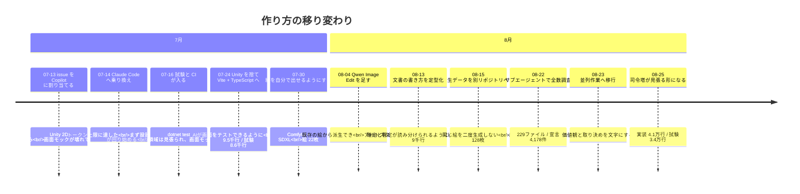
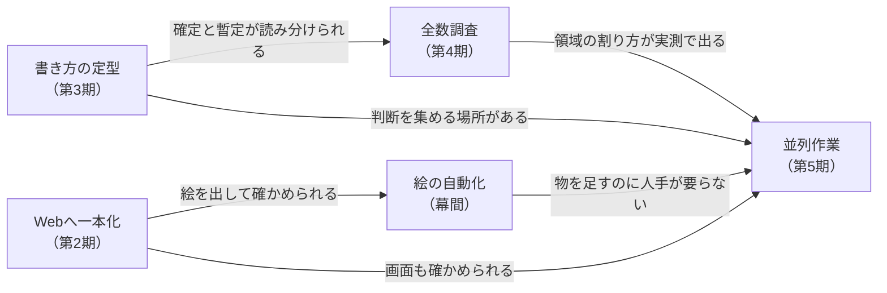

# ここまでの育ち方

**このリポジトリは 2026-07-13 に始まり、6週間で 2,273 コミットになりました。** その間に**作り方そのものを4回変えています**——変えるたびに、前のやり方では回らなくなった理由がありました。

**今の仕組みは [`ParallelAgents.md`](./ParallelAgents.md) にあります。** この文書は、**そこへどうやって辿り着いたか**だけを扱います。

## 一目で

**変えた理由は毎回「前のやり方では確かめられない」でした。** 画面が壊れたことを確かめられない
（第1期）→ 確定と暫定を読み分けられない（第3期）→ 宣言がどこに居るべきか数えられない（第4期）。

## 規模の推移

**測ったのは `git grep -c ''`（行数）で、その日の最終コミット（日本時間）を見ています。** 置き場は
C#期とTS期をまたぐので、**4つの列に何を入れたかを先に決めています。**

| 列 | C#期（〜07-24） | TS期（07-24〜） |
| --- | --- | --- |
| 実装 | `Assets/Scripts/**/*.cs` | `src/**/*.ts`（`*.test.ts` を除く） |
| 試験 | `Tests/**/*.cs` | `tests/**/*.ts` ＋ `src/**/*.test.ts` |
| 文書 | `Documents/**/*.md` | `docs/**/*.md` |
| 定義 | `Assets/StreamingAssets/**/*.yaml` | `public/**/*.yaml` → `src/assets/**/*.yaml` |

| 日 | 実装 | 試験 | 文書 | 定義（YAML） |
| --- | --: | --: | --: | --: |
| 07-18 | 4,337 | 4,300 | 2,043 | 63 |
| 07-25 | 9,454 | 8,596 | 4,438 | 1,527 |
| 08-01 | 15,506 | 11,381 | 5,498 | 1,851 |
| 08-13 | 26,885 | 18,583 | 9,000 | 3,151 |
| 08-23 | 38,447 | 29,038 | 14,307 | 6,656 |
| 08-26 | 41,166 | 33,622 | 15,456 | 7,349 |

**試験は最初から実装とほぼ同じ量あります。** 07-16 に `Tests/` と `dotnet test` のCIが同時に入り、
以後どの時点でも試験は実装の7割〜同量です。**跳ねた日はありません**——TS移行（07-24）でも、
[PR #166](https://github.com/gooyyu1/UnmappedIsland/pull/166) の本文が「**C#実装（Domain/Loader、
約4,600行）と NUnit テスト（約7,600行）を TypeScript/Vitest へ移植した**」と述べているとおり、
**移行は量の断絶ではなく置き換え**です。

**だから「試験が増えたことが並列化の前提になった」とは言えません。** 試験は並列化の5週間前から
CIで回っていて、**1人のエージェントに書かせるときにも同じだけ要ります**（この点は後述）。

## 第1期（07-13〜）issue を Copilot に割り当てる

**始まりは Unity 2D の Android アプリ**でした。C# のスクリプトと `Assets/` の骨組みがあり、`.github/copilot-instructions.md` が初日に置かれています。

**やり方**: issue を書いて Copilot に割り当て、上がってきたPRを見る。

**変えた理由は、画面モックが直るたびに壊れたことです。** 初日（07-13）だけで画面まわりのPRが**9本**上がっており、履歴にその跡がそのまま残っています。

| PR | 何が起きたか |
| --- | --- |
| #19 13:39 | 「キャラクターゾーンとステータスバーを左右配置に変更」（issue #18） |
| **#21 13:55** | **「#18 が壊した画面レイアウトを復旧」**——カレンダーが幅を占め切って天気タイルが約17px に、天気カードの高さがキャラクターゾーンを約44px に潰し、パネルの境界を内容がはみ出していた |
| #25・#27 | 向き別指定の統合、エリア名整理とレイアウト比率修正 |
| **#29 15:59 → 18:54** | **「全面的な作り直し」。3時間かけて、マージされずにクローズ。** 本文は「これまでの実装は複雑なCSS Gridの回避策に頼っていて、読み解くのも保守するのも難しかった」と述べている |

**壊す → 直す → 作り直す → 捨てる**が半日で1周しています。**時間とトークンだけが減り、画面は進みませんでした。**

**そして Copilot の月のトークン上限に達しました。** ここで Claude Code へ移っています。Claude Code は 07-14——**乗り換えの前日**——から設計文書のほうを書き始めており、しばらく**実装を割り当てる相手と、設計を詰める相手が別々**という形が続きます。

> **注**: この期の判断（モックの壊れ方に手を焼いたこと、トークン上限に達したこと）は**当事者の証言**で、リポジトリから読めるのは**PRの本数・題・時刻・クローズされた事実**までです。上の表はその範囲で裏付けが取れたものだけを並べています。

## 第2期（07-24〜）Unity を捨て、Web へ一本化する

**07-24 に Unity プロジェクトを丸ごと削除**し、Vite + TypeScript + Vitest へ移りました（`2e7fad80` と `3455c3d2`）。同じ日に `src/domain` が生まれています。

**目的は「AIが画面をテストできるようにすること」でした。** 第1期で分かったのは、**モックが壊れても誰も気づけない**ということです——人間が目で見るまで、壊れたことが分かりません。Unity のままでは、**AIが画面を出して確かめる道がありませんでした。**

**これが無ければ、画面の実装はそもそも任せられません。** 直したかどうかを確かめられない相手に画面を書かせると、第1期がずっと続きます。

**この判断が、以後の全部を決めました。**

- **画面を実ブラウザで撮れるようになりました**（`run` skill が同じ 07-24 に project skill として入ります）。**壊れたことがその場で分かります。**
- **試験と画面が、同じ実行環境に載りました。** 領域の試験は 07-16 から `dotnet test` でCIに載っていましたが、**画面はその外**で、HTMLモックを見張るものは何もありませんでした。移行で試験の量は増えていません（上の表）——増えたのは**試験が届く範囲**です。
- **エージェントが、画面まで含めて「動かして確かめる」ことができるようになりました。** ここが無いと、**並列かどうか以前に、画面を書かせること自体が成立しません**——第1期がそれです。

Copilot のコミットは 08-06 が最後です（CIワークフローの修正2件）。**実装の割り当て先としては、07-17 の `on_max` 実装で終わっています。**

## 幕間（07-30〜08-15）絵を自動で作れるようにする

**期の区切りとは別に、ここが通っていないと全部が止まります。** 物を1つ足すたびに絵が要るので、
**絵だけ人手だと、コンテンツの追加がそこで詰まります。**

| 日 | 何をしたか | それで何ができるようになったか |
| --- | --- | --- |
| **07-30** | ComfyUI の手順を skill にし、Flux と SDXL を比べて **SDXL に統一** | エージェントが**自分で絵を出せる**ようになった。Flux を捨てたのは**生成画像が非商用**だから（SDXL 1.0 base は OpenRAIL++-M で商用可）。1枚8〜12秒 |
| 07-31 | レーン背景のシームレス化・9patch 化を、生成の後処理として作り込む | 出た絵を**そのまま使える形**にするところまで自動になった |
| **08-04** | **Qwen Image Edit を導入**（`tools/comfyui/qwen_edit.py`） | **既存の絵から派生**できるようになり、アートスタイルが揃った。**SDXL が持っていない被写体・構図**も作れる。1枚80〜110秒 |
| **08-15** | 生データを別リポジトリ **[UnmappedIsland-art-raw](https://github.com/gooyyu1/UnmappedIsland-art-raw)** へ分ける | **同じ入力の絵は二度生成しない。** 後処理を詰め直すだけなら ComfyUI が要らない |

**絵の枚数**: 07-31 に22枚 → 08-15 に128枚 → 08-26 に161枚。

### なぜ「生データを別リポジトリへ」が効いたか

**絵は1枚1MB前後で、全部で180MB近くになります。** 本体へ入れると clone が重くなり、**セッションを
立てるたびにその重さを払う**ことになります。

分けたことで、`build.py` は**生成の前に置き場へ訊き、同じ入力の絵が既にあれば ComfyUI へ投げません。**
Qwen Image Edit は1枚90秒〜15分かかるので、**後処理を1行直すたびにそれを払うかどうか**の差になります。

**同じ入力・同じ seed なら、プロセスを跨いでもバイト一致で再現されます。** だから「取っておく」ことに
意味があります——再現できない生成物を取っておいても、それは**ただのキャッシュ**です。

### 選び方の軸は、ここでも同じでした

- **Flux を捨てたのはライセンス**（非商用）。**絵が綺麗かどうかでは選んでいません。**
- **Qwen を足したのは、SDXL では出せない被写体があったから。** skill には「**SDXLが持っていない被写体は、
  何枚振っても出ない**」と実例つきで書いてあります——**振り直しで解決しないものを、振り直しで解決しようと
  しない**ための記録です。
- **生データを分けたのは、確かめ直す速さのため。** ここでも速さそのものではなく、**確かめ直せること**が
  理由になっています。

## 第3期（08-13〜）書き方を定型にする

**08-13 に `DocumentStyle.md`** が入り、見出し・節番号・概要の定型・**実装状況と確定度の表記**が決まりました。

**変えた理由**: 文書が9千行に達し、**どれが決まったことで、どれが検討中なのかが読み分けられなくなった**ためです。ドキュメント先行で書いた設計は、実装済みの節と未実装の節が**同じ断定調で並びます。**

ここで入った `【確定】` の印が、後に**人間の判断を集める仕組み**（確定待ちの issue）の土台になります——**「覆すには人間の判断が要る」と宣言できる場所**が、先に必要でした。

## 第4期（08-22〜）サブエージェントで全数調査する

**08-22、`src` 配下の宣言を全部棚卸ししました**（`review/placement/`）。対象は **229ファイル / 約37,200行 / 宣言 4,178件**。1件ずつ「そこに居るのが適切か」を5段階で判定しています。翌 08-23 には**名前だけを見る調査**（`review/naming/`）も独立の観点として立ちました。

**やり方**: 1つのセッションが複数のサブエージェントへ領域を割り、結果を1箇所へ集める。**読むだけの作業なので衝突しません。**

**ここで分かったこと**が、次の期の設計を決めました。

- **領域を6つに割ると、1タスクの編集がだいたい1領域に収まる**（今の所有権の地図はこの調査の実測です）。
- **名前の妥当性は、他の観点の補足に混ぜると拾われない**（27件が実際にそうなりました）。だから独立の観点として立て直しています。

## 第5期（08-23〜）並列作業へ移行する

**08-23、価値観と取り決めを文字にしました。**

| 入れたもの | 何のために |
| --- | --- |
| `.claude/policies.md` ＋ 読み込むフック | **同じ問いを二度訊かない。** セッションは毎回まっさらなので、判断を置いておく場所が要る |
| `.claude/parallel-work.md` | 担当の割り方・PRの型・段の分け方 |
| **確定待ちの issue**（#656） | **チェックを付けるだけで答えになる**形で判断を集める |
| **司令塔の現在地**（#732、08-24） | いま何が走っているかを1箇所に置き、司令塔を引き継げるようにする |

**08-25 に見張り（`watch-prs.sh`）が入り、司令塔がシェルで待つ形になりました。** それまでは各セッションに自分のPRを見張らせていましたが、**見張りは自分を起こす道具を要求し、それらは自動承認できない**ので、そのまま人間のタップになっていました。

この日1日で、**同じ形の穴が5つ**見つかっています——どれも「気づけない」形をしていました。塞いだ結果は [`ParallelAgents.md`](./ParallelAgents.md) の10節にあります。

## なぜこの順番でしか進めなかったか

**並列作業は、それ以前の段が作ったもの全部の上に立っています。** 逆に、**すべての段が一列に並んで
いるわけではありません**——書き方の定型（第3期）は、Webへ一本化したこと（第2期）とは独立に、
文書が積み上がったことから来ています。

- **確かめられなければ、書かせても進みません。** 第1期はこれで止まりました——**壊れたことが人間の目にしか見えないと、直しても直った証拠が出ません。**
- **絵が人手のままなら、並列にしても詰まります。** 物を1つ足すたびに絵が要るので、**そこだけ人間を通すと、何本流しても待ち行列が1本に戻ります。**
- **確定と暫定が読み分けられなければ、判断を集められません。** どれが訊くべきことかが決まりません。
- **領域の割り方が分からなければ、担当を配れません。** 6分割は思いつきではなく、229ファイルを数えた結果です。

### 1人でも要るものと、並列で初めて要るもの

**上の図が言っているのは順番だけで、「前の段は並列のために在った」という意味ではありません。**

**試験・画面を確かめる道・絵の自動化は、エージェントに書かせる時点で要ります**——1人でも同じです。
試験に至っては並列化の5週間前（07-16）から回っており、**並列化が足したものは1行もありません。**

**並列で初めて要ったのは、[`ParallelAgents.md`](./ParallelAgents.md) 1節の4つ**——衝突しないこと・
判断を集めること・品質が揃うこと・失敗が見えることです。試験がここに関わるとすれば量ではなく、
**壊れたときの届く先**のほうです。1人なら次の一手で気づくものが、同時に走っていると、気づく前に
他の作業がその上へ積まれます。だから並列で足したのは試験そのものではなく、**人を通さずに必ず走る
こと**（CIの許可リストを外し、どのファイルを触っても4つの検査が走る）と、**揃わない所を検査に
変えること**（同 10節）です。

**逆に、これらが揃った後は速く進みました。** 並列化してからの3日間（08-23〜08-26）で、実装は2.7千行・試験は4.6千行・文書は1.1千行増えています。

## 変えなかったもの

**作り方は4回変わりましたが、変えていない軸が2つあります。**

- **文書が先。** 07-14 の2件目のコミットが「世界記述YAML仕様書」です。実装より設計文書のほうが先に立ち、**今も仕様書が実装の拠り所**です。
- **人間は決めるだけ。** Copilot に割り当てていた頃から、**書くのは機械で、決めるのは人間**という分担は変わっていません。変わったのは**決めさせ方の手数**だけです——issue を書いて割り当てる形から、**チェックを1つ付ける形**まで下がりました。

**そして、変えるときの決め手も毎回同じでした。** 相手を替えたのも（第1期）、土台を捨てたのも（第2期）、
書き方を縛ったのも（第3期）、**「今のままでは確かめられない」から**です。**速さで選んだことは一度も
ありません**——速さは、確かめられるようになった後から付いてきました。
