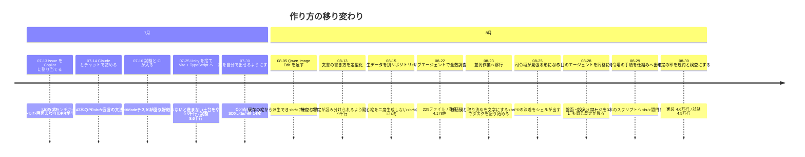
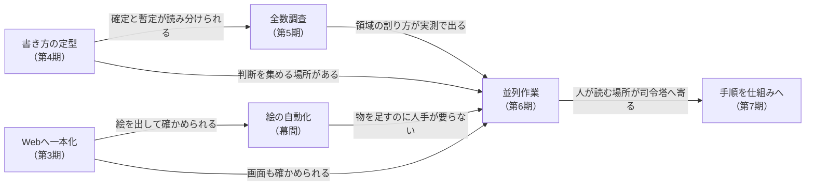

# ここまでの育ち方

**このリポジトリは 2026-07-13 に始まり、7週間で 2,500 コミットになりました。** その間に**作り方そのものを6回変えています**。

**今の仕組みは [`ParallelAgents.md`](./ParallelAgents.md) にあります。** この文書は、**そこへどうやって辿り着いたか**だけを扱います。

## 一目で



## 何を減らそうとして変えてきたか

**変えてきた動機は、どれも「人間の手数を減らして、同時に流せる量を増やす」ことです。**
減らす相手は毎回違いました。

| 変えたこと | 減らしたかった手数 |
| --- | --- |
| issue を書いて割り当てる → チャットで詰める（第2期） | **1往復ごとに issue を書き直す手間。** 細かい訂正がその場で返せて、判断が要るところは相談できる |
| Unity → Web（第3期） | **人間がGUIを操作しないと進まないこと。** エージェントに渡せるのがコードだけだった |
| 絵を人手 → 自動（幕間） | **物を1つ足すたびに絵を作る手数** |
| 書き方を定型にする（第4期） | **「これは決まったことか」を毎回訊かれること** |
| 並列作業（第6期） | **1本ずつ順番に流すこと。** 待っている間、人間も待つ |
| 司令塔の手順を仕組みへ（第7期） | **決着したPRを人が読んで振り分けること** |

**「AIが確かめられない」ことを潰したのも、このうちの1つでした**——確かめられないものは人間が
確かめるしかないので、そこがそのまま人間の手数になります。ただし**全部がそこから来たわけでは
ありません。** 上の表のうち、確かめられるかどうかの話なのは Web への一本化（の一部）と、
書き方の定型だけです。

## 規模の推移

**この表は手で埋めません。** `npm run stats:history`（[`scripts/historyStats.mjs`](../scripts/historyStats.mjs)）に
日付を渡すと、そのまま出ます。

```
npm run stats:history -- 2026-07-18 2026-07-25 2026-08-01 2026-08-13 2026-08-23 2026-08-26 2026-08-30
```

**測っているのは、その日の最終コミット（日本時間）の状態です。** 行数は `git grep -c ''`。置き場は
C#期とTS期をまたぐので、**両方を合併した1つの式で数えています。**

| 列 | C#期（〜07-25） | TS期（07-25〜） |
| --- | --- | --- |
| 実装 | `Assets/Scripts/**/*.cs` | `src/**/*.ts`（`*.test.ts` を除く） |
| 試験 | `Tests/**/*.cs` | `tests/**/*.ts` ＋ `src/**/*.test.ts` |
| 文書 | `Documents/**/*.md` | `docs/**/*.md` |
| 定義 | `Assets/StreamingAssets/**/*.yaml` | `public/**/*.yaml` → `src/assets/**/*.yaml` |

| 日 | 実装 | 試験 | 文書 | 定義 | issue | PR | 1PRあたり | 文書と実装が同じPR |
| --- | --: | --: | --: | --: | --: | --: | --: | --: |
| 07-18 | 4,337 | 4,300 | 2,043 | 63 | 18 | 48 | 8.9ファイル / 610行 | 29% |
| 07-25 | 9,454 | 8,596 | 4,438 | 1,527 | 48 | 124 | 13.4ファイル / 1,020行 | 32% |
| 08-01 | 15,506 | 11,381 | 5,498 | 1,851 | 48 | 210 | 13.9ファイル / 859行 | 62% |
| 08-13 | 26,885 | 18,583 | 9,000 | 3,151 | 51 | 369 | 11.1ファイル / 326行 | 69% |
| 08-23 | 38,447 | 29,038 | 14,307 | 6,656 | 58 | 589 | 19.0ファイル / 529行 | 60% |
| 08-26 | 41,166 | 33,622 | 15,456 | 7,349 | 152 | 699 | 5.0ファイル / 229行 | 44% |
| 08-30 | 45,837 | 44,896 | 17,906 | 10,893 | 330 | 851 | 6.6ファイル / 240行 | 56% |

**PR は `main` へ入った累計**（マージコミットと squash の両方を数え、司令塔が `main` へ直接
push した分は入りません）。**1PRあたりと「同じPR」の割合は、1つ上の行からの区間の平均**です。

### issue の数とPRの数は、成果ではなく方式の記録

**issue が 08-23 の58件から08-30の330件へ跳ねているのは、仕事が6倍になったからではありません。**
この日から**タスクをissueで配り始めた**（第6期）ためで、数はやり方の名残です。**多いほうが良い
ものではありません。**

**PRの数も、単独では読めません。** 07-25 の週は1本あたり **13.4ファイル・1,020行**でしたが、
並列化してからは **5〜7ファイル・230〜240行**です。**1本が3〜4分の1になっているので、本数が
増えたぶんがそのまま量ではありません。** 1つのタスクを1セッションが持つ形にしたことで、PRの
粒が「1セッションで片付く大きさ」に揃ったのがこの列です。

### 試験は最初から実装とほぼ同じ量ある

07-16 に `Tests/` とCIが同時に入り、以後どの時点でも試験は実装の7割〜同量です。**跳ねた日は
ありません**——TS移行でも、[PR #166](https://github.com/gooyyu1/UnmappedIsland/pull/166) の本文が
「**C#実装（Domain/Loader、約4,600行）と NUnit テスト（約7,600行）を TypeScript/Vitest へ
移植した**」と述べているとおり、**移行は量の断絶ではなく置き換え**です。

**だから「試験が増えたことが並列化の前提になった」とは言えません。** 試験は並列化の5週間前から
CIで回っていて、**1人のエージェントに書かせるときにも同じだけ要ります**（この点は後述）。

## 第1期（07-13〜07-21）issue を Copilot に割り当てる

**始まりは Unity 2D の Android アプリ**でした。C# のスクリプトと `Assets/` の骨組みがあり、`.github/copilot-instructions.md` が初日に置かれています。

**やり方**: issue を書いて Copilot に割り当て、上がってきたPRを見る。1つの issue に1本のブランチが立ち、**1本のPRで終わります。**

**この形の重さは、初日の画面まわりにそのまま出ています。** 07-13 だけで画面まわりのPRが**9本**上がりました。

| PR | 何が起きたか |
| --- | --- |
| #19 13:39 | 「キャラクターゾーンとステータスバーを左右配置に変更」（issue #18） |
| **#21 13:55** | **「#18 が壊した画面レイアウトを復旧」**——カレンダーが幅を占め切って天気タイルが約17px に、天気カードの高さがキャラクターゾーンを約44px に潰し、パネルの境界を内容がはみ出していた |
| #25・#27 | 向き別指定の統合、エリア名整理とレイアウト比率修正 |
| **#29 15:59 → 18:54** | **「全面的な作り直し」。3時間かけて、マージされずにクローズ。** 本文は「これまでの実装は複雑なCSS Gridの回避策に頼っていて、読み解くのも保守するのも難しかった」と述べている |

**壊す → 直す → 作り直す → 捨てる**が半日で1周しています。**直すたびに issue を書き直すのは人間**なので、この1周は丸ごと人間の手数でした。

**割り当ては 07-21 まで続いています**（`copilot/` から `main` へ入ったPRは 07-13 に12本・07-14 に5本・07-18 に1本・07-20 に5本・**07-21 に24本**）。C#領域のカプセル化、`containers.yaml` の整理、CIの整備まで幅広く任せています。その後は 08-05 に1本、08-07 にCI修正2本で、いったん途切れました。

> **注**: この期の判断（モックの壊れ方に手を焼いたこと、Copilot のトークン上限に達したこと）は**当事者の証言**で、リポジトリから読めるのは**PRの本数・題・時刻・クローズされた事実**までです。上の表はその範囲で裏付けが取れたものだけを並べています。

## 第2期（07-14〜）Claude とチャットで文法を詰める

**07-14 22:53、`claude/japanese-instruction-6nfcpe` という1本のブランチが立ち、07-20 22:38 までに
そこから43本のPRが `main` へ入りました。** 1つのブランチにPRを積み続ける形は、**1つのチャットが
続いている**ことの跡です。

**ここで宣言の文法が形になりました。** 順に、効果システムの設計 → 世界記述YAML仕様書 →
`effects` を対象キーの辞書型へ → `modify` を self/parent/child で共通化 → `accumulate`・
passive/active・`on_zero` の導入 → YAML定義ドキュメントを文法リファレンスへ、と積み上がっています。

**issue を書いて渡す形との違いは、往復の細かさです。** issue では1往復が「issue を書く →
PRを見る」になり、**言い直しのたびに文章を書き直すのは人間**でした。チャットでは訂正がその場で
返せて、**自分だけでは決められないところを相談しながら決められます。** 文法のように「どちらでも
動くが、後で全部に効く」判断が続く仕事では、ここが効きました。

**第1期と第2期は重なっています。** 07-14 から 07-21 までの8日間は、Copilot への割り当てと
チャットが並走していました。**片方へ乗り換えた日はありません。**

## 第3期（07-25〜）Unity を捨て、Web へ一本化する

**07-25 に Vite + TypeScript + Vitest の足場が入り（`2e7fad80`）、同じ日に Unity プロジェクトを
丸ごと削除しました（`3455c3d2`）。** `src/domain` も同じ日に生まれています。

**理由は、Unity が GUI 操作を前提にしていることです。** シーンやプレハブの組み立て、実行、
確認が Unity エディタの中にあり、**エージェントに渡せるのはコードだけ**でした。残りは全部
人間の手に残るので、**どれだけ書かせても、そこで詰まります。**

**移行先を選ぶときには、画面表示を確かめられるかを調べています。** ただしそれは**選定の条件**で
あって、移行そのものの理由ではありません。結果として、次の2つが同時に手に入りました。

- **画面を実ブラウザで撮れるようになりました**（`run` skill が移行の直後 07-25 に project skill として入ります）。**壊れたことがその場で分かります。**
- **試験と画面が、同じ実行環境に載りました。** 領域の試験は 07-16 からCIに載っていましたが、**画面はその外**で、HTMLモックを見張るものは何もありませんでした。移行で試験の量は増えていません（上の表）——増えたのは**試験が届く範囲**です。

**移植にはサブエージェントを並べています。** メインのエージェントが規約を書き、それをサブへ
徹底させる形です。[PR #166](https://github.com/gooyyu1/UnmappedIsland/pull/166) の本文が、
「TypeScriptコーディング規約を `Documents/Engine/CodingConventions.md` に新設（**複数エージェント
での並行移植でもスタイルが揃うよう**、機械的検査で担保できない規約のみを明文化）」と書いています。
**1本のPRで247ファイル・18,573行の追加と17,273行の削除**が入りました。

**「規約を先に書いて、書く相手を増やす」形は、ここが最初です。** 後の並列作業（第6期）で
`.claude/parallel-work.md` がやっていることと、狙いは同じです。

## 幕間（07-30〜08-15）絵を自動で作れるようにする

**期の区切りとは別に、ここが通っていないと全部が止まります。** 物を1つ足すたびに絵が要るので、
**絵だけ人手だと、コンテンツの追加がそこで詰まります。**

| 日 | 何をしたか | それで何ができるようになったか |
| --- | --- | --- |
| **07-30** | ComfyUI の手順を skill にし、Flux と SDXL を比べて **SDXL に統一** | エージェントが**自分で絵を出せる**ようになった。Flux を捨てたのは**生成画像が非商用**だから（SDXL 1.0 base は OpenRAIL++-M で商用可）。1枚8〜12秒 |
| 07-31 | レーン背景のシームレス化・9patch 化を、生成の後処理として作り込む | 出た絵を**そのまま使える形**にするところまで自動になった |
| **08-05** | **Qwen Image Edit を導入**（`tools/comfyui/qwen_edit.py`） | **既存の絵から派生**できるようになり、アートスタイルが揃った。**SDXL が持っていない被写体・構図**も作れる。1枚80〜110秒 |
| **08-15** | 生データを別リポジトリ **[UnmappedIsland-art-raw](https://github.com/gooyyu1/UnmappedIsland-art-raw)** へ分ける | **同じ入力の絵は二度生成しない。** 後処理を詰め直すだけなら ComfyUI が要らない |

**絵の枚数**: 07-31 に14枚 → 08-15 に131枚 → 08-30 に178枚（`src/assets/**` の画像。`docs/ui` の画面写真は数えていません）。

### なぜ「生データを別リポジトリへ」が効いたか

**生データは1枚1.2MB前後で、207枚・244MBあります**（[UnmappedIsland-art-raw](https://github.com/gooyyu1/UnmappedIsland-art-raw)・08-30）。本体へ入れると clone が重くなり、**セッションを
立てるたびにその重さを払う**ことになります。本体に入っているのは後処理を通した178枚・39MBです。

分けたことで、`build.py` は**生成の前に置き場へ訊き、同じ入力の絵が既にあれば ComfyUI へ投げません。**
Qwen Image Edit は1枚90秒〜15分かかるので、**後処理を1行直すたびにそれを払うかどうか**の差になります。

### 選び方の軸

- **Flux を捨てたのはライセンス**（非商用）。**絵が綺麗かどうかでは選んでいません。**
- **Qwen を足したのは、SDXL では出せない被写体があったから。** skill には「**SDXLが持っていない被写体は、
  何枚振っても出ない**」と実例つきで書いてあります——**振り直しで解決しないものを、振り直しで解決しようと
  しない**ための記録です。
- **生データを分けたのは、確かめ直す速さのため。**

## 第4期（08-13〜）書き方を定型にする

**08-13 に `DocumentStyle.md`** が入り、見出し・節番号・概要の定型・**実装状況と確定度の表記**が決まりました。

**変えた理由**: 文書が9千行に達し、**どれが決まったことで、どれが検討中なのかが読み分けられなくなった**ためです。ドキュメント先行で書いた設計は、実装済みの節と未実装の節が**同じ断定調で並びます。**

**読み分けられないと、エージェントは毎回訊きに来ます。** ここで入った `【確定】` の印が、後に
**人間の判断を集める仕組み**（確定待ちの issue）の土台になります——**「覆すには人間の判断が要る」と
宣言できる場所**が、先に必要でした。

## 第5期（08-22〜）サブエージェントで全数調査する

**08-22、`src` 配下の宣言を全部棚卸ししました**（`review/placement/`）。対象は **229ファイル / 約37,200行 / 宣言 4,178件**。1件ずつ「そこに居るのが適切か」を5段階で判定しています。翌 08-23 には**名前だけを見る調査**（`review/naming/`）も独立の観点として立ちました。

**やり方**: 1つのセッションが複数のサブエージェントへ領域を割り、結果を1箇所へ集める。**読むだけの作業なので衝突しません。** 第3期の移植と同じ形を、調べる側で使っています。

**ここで分かったこと**が、次の期の設計を決めました。

- **領域を6つに割ると、1タスクの編集がだいたい1領域に収まる**（今の所有権の地図はこの調査の実測です）。
- **名前の妥当性は、他の観点の補足に混ぜると拾われない**（27件が実際にそうなりました）。だから独立の観点として立て直しています。

## 第6期（08-23〜）並列作業へ移行する

**08-23、価値観と取り決めを文字にしました。**

| 入れたもの | 何のために |
| --- | --- |
| `.claude/policies.md` ＋ 読み込むフック | **同じ問いを二度訊かない。** セッションは毎回まっさらなので、判断を置いておく場所が要る |
| `.claude/parallel-work.md` | 担当の割り方・PRの型・段の分け方 |
| **確定待ちの issue**（#656） | **チェックを付けるだけで答えになる**形で判断を集める |
| **司令塔の現在地**（#732、08-24） | いま何が走っているかを1箇所に置き、司令塔を引き継げるようにする |

**ここで issue の役割が変わりました。** それまでの issue は「Copilot へ渡す仕事」で、始まってから
1か月（08-13 まで）で51件しかありません。**タスクを配る器にしてからの1週間で、270件以上
増えています**（上の表）。

**08-25 に見張り（`watch-prs.sh`）が入り、司令塔がシェルで待つ形になりました。** それまでは各セッションに自分のPRを見張らせていましたが、**見張りは自分を起こす道具を要求し、それらは自動承認できない**ので、そのまま人間のタップになっていました。

この日1日で、**同じ形の穴が5つ**見つかっています——どれも「気づけない」形をしていました。塞いだ結果は [`ParallelAgents.md`](./ParallelAgents.md) の10節にあります。

## 第7期（08-28〜）司令塔の手順を仕組みへ出す

**並列で流せるようになった後、残った人間の手数は司令塔の側にありました。** 見張りが決着を出しても、
**振り分け・マージ・後片付け・レビューは人が順に叩く**ままだったからです。

| 日 | 入れたもの | 出した手数 |
| --- | --- | --- |
| **08-28** | `.github/extensions/session-bootstrap`・`copilot-setup-steps.yml` | **Copilot CLI にも同じ既定（価値観の読み込み・自動整形）が載り、2つ目のエージェントが同格になった。** 見張りと待ちの道具も、エージェントを選ばない `scripts/agent/` へ集約 |
| 08-28 | 生成物の作り直しワークフロー（#1010・#1015） | **古い生成物のまま `main` に入ったら、ワークフローが作り直して push する** |
| **08-29** | `board.sh`・`dispatch-task.sh`・`merge-and-close.sh`（#1039） | 司令塔が毎回同じ順で叩いていた手順を3本へ畳んだ。**マージから issue の確認・セッションの畳み・本体の追随まで、判断のない部分が1コマンドになる** |
| **08-29** | `needs-user-review.sh`・`dispatch-review.sh` ＋ `.claude/review-prompt.md` | **関門とレビューが機械で引けるようになった。** 宣言文法や `【確定】` の印に触るPRは自動で止まり、レビューは専用セッションへ出て結果がPRのコメントで返る——**司令塔が差分を読まずに振り分けられる** |
| **08-30** | `【確定】` の射程・中身・出どころ・権限の規約と検査（[#1185](https://github.com/gooyyu1/UnmappedIsland/issues/1185)） | 印の中に**ユーザーが判断していないものが混ざる**経路を塞いだ。第4期で入れた印を、**機械で守れる形**へ作り直したもの |

**この期の変更には、確かめられるかどうかの話が1つもありません。** 減らしているのは、
**決着したものを人が読んで次へ渡す手数**だけです。

## 段はどう積み上がったか

**並列作業は、それ以前の段が作ったもの全部の上に立っています。** ただし、**すべての段が一列に
並んでいるわけではありません**——書き方の定型（第4期）は、Webへ一本化したこと（第3期）とは
独立に、文書が積み上がったことから来ています。



- **人間がGUIを操作しないと進まないなら、何本流しても人間の速さで進みます。** 第3期はこれを外しました。
- **絵が人手のままなら、並列にしても詰まります。** 物を1つ足すたびに絵が要るので、**そこだけ人間を通すと、何本流しても待ち行列が1本に戻ります。**
- **確定と暫定が読み分けられなければ、判断を集められません。** どれが訊くべきことかが決まりません。
- **領域の割り方が分からなければ、担当を配れません。** 6分割は思いつきではなく、229ファイルを数えた結果です。
- **並列にして初めて、司令塔の手数が全体の上限になりました。** 第7期はそこを削っています。

### 1人でも要るものと、並列で初めて要るもの

**上の図が言っているのは順番だけで、「前の段は並列のために在った」という意味ではありません。**

**試験・画面を確かめる道・絵の自動化は、エージェントに書かせる時点で要ります**——1人でも同じです。
試験に至っては並列化の5週間前（07-16）から回っており、**並列化が足したものは1行もありません。**

**並列で初めて要ったのは、[`ParallelAgents.md`](./ParallelAgents.md) 1節の4つ**——衝突しないこと・
判断を集めること・品質が揃うこと・失敗が見えることです。試験がここに関わるとすれば量ではなく、
**壊れたときの届く先**のほうです。1人なら次の一手で気づくものが、同時に走っていると、気づく前に
他の作業がその上へ積まれます。だから並列で足したのは試験そのものではなく、**人を通さずに必ず走る
こと**（CIの許可リストを外し、どのファイルを触っても4つの検査が走る）と、**揃わない所を検査に
変えること**（同 10節）です。

## 変えなかったもの

**作り方は6回変わりましたが、変えていない軸が2つあります。**

- **書く前に仕様を書く。** Claude Code が最初に書いたのは 07-14 22:47 の「効果システム設計ドキュメント」で、次が「世界記述YAML仕様書」（07-15 00:11）です。今も仕様書が実装の拠り所です。
- **人間は決めるだけ。** Copilot に割り当てていた頃から、**書くのは機械で、決めるのは人間**という分担は変わっていません。変わったのは**決めさせ方の手数**だけです——issue を書いて割り当てる形から、**チェックを1つ付ける形**まで下がりました。

### 「文書が先」はウォーターフォールではない

**先に書くのは、その機能の仕様だけです。** 書いたらすぐ実装へ移り、次の機能でまた書きます。
**全部の設計を終えてから実装に入ったことはありません。**

表の右端の列がそれです——**PRの51〜69%が、文書と実装（試験を含む）を1本のPRの中で触っています。**
仕様と実装が別々の期に分かれているなら、この割合は上がりません。上がり切らずに5〜7割で
止まっているのは、**仕様だけ・実装だけのPRも常に混ざっている**からで、これも段階が分かれて
いないことの現れです。

第2期の43本のPRが、この形の最初の実例です。「効果システムの設計」の次が「`modify` 効果を
self/parent/child で共通化」、「レシピシステムの設計」の次がその実装、という並びになっています。
