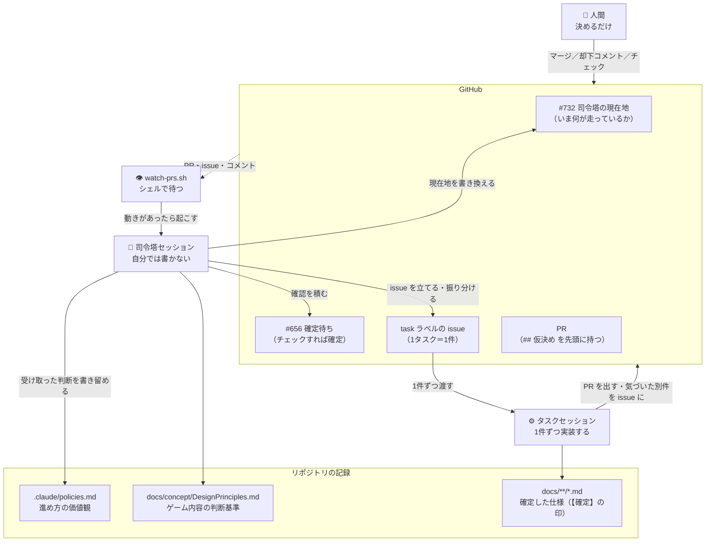
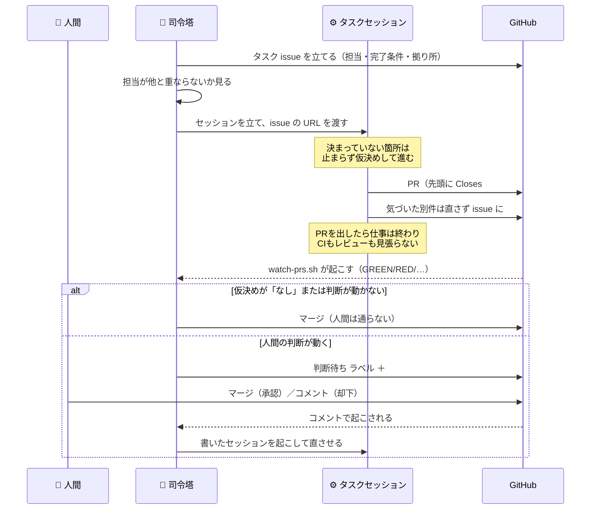
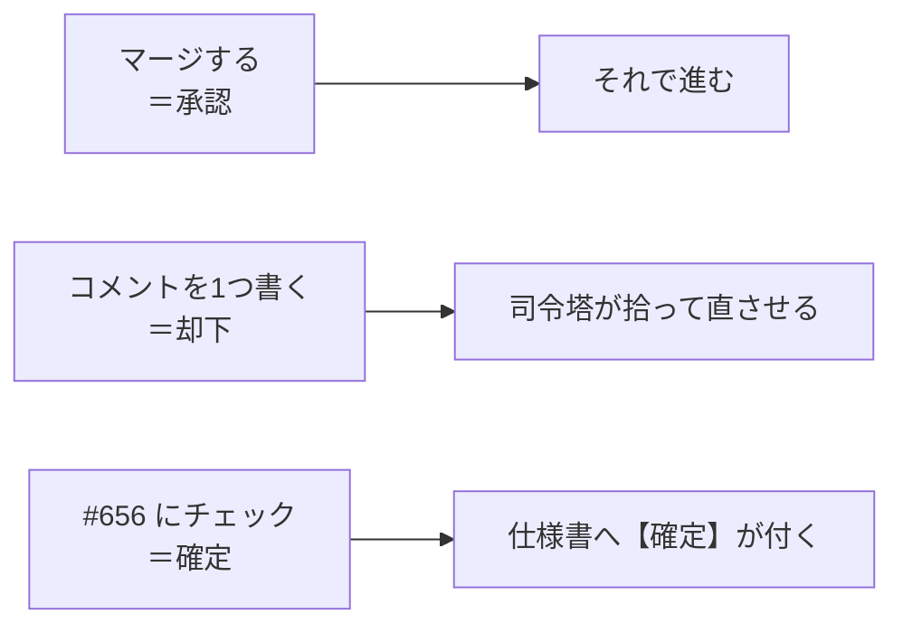

# 並列作業の全体像

**このゲームは、複数のAIエージェントが同時に開発しています。** この文書は、その仕組みが**何でできていて、何がどう流れるのか**を人間の読み手へ示します。

**規則そのものは [`.claude/parallel-work.md`](../.claude/parallel-work.md) が持ちます。** あちらはエージェントが従う取り決めで、こちらは全体像だけを扱います——同じ説明を二度書かないため、細かい条件はあちらへのリンクに留めます。

## 1. 何が要るのか

1人で書くなら要らないものが3つ要ります。

- **衝突しないこと。** 同時に書く相手が居るので、担当が重なると互いの足元を壊します。
- **判断を集めること。** 決めるのは人間ですが、**人間の手数を最小にしないと使われなくなります**——指示はスマホから来ます。
- **失敗が見えること。** 取りこぼしは「気づけないこと」として現れるので、放っておくと**成功と区別が付きません。**

以下の登場人物は、全部この3つのために在ります。

## 2. 登場人物

**司令塔は自分では書きません。** 書くのはタスクセッションで、司令塔がやるのは**issue を立てる・振り分ける・PRを振り分ける・記録する**の4つです。

## 3. issue は3種類あり、役割が違う

**同じ「issue」でも、中身も寿命も読み手も違います。**

| 種類 | 例 | 何のためか | 誰が書き換えるか |
| --- | --- | --- | --- |
| **司令塔の現在地** | [#732](https://github.com/gooyyu1/UnmappedIsland/issues/732) | **いま何が走っていて、何があなた待ちか。** 新しい司令塔セッションはこのURLを貼れば引き継げる | 司令塔（本文を書き換える。PRもコミットも作らない） |
| **確定待ち** | [#656](https://github.com/gooyyu1/UnmappedIsland/issues/656) | **チェックを付けるだけで答えになる**問いを1件ずつ積む場所 | 司令塔が積み、人間がチェックする |
| **タスク** | `task` ラベル | **1件＝1セッション＝1ブランチ＝1PR。** 担当ファイル・完了条件・拠り所を書く | 司令塔かセッションが立てる |

**現在地を issue の本文に置くのは、PRにすると写しの履歴で埋まるからです。** 1日に何度も動く情報は、レビューの通り道に載せません。

### 確定待ちは「断定文」で書く

**「どうしますか」とは書けません。** 決まっていない箇所は仮決めして進むのが既定なので、具体的な案は常に手元にあります。だから**太字の1文が、そのまま仕様書へ書ける形**になっていて、人間は**同意するものにチェックを付けるだけ**で済みます。

**チェックが無いことは「否」ではありません**（見ていない・今は決めない、も同じ）。暫定が既定なので、放置されたままで何も壊れません。

## 4. 1つのタスクが流れる道

**PRを出したセッションは、そこで仕事が終わりです。** CIもレビューも見張らせません——見張らせると、自分を起こす道具が要り、**それらは自動承認できないので、そのまま人間のタップに化けます。** 待つのは、シェルで待てる司令塔の仕事です。

## 5. 人間が触るのは3箇所だけ

**却下がコメントなのは、GitHubのレビュー機能が使えないからです。** セッションは人間の資格情報で push するので、**PRの作者が全部その人になり**、自分のPRには Approve も Request changes も出せません。

**理由まで書かなくて構いません**——「−5 で」だけで足ります。足りなければ司令塔が訊きます。

## 6. 判断が要るかどうかは、書いた本人が申告する

**PRの先頭には必ず `## 仮決め` 節があります。** 「なし」と書くのも仕事のうちで、**書かせないと「仮決めが無かった」のか「書き忘れた」のかが区別できません。**

| `## 仮決め` の中身 | 扱い |
| --- | --- |
| 「なし」＋ CIが緑 | **司令塔がマージ。** 人間は通らない |
| 判断が動く仮決めあり | **`判断待ち` を付けて止める。** #732 の先頭へ1行 |
| 仮決めはあるが、既に決まったことの後始末だけ | **司令塔がマージし、理由をコメントに残す** |

**司令塔はこの節だけを見て振り分け、差分を読み直して判定しません。** 仮決めをしたのは書いた側で、材料もそちらにしか無いからです。

**決めきれなかった問いも同じ節に書かせます。** セッションは司令塔を起こせないので、**書かなければその問いは誰の目にも触れずに消えます**——実際に一度、「日暮れ後の戻り道に窯まで要求してよいか」という問いが最後の要約にだけ残り、そのまま入りました。

## 7. 衝突は「担当の列挙」で避ける

**タスク issue には担当ファイルを書き、触ってはいけないファイルは書きません**——列挙で補集合が決まります。

**1ファイル重なることは、直列にする理由になりません。** 変える箇所が別なら並列に流し、触らない箇所を指示で名指しします。重なりの度合いを見ずに直列へ落とすと、鎖が伸びた分がそのまま遅れになります。

領域の地図（`src/domain` / 生成とローダ / カードとUI / ウィンドウ / ゲーム組み立て / 解析と図鑑の6分割）は [`.claude/parallel-work.md`](../.claude/parallel-work.md) の「所有権の地図」にあります。

## 8. 待つ仕組み

司令塔は [`watch-prs.sh`](../.claude/watch-prs.sh) をバックグラウンドで走らせ、**動きがあった瞬間に1回だけ起きます。**

| 合図 | 意味 | 司令塔がすること |
| --- | --- | --- |
| `GREEN` | CIが通った | `## 仮決め` を見て振り分ける |
| `RED` | CIが落ちた | 書いたセッションを起こして直させる |
| `GONE` | 見張っていた issue が閉じた | そのセッションを畳む／次を投入する |
| `COMMENT` | PRか issue にコメントが付いた | 却下として拾う |
| `TASK` | 知らない issue が現れた | 拾うか、把握済みとして脇へ置く |

**待ちを終える条件は「動いているものが終わること」ではなく「やることが無いこと」です。** 前者だと、投入した全部が判断待ちで止まった瞬間に**何も起こらなくなり**、その間に積まれた仕事も誰の目にも触れません。

## 9. 受け取った判断は、その場で書き留める

**人間の考えは人間の頭の中にしかありません。** 同じことを二度訊かずに済むよう、**受け取った価値観はその場で記録し、次のセッション以降の既定にします。**

| 記録するもの | 置き場 | いつ読まれるか |
| --- | --- | --- |
| 進め方・設計・レビューの価値観 | [`.claude/policies.md`](../.claude/policies.md) | **セッション開始時に全文が自動で読み込まれる** |
| ゲーム内容の判断基準 | [`DesignPrinciples.md`](./concept/DesignPrinciples.md) | ゲーム内容の判断をするとき |
| 確定した個別の仕様 | 該当する仕様書（`【確定】` の印） | その領域を触るとき |

**書くのは「場面（AとB）・選ぶ方・重視していること」です。** 結論だけでは、字面の違う場面に効きません。

**記録するのは着手前です。** 着手後や応答の最後では、会話が要約された時点で判断の文脈が失われた後になります。

## 10. この仕組みが繰り返し踏んだ失敗

**どれも「気づけない」形で現れました。** 塞いだ結果は取り決めと道具に入っています。

| 起きたこと | なぜ気づけなかったか |
| --- | --- |
| 閉じた issue へセッションを立て、120分の空待ちに入りかけた | 見張りが**PRだけ**を見ていて、PRが出ないまま終わった場合に何も届かなかった |
| `docs/` しか触らないPRが誰にも拾われず残った | CIが走らないPRを「まだ決着していない」と見なし続けていた |
| 解析が黙って空を返し、レポートの節が丸ごと消えた | 検査は**値**を見ていたが、**表そのものが消えること**を誰も見ていなかった |
| 生成物と手書きの定数が、**互いにだけ一致**していた | どちらも今の定義を映していないのに、突き合わせる相手が互いだったので緑のままだった |
| 沈黙したセッションを死んだと判断し、同じ仕事を二重に書いた | セッションの状態が引けない状況で、**枝が push されていないか**を見なかった |

**「緑」は「壊れていない」と「見ていない」のどちらでもありえます。** だから見張りを足したときは、**実際に入力を壊して赤くなるのを見てから**報告する、という決まりがあります。

## 11. 使われない仕組みは、無いのと同じ

**人間に回す部分は最小にして、自己完結させます。**

- **人が関与せずに回る形にできるなら、そちらを選びます。** 関与が要るのは判断そのものだけです。
- **判断を仰ぐときは、リポジトリを開かずに答えられるだけの文脈を添えます。** 手元にあるからと省くと、**答えが返ってきません。**
- **タップを1回増やすだけの関門は、無いのと同じにします。** だから進捗の写しにはPRを作らず、判断が動かないPRは司令塔が通します。
