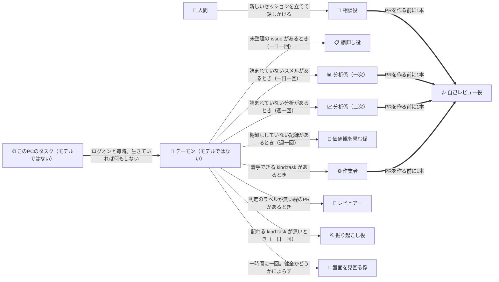
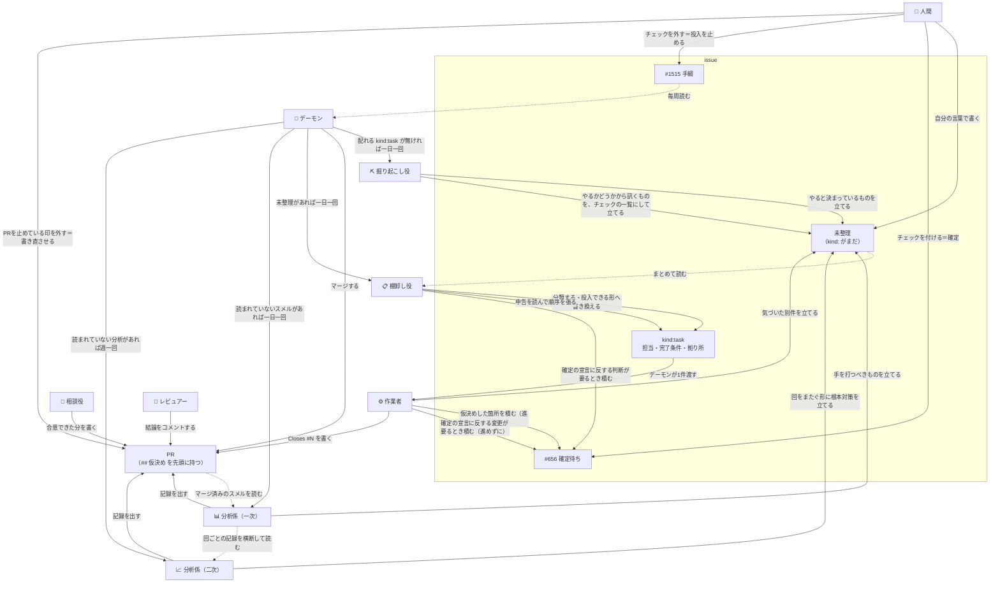
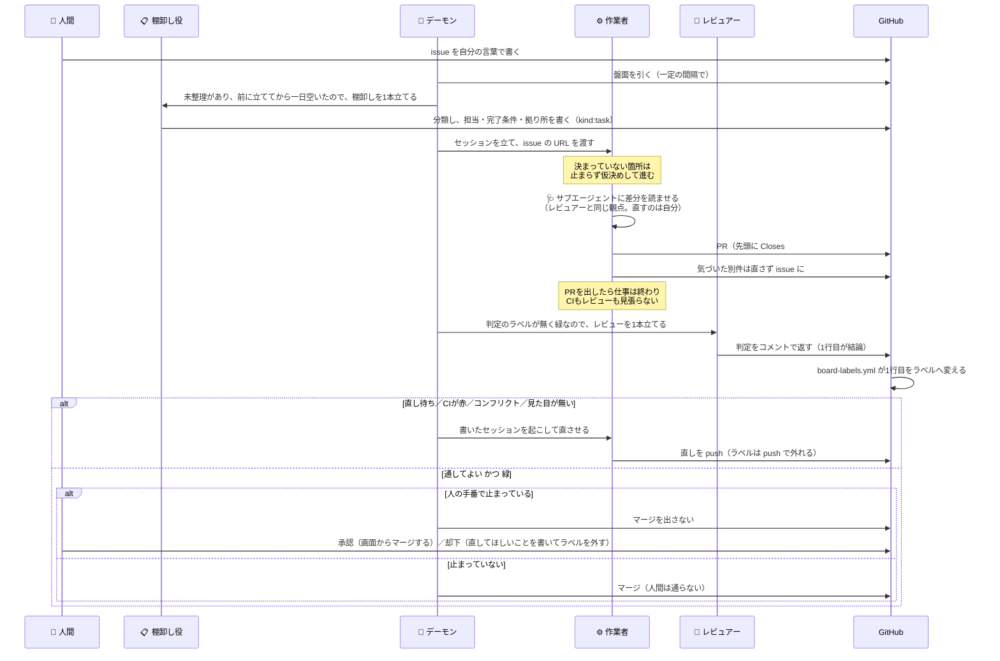
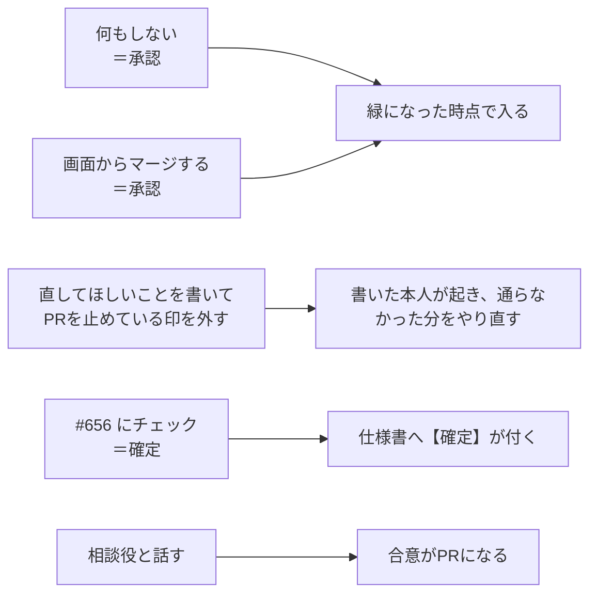
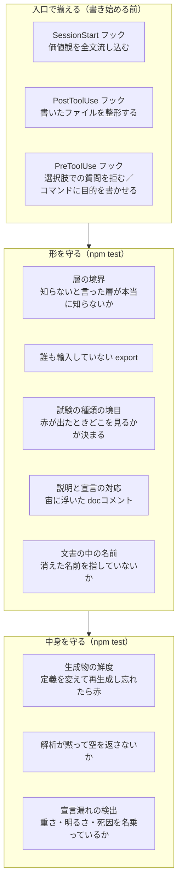

# 並列作業の全体像

**このゲームは、複数のAIエージェントが同時に開発しています。** この文書は、その仕組みが**何でできていて、何がどう流れるのか**を人間の読み手へ示します。

**規則そのものは [`.claude/parallel-work.md`](../.claude/parallel-work.md) が持ちます。** あちらはエージェントが従う取り決めで、こちらは全体像だけを扱います——同じ説明を二度書かないため、細かい条件はあちらへのリンクに留めます。

**この形へどうやって辿り着いたかは [`HowWeGotHere.md`](./HowWeGotHere.md)。** 作り方はそのつど変わっており、**並列作業はそれ以前の段が作ったもの全部の上に立っています。**
ただし**その多くは、並列のために作ったものではありません**——試験も、画面を確かめる道も、絵の
自動化も、1人のエージェントに書かせる時点で要ります。**これは種類の話で、量は別です**——盤面を
回す仕組みを試す分の試験は、並列化そのものが生んでいます。

## 1. 何が要るのか

要るのは、1人で書くなら要らないものです。

- **衝突しないこと。** 同時に書く相手が居るので、触る先が重なると互いの足元を壊します。
- **判断を集めること。** 決めるのは人間ですが、**人間の手数を最小にしないと使われなくなります**——指示はスマホから来ます。
- **品質が揃うこと。** 書き手が毎回違うので、**放っておけば揃いません**（10節）。人間なら「前もこう書いたから」で揃うところが、セッションは毎回まっさらです。
- **失敗が見えること。** 取りこぼしは「気づけないこと」として現れるので、放っておくと**成功と区別が付きません。**

**以下の登場人物と仕組みは、全部これらのために在ります。** 逆に言えば、**どれにも効かないものは置いていません。**

## 2. 登場人物 — どんなエージェントが居るか

**役を分けている基準は、やっていることではなく「何に書けるか」と「何で立つか」です。** 掘り起こし役と棚卸し役はどちらも読んで issue へ出す役ですが、**既にある issue を書き換えられるのは棚卸し役だけ**です（掘り起こし役が書けるのは、自分で立てる新しい issue だけです）。**下の表の4列目（どう走るか）は基準ではありません**——「何に書けるか」から出てくる帰結です（「立ち方は『何に書けるか』が決めている」）。

### 誰が誰を立てるか

**どれも、条件が出た瞬間に立ちます。** 相談役の条件は「**人間が相談したくなったこと**」で、そのとき人間はもうそこに居るので、機械の引き金を置いても待つだけになります。

**デーモンを起こす係と、盤面を見回る係は、立つ条件が背反です。** 前者が手を出すのはデーモンが居ないときだけ（走っていれば `daemon.sh start` は何もしません）、後者が立つのは居るときだけ（立てるのがデーモン自身です）。**同じ原因に両方が別々の手を出す形は、錠ではなくこの背反で消えています**（[`board-design.md`](../.claude/board-design.md) 2.21.1）。

**作業者とレビュアーを立てるのはモデルではありません。** [`daemon.sh`](../scripts/agent/daemon.sh) が一定の間隔で GitHub から盤面を引き、打つ手を [`board-move.mjs`](../scripts/agent/board-move.mjs) が決めます（8節）。**人が1本もセッションを立てていなくても、投入・レビュー・直しの再開・マージは進みます。**

**デーモンを起こす者だけは、デーモンの外に居ます。** 落ちれば盤面は1ミリも動かないので、そこを盤面の中の仕組みで見張ると**落ちたときに見張りも立ちません**。起こすのは**このPCのタスクスケジューラ**で、ログオンのときと毎時に `daemon.sh start` を打つだけです——**モデルは1つも動かず**、生きていればあちらが自分で引き返します（[`board-design.md`](../.claude/board-design.md) 2.19）。

**太い矢印がサブエージェントで、残りはセッションです**（下の「立ち方は『何に書けるか』が決めている」）。**サブエージェントは自己レビュー役だけ**で、どこにも書かず、親へ結論を返すだけです。枠で囲っていないのは、**PRを出す側なら誰のセッションの中にも立つ**からです。

| 種類 | 何をするか | **何に書けるか** | **何で立つか** | どう走るか |
| --- | --- | --- | --- | --- |
| 💬 **相談役** | 人間と直接やりとりして、決まっていないことを決める。**訊かれたら実装ではなく設計案を返す** | PR（合意できた分だけ）、価値観の記録（`.claude/decisions/`） | **人間が新しいセッションを立てて話しかける** | セッション |
| ⛏️ **掘り起こし役** | 完成の定義に照らして、**まだ issue になっていない残りを数える** | **新しい issue だけ**——やると決まっているものはそのまま、やるかどうかから訊くものは `判断待ち` を付けたチェックの一覧に（分類は棚卸し役が付ける） | デーモンが [`dispatch-chore.sh`](../scripts/agent/dispatch-chore.sh)。**配れる `kind:task` が無ければ一日一回** | セッション |
| 📋 **棚卸し役** | 未整理の issue を分類し、投入できる形へ翻訳する | **issue の本文とラベル**（原文は `## 元の報告` として残す） | デーモンが [`dispatch-chore.sh`](../scripts/agent/dispatch-chore.sh)。**未整理があれば一日一回** | セッション |
| 📊 **分析係（一次）** | マージ済みPRのコメントに残ったスメル（[`board-design.md`](../.claude/board-design.md) 4.4）を拾う——書き手はレビュアーと、PRを書いた側の両方。**見るのはその回の帯だけで、過去の回の分析は読まない** | **新しい issue**（`kind:` は付けない）と、**記録のPR1本**（`.claude/analysis/<日付>.md`）。読んだコメントには 👀 を付ける | デーモンが [`dispatch-chore.sh`](../scripts/agent/dispatch-chore.sh)。**読まれていないスメルがあれば一日一回** | セッション |
| 📈 **分析係（二次）** | 一次が回ごとに書いた記録を横断して読み、**複数の回に現れている形に根本対策を打つか決める**（[`board-design.md`](../.claude/board-design.md) 2.17.4）。PRのコメントも issue も読み直さない | **新しい issue**（`kind:` は付けない）と、**記録のPR1本**（`.claude/analysis/summary/<日付>.md`）。方針の文書へは書かない——畳むのは価値観を畳む係 | デーモンが [`dispatch-chore.sh`](../scripts/agent/dispatch-chore.sh)。**二次がまだ読んでいない一次の記録があれば週一回** | セッション |
| 🧭 **価値観を畳む係** | `.claude/decisions/` に溜まった判断の履歴を読み、**一般則へ畳む候補を並べる。反映はしない** | **`判断待ち` を付けた issue 1本だけ**（リポジトリへは1行も書かない）。反映するのは、チェックが埋まった後に配られる別のセッション | デーモンが [`dispatch-chore.sh`](../scripts/agent/dispatch-chore.sh)。**棚卸ししていない記録があれば週一回** | セッション |
| 🔧 **盤面を見回る係** | **デーモンは生きているのに盤面が進んでいない**形を拾うため、正常の定義（不変条件）に照らして盤面が健全かを毎回確かめ、崩れていれば原因を特定して直す（[`board-design.md`](../.claude/board-design.md) 2.21） | **`main` への直接 push**（PRにすると、詰まっている間はマージされないので直しが届かない）と、人にしか直せないときの issue、**見回りの記録**（`~/.claude/board-state/patrol.jsonl`） | デーモンが [`dispatch-chore.sh`](../scripts/agent/dispatch-chore.sh)。**一時間に一回、盤面の見え方によらず**（**印で絞ると、印に掛からない壊れ方を拾えない**）。**このPCでしか調べられない**（`~/daemon.log`） | セッション |
| ⚙️ **作業者** | task issue を1件実装する | PR1本 ＋ 気づいた別件の新しい issue ＋ 立てるほどではない気づきの `[スメル] ` コメント | デーモンが [`dispatch-task.sh`](../scripts/agent/dispatch-task.sh) | セッション |
| 🩺 **自己レビュー役** | **これから出す差分**を、レビュアーと同じ観点で読む。**直さない** | **どこにも書かない。** 指摘を受けた本人が、直すか理由を書くかして PR本文の `## 自己点検` へ載せる | **PRを出す側が誰でも**、**PRを作る前**に1本（立てられない環境では、理由を1行書いて同じ観点を自分で通す） | **PRを出す側のサブエージェント** |
| 🔬 **レビュアー** | PR1本の差分と、その外まで読む。**直さない** | **PRへのコメント1つだけ**（issue も立てない） | デーモンが [`dispatch-review.sh`](../scripts/agent/dispatch-review.sh) | セッション |

**盤面を見回る係だけは、直しをPRに載せません。** 盤面が詰まっている間はPRがマージされないので、載せると直しが届きません（出どころ: ユーザーの指示・2026-09-06）。

**PRを出すのは主に作業者と相談役**で、どちらも**1セッション＝1ブランチ＝1PR**に閉じます。**一次と二次の分析係も記録のPRを1本ずつ出します**が、記録だけの差分なので、**作業者の枠には数えません**（8節の `CHORE`）。**棚卸し役・レビュアー・掘り起こし役・価値観を畳む係は作業ツリーへ書かない**ので、何本立てても互いの足元を壊しません。自己レビュー役はPRを出す側のチェックアウトをそのまま使いますが、**読むだけ**なので同じです。

**周期で立つ係の引き金は、「仕事があるか」と「前に立ててから間隔が空いたか」の2つです**（[`board-design.md`](../.claude/board-design.md) 2.17）。**件数のしきい値は置きません**——溜まるまで待つ形にすると、1件のまま来ない日が続いたときにそれが放置され、しきい値そのものが「そこまでは残ってよい」の宣言になります。上の表で周期の係に書いた「何で立つか」は、この2つを並べたものです。

**掘り起こし役に実装させないのは、報告と反映を同じ役に持たせないためです。** 掘り起こし役が出すのは材料で、それを配るのはデーモン、手を動かすのは配られた作業者です。棚卸し役だけが**既にある** issue の更新権限を持ちますが、**書き換えるのは型であって中身ではありません**（原文を消させない）。

### 立ち方は「何に書けるか」が決めている

**別セッションにするかサブエージェントにするかは、役の性質ではなく、上の表の「何に書けるか」から出てきます。**

**どこかに書く役は、別セッションです。** 書く先で理由が分かれます。

- **ファイルへ書く**（作業者・相談役・一次と二次の分析係）— 専用の作業ツリーが要ります。同じチェックアウトを共有すると、整形のフックや git の状態を互いに壊します。
- **GitHubへ書く**（レビュアー・棚卸し役・一次と二次の分析係・掘り起こし役・価値観を畳む係）— **書いたものが記録として残り、それが次を動かす合図になります**（判定のラベル・`## 未整理`・チェックボックス）。合図を読むのはデーモンか人間で、**書いた側が生きている必要はありません**。親と運命を共にするサブエージェントには置けません。

**どこにも書かない役だけが、サブエージェントにできます。** 報告の行き先が親しかないので、渡し方を決める余地がそもそもありません。**読んだ量は子の文脈に留まり、親へ返るのは結論だけです。**

**「読むだけならサブエージェント」ではありません。** レビュアーも棚卸し役も読む仕事ですが、どちらも別セッションです。**書いているものが何を買っているかで決まります。**

| 役 | 書いているものが買っているもの |
| --- | --- |
| 🔬 レビュアー | **保証。** 判定のラベルが付いていないPRをデーモンが毎周レビューへ出し続けるのは、**レビューを通したかどうかがPRの外から見える形で残っている**からです（コメントの1行目が [`board-labels.yml`](../.github/workflows/board-labels.yml) でラベルへ変わります）。書いた本人の自己レビューへ移すと、この判定が出せる情報がゼロになります |
| 📋 棚卸し役 | **誰も書き写さなくて済むこと。** 成果は issue の本文そのもので、分解を通れば1件が数件になり、そのまま配られます。報告に作り替えると、書き写す役が別に要ります |
| ⛏️ 掘り起こし役 | **残りが、配れる仕事として残ること。** 報告に作り替えると、読んだセッションが終わった時点で消えます |
| 🧭 価値観を畳む係 | **諾否を受け取る場所。** 候補はユーザーが選ぶまで反映できませんが、**周期で立つ係には訊く先がありません**（人間はそのセッションを見ません）。チェックボックスにして置いておけば、**答えを待つあいだ誰も止まりません** |
| 🩺 自己レビュー役 | **何も買っていません。** 指摘を使うのは親だけで、**素通しした事実はどこにも残りません**——だから往復の回数は削れても、レビュアーの代わりにはなりません |

### 💬 相談役 — 人間が立て、合意した分だけをPRにする

**引き金は「人間が相談したくなったこと」で、それは既にあります。** 機械が先回りして立てても、人間が来るまで待つだけなので、取りこぼしはありません。**新しいセッションを立てて話しかけてください。**

- **担当を宣言しません**（7節）。列挙は**どこから読み始めるかの手がかり**で、相談役はそれを**対話した人間から直接受け取っている**からです。残るのは実際の衝突だけで、コストはリベース1回です。
- **PRは合意できた分だけ**です。議論の途中では書きません。**マージ前に合意が増えたら、同じPRへ足します**（1セッション＝1ブランチ＝1PRを崩しません）。マージされた後に続きが出たら、新しいセッションを立ててください。
- **合意が仕様書の節へ落ちるPRは、`判断待ち` になります。** `【確定】` の印が増えるので、機械の関門（6節）に掛かるためです。**これは正常で、そのマージが「差分への承認」にあたります**——チャットで合意したのは文面で、まだ差分は見ていません。**運用そのものの合意には、今この経路がありません。** [`needs-user-review.sh`](../scripts/agent/needs-user-review.sh) の射程は `docs/` 配下の `.md` なのでこの文書も入りますが、**印を置くのは仕様書だけ**という運用なので、ここに落ちた合意では印が動かず、関門も鳴りません。`.claude/**` は射程の外です。

### ⛏️ 掘り起こし役 — 探すのではなく、数える

**立つのは、配れる `kind:task` が尽きた周です**（[`board-design.md`](../.claude/board-design.md) 2.17 の周期で起きる係）。**盤面が `TASK` を出せない周がこの役の出番**で、見つからない周が続いても一日一回に収めます。渡す本文は [`dig-prompt.md`](../.claude/dig-prompt.md)。

**「仕事を探せ」とは言いません。** そう言われたエージェントは必ず何か見つけるので、出力の質が観点の質と同じになり、**観点を毎回考える人が要る**ことになります。機械が起こす役なので、その人は居ません。

> **完成の定義に載っているもの － 既に issue になっているもの ＝ 掘り起こすもの。**

**探索は無限ですが、定義に照らした穴は有限です。** だから残りは減っていき、**ゼロになったら「もう無い」と言えます。** 観点を毎回変える必要はありません——同じものを数えても、残りが減るので出力は毎回変わります。

数えるのは、**残りの作業量を答えられるもの**だけです（[`.claude/policies.md`](../.claude/policies.md)「未実装のものの扱い」。「無くても完成を宣言できるもの」は [`Someday.md`](./Someday.md) に分けてあります）。

- `未決事項`・`今後の検討課題` の節
- `【未実装】` の印
- 収支の穴。**生成済みの `stats/balance.yaml` を読みます**——表は `main` への push のたびに workflow が作り直すので、`npm run stats:balance` で作り直さずに読むだけで足ります。**コンテンツ不足が本命のボトルネック**です（[`.claude/parallel-work.md`](../.claude/parallel-work.md) の「コンテンツを後回しにしない理由」）

**出口は分かれていて、掘り起こし役自身が振り分けます。** 全部を訊く側へ回すと、**この役を起こしても盤面が動きません**——`判断待ち` の付いた issue は誰にも配られないので、配れるものが1件も増えないからです。

- **やると決まっているもの**（段0を通った `【未実装】`・収支の穴）→ **issue を立てる**。棚卸し役が分類して盤面へ戻ります。
- **やるかどうかから訊くもの**（未決事項と、段0を通っていない `【未実装】`）→ **チェックの一覧を1本立てます**（`判断待ち` を付けるので、答えが埋まるまで誰にも配られません。[`board-design.md`](../.claude/board-design.md) 2.17.2）。**未決は「まだ決めていないこと」であって「やると決めたこと」ではない**ので、そのまま配ると乗り気でないものが実装されて戻ってきます（[`.claude/parallel-work.md`](../.claude/parallel-work.md)「未決は「やるかどうか」から訊く」）。

**「残り0件」は失敗ではなく、正しい報告です。** 人間が知りたいのは「ゴールが近いのか」で、それに答えられるのは数だけです。

**印にも測定にも載らないもの——「面白さが足りない」の類——は、掘り起こし役には見つかりません。** それは相談役の領分です。**掘り起こし役は完成の定義に照らして残りを数え、相談役は完成の定義そのものを動かします。** 前者は数えるだけなので機械が起こせて、後者は人間が要ります。

### 誰が issue とPRに触るか

**判断も仕事も issue の上に載ります。** 誰がどこへ書けるかは、上の表の「何に書けるか」がそのまま現れます。

**リポジトリの記録にも書く役が居ます**——相談役がユーザーから受け取った判断を `.claude/decisions/` へ、作業者が確定した仕様を `docs/**` へ（9節）、一次の分析係がその回の帯で繰り返し現れた形を `.claude/analysis/` へ、二次の分析係が回をまたいでいる形を `.claude/analysis/summary/` へ。

## 3. issue は種類ごとに役割が違う

**同じ「issue」でも、中身も寿命も読み手も違います。**

| 種類 | 例 | 何のためか | 誰が書き換えるか |
| --- | --- | --- | --- |
| **確定待ち** | [#656](https://github.com/gooyyu1/UnmappedIsland/issues/656) | **チェックを付けるだけで答えになる**問いを1件ずつ積む場所 | 気づいたセッションが積み、人間がチェックする |
| **手綱** | [#1515](https://github.com/gooyyu1/UnmappedIsland/issues/1515) | **チェックを外すだけで、その種類の投入が止まる。** デーモンが毎周読む | 人間がチェックを外す |
| **タスク** | `kind:task` ラベル | **1件＝1セッション＝1ブランチ＝1PR。** 担当ファイル・完了条件・拠り所を書く | 誰でも立てられる。分類（`kind:`）を付けるのは棚卸し役 |
| **盤面** | [#1714](https://github.com/gooyyu1/UnmappedIsland/issues/1714) | **デーモンが見ている盤面を、スマホから読む場所。** 手元で `board.sh` を叩けない人のために | デーモンが周期で丸ごと書き換える。人は読むだけ |
| **畳む候補** | 価値観を畳む係が周ごとに立てる | **チェックを付けた候補だけが、次のセッション以降の既定になる。** `判断待ち` が付いた状態で立つので、外れるまで誰にも配られない | 係が立て、人間がチェックする |

**盤面の issue は写しで、手を決める材料ではありません。** 走っているセッションもPRのラベルも GitHub 側の事実なので、[`board.sh`](../scripts/agent/board.sh) もデーモンも毎回引き直します——**写しを持つと古くなったことに誰も気づけない**ので、本文には**いつ時点かを一緒に書きます**（[`board-design.md`](../.claude/board-design.md) 2.20.1）。

### issue は、棚卸し役が分類してから配られる

**人間は自分の言葉で issue を書きます。** 担当も完了条件も付きません——**書式を覚えることは判断ではないので、型を人間の側へ要求しません。**

そのまま投入すると、**PRの範囲が宣言されていない**まま差分が返り、レビュアーは範囲外へ伸びたかを機械的に判定できず、全部が判断待ちに落ちます。そこで**棚卸し役が分類します**（そのまま／翻訳／分解／束ねる／返却、のいずれかの出口。書き換えたときも原文は消しません）。

**分類は `kind:` のラベル1本です**——1セッションで片付く作業単位（`kind:task`）か、投入する先が無い常設の盤か。**未整理とは、`kind:` を1つも持たないこと**で、分類の値を数え上げて「そのどれでも無い」という否定の列挙では表しません。出口が増えるたびに条件を書き換えることになり、書き忘れた出口の issue が毎周また拾われるからです。

**常設の盤の値は、その本文を機械がどう扱うかで分かれます**（[`board-design.md`](../.claude/board-design.md) 2.17.5）。盤面がユーザーの答えとしてチェックを拾うのは、そのうち**答えを受ける盤**からだけです。**ラベルの名前が、機械の扱いをそのまま名乗ります**——名乗らせないと、機械が本文を読んでいることを誰も想像できないまま、下ろす者の居ないチェックが `## 確定待ち` に居座ります。

**「もう成り立たない issue」に専用のラベルは作りません。** それは *task ではなくなった* のではなく *task だが、もう要らないと思う、と人へ返した* 状態なので、置き場は分類ではなく**配ってよいかの軸**（`判断待ち`）です。棚卸し役は `kind:task` を付けたうえで `[返却]` のコメントを1つ置き、そこから先は作業者が人へ返すときと同じ道を通ります。

**エージェントが自分で立てた issue には `origin:agent` が付きます。** 人もエージェントも同じアカウントで書き込むので、GitHub の側からは見分けられません（`user` も `author_association` も同じ値になります）。そこで**エージェントが自分で名乗ります**——起票のときに一緒に渡すので、後から付け直す手は要りません（別の手が要る形にすると、付け忘れた issue が「人が立てた」として数えられます）。**人が立てた issue には何も付きません**（印が無いことが「人が立てた」を表すので、人間の側の手数は増えません）。**この軸は数えるためのもので、盤面は読みません。**

**分類が済んだ issue は、そのまま配られます。** 棚卸し役は `判断待ち` を付けません——**人の手番に入る印を、判断の要らないところへ付けない**ためです（[`board-design.md`](../.claude/board-design.md) 2.13.1）。付けたぶんだけ、外すタップが増えます。順序（`blockedBy`）を張るかどうかを決めるのも棚卸し役です——**なぜその順序かを知っているのは issue を立てた側だけ**なので、立てたセッションが本文の `## 順序` 節で申告し、棚卸し役がそれを読んで決めます。**張る手そのものはワークフローが持ちます**——依存の API はセッションの側の道具に無いので、棚卸し役は待つ側の issue へ `[順序] #<先に要るほう> の後` とコメントし、[`board-labels.yml`](../.github/workflows/board-labels.yml) がそれを張ります。**申告の無いものに順序は作りません**——推定を許すと、触る先が重なっているだけの組まで直列に落ちます。

### 確定待ちは「断定文」で書く

**「どうしますか」とは書けません。** 決まっていない箇所は仮決めして進むのが既定なので、具体的な案は常に手元にあります。だから**太字の1文が、そのまま仕様書へ書ける形**になっていて、人間は**同意するものにチェックを付けるだけ**で済みます。

**チェックが無いことは「否」ではありません**（見ていない・今は決めない、も同じ）。暫定が既定なので、放置されたままで何も壊れません。

## 4. 1つのタスクが流れる道

**PRを出したセッションは、そこで仕事が終わりです。** CIもレビューも見張らせません——見張らせると、自分を起こす道具が要り、**それらは自動承認できないので、そのまま人間のタップに化けます。** 待つのはデーモンの仕事です。

**直すのは、レビュアーではなく元を書いた作業者です。** 文脈を持っているのはそちらで、レビュアーが push すると1つのPRを2つのセッションが握ることになります。

**後片付けは、マージした手からは切り離してあります。** マージするのは [`merge-pr.sh`](../scripts/agent/merge-pr.sh)、後片付け（`Closes` の issue が閉じたかの確認 → 積まれていたPRの差し戻し → 本体のチェックアウトを新しい `main` へ進める）は [`tidy-merged-pr.sh`](../scripts/agent/tidy-merged-pr.sh) で、**マージ済みのPRを見つけた周**に別の手として打ちます——**ユーザーはPRを画面からマージするので、繋いだままだとその回はどれも走りません。** セッションを畳むのも同じ理由で別の手（`ARCHIVE`）です。

### 盤面が管理しているのは、セッションではなく開いているPR

**人間は、盤面を通さずにセッションを立てます**（相談役がそうですし、思いついた仕事を直接頼むこともあります）。**それでも仕組みから外れません。** どの経路で立ったセッションでも、**PRを出した瞬間に上の道へ載ります。**

- **デーモンはそのPRに気づきます。** 引いてくるのは**開いている全PR**で、誰がどう立てたかは見ません（8節）。
- **レビューが立ちます。** [`dispatch-review.sh`](../scripts/agent/dispatch-review.sh) はPR番号だけで立ち、誰が書いたかを見ません。
- **差し戻す相手が分かります。** **セッションは自分のIDを名乗る決まり**で、コミットに `Claude-Session: https://claude.ai/code/<ID>` のトレーラが入ります。盤面はそれを読みます——本文の脚注は書き直した拍子に落ちますが、トレーラは残ります。

**だから、立てる前に申告する必要はありません。** PRを出す前のセッションに対して盤面がすることは、投入も畳みも衝突判定も含めて何もないからです。**申告を要求すると、思いついたときに立てる気楽さがそこで消えます**——そして申告し忘れた分は静かに落ちます。

**名乗り忘れは、CIが赤くします**（[`tests.yml`](../.github/workflows/tests.yml) の `名乗り`）。トレーラを持つコミットが1本も無いPRは、そこで止まります——**赤いPRを盤面はレビューへもマージへも出しません。** 促すだけにしないのは、書き忘れが既に実害を出しているからです。**中身の誤りを見るジョブとは分けてあります**——名乗り忘れは中身の話ではないので、直し方も直す人も別です。

**人間が直接立てたセッションを、機械は畳みません。** 話している最中かもしれないからです。**ただし差し戻しの `send_message` は割り込ませます**——それは判断の取り消しではなく、中身が正しいかの話で、`[デーモン]` の印が付くので出どころを取り違えません。

## 5. 人間が受け持つのは、判断そのものだけ

**規則の上ではPRを承認するのは人間ですが、全部が回ってくるわけではありません。** 回るのは2つだけです（6節）——**機械が引いた線**（確定の宣言が増えた／消えた）に触ったPRと、**レビュアーが「人の判断が要る」と判定した**PR。実測（2026-08-29）では、当時の機械の線で**直近25本のうち5本**が止まり、そこに**倍率がゲームへ入った3本すべて**が入りました。

**機械の線は「モデルには決めさせないもの」を名指ししたものです。** 「これは通してよい」とモデルが裁量で判断できる形にすると、**越えられる関門は越えます**。だから機械の側は、**越え方まで人間の手に固定してあります**——通すなら**画面からマージします**（後片付けはマージした手から切り離してあるので、それでも走ります）。**承認のためのラベルはありません**——通してよいのならマージすればよいだけで、そのためにラベルを1つ付けさせる理由がないからです。

**覚えることは1つです**——**ラベルを外す＝動いてもらう、自分で終わらせる＝閉じる（issue）かマージする（PR）。** issue の `判断待ち` は前からこの形で、PRの側だけが「付けて出す」形だったので、**同じラベルの外し方が場所によって別の意味を持っていました**（[`board-design.md`](../.claude/board-design.md) 2.13.1）。**付けたのがレビュアーか機械かも、見分ける必要がありません。**

**既定はマージで、手を動かすのはほぼ止めるときだけです。** 手数の多い入口は使われなくなり、**使われない仕組みは無いのと同じ**だからです（11節）。**マージが止まっているPR**（`判断待ち` が付いたもの）**だけは、通すほうにも1手（画面からのマージ）が要ります。** 相談役との対話だけは手数が掛かりますが、そこで扱うのは**まだ形になっていない判断**なので、短くはできません。そのPRが関門に掛かるかどうかは、合意がどこへ落ちたかで決まります（2節）。

**作業セッションは、人間へ問いかけません。** 人間はそのセッションを見ないので、訊いた側は答えの来ない相手を待ち続けます。決まっていない箇所は仮決めして進み、**仮決めすらできないときだけ、仕事を issue へ返して終わります**——1行目を `[返却] <なぜ返すか>` にしたコメントを置くと、issue に `判断待ち` が付き、人間が外すまで誰にも配られません。**返さないまま止まったセッションは、盤面が一度起こして、それでも動かなければ代わりに返します。** 詳細は [`board-design.md`](../.claude/board-design.md) 2.15。

**却下がラベルの出し入れなのは、GitHubのレビュー機能が使えないからです。** セッションは人間の資格情報で push するので、**PRの作者が全部その人になり**、自分のPRには Approve も Request changes も出せません。

**理由はコメントに書けば足ります**——「−5 で」だけで構いません。足りなければ、起こされたセッションがPRのコメントで訊きます。**ただしコメントだけでは止まりません**——デーモンが読むのはラベルだけなので、**止める意思はラベルを外すことで表します。** 外れたことは出来事としてワークフローが拾い、`却下` のラベルへ訳されます（**外れている状態は書けません**——外れていることと、最初から付いていないことが同じに見えるからです）。

## 6. 止める線は機械が引き、差分はレビュアーが読む

**PRの先頭には必ず `## 仮決め` 節があります。** 「なし」と書くのも仕事のうちで、**書かせないと「仮決めが無かった」のか「書き忘れた」のかが区別できません。**

**ただし、申告だけでは止める線になりませんでした。** 直近25本（2026-08-29 の実測）で `## 仮決め` に中身のあったPRは **22本**。全部を人間へ回せば**タップを1回増やすだけの関門**になり、本当に判断が要るものが埋もれます。実際に付いた `判断待ち` は **0本**——受け取る側が使えていませんでした。

そこで、判定を次のように割ってあります。

| 何を見るか | 誰が見るか | 越え方 |
| --- | --- | --- |
| **確定の宣言の増減**（見出しに付いた `【確定】` と、文書単位の宣言） | 機械（[`needs-user-review.sh`](../scripts/agent/needs-user-review.sh)） | **デーモンには越えられません。** `判断待ち` のラベルが付き、通すなら**画面からマージします** |
| **差分の中身**（原因の深さ・同じ誤りの兄弟・不要になった旧コード・名前と現実のずれ） | 🔬 レビュアー（PR1本につき1セッション） | 「直しが要る」なら、元を書いた作業者が直す |
| **差分の中身が人の判断を要するか**（宣言文法・スキーマ・ゲームコンセプト・確定節に抵触するか） | 🔬 レビュアー（`[レビュー] 通してよい（人の判断が要る）`） | 上と同じ（`判断待ち` が付き、通すなら画面からマージ）。**何を判断してほしいかは、そのコメントに書かれています** |
| **決めきれなかった問い** | 人間 | — |

**出されたPRの差分を読むのはレビュアーです。** 読むこと自体はPR1本につきセッションを1本立てれば済み、**盤面が受け取るのは「通してよい」か「直しが要る」かだけ**で足ります。1つのセッションが多数のPRを読む形にすると、**読むほど文脈が埋まって後の判断が痩せます。** 確定節の射程に変更が掛かっただけのPRを機械で止めないのも同じ理由で——実測では大半が「`【未実装】` を外して実装した」もので、確定した中身は動いていませんでした——**全部を止めると、またタップを1回増やすだけの関門になります。**

**機械に残してあるのは、誤検知が構造的に無い1つだけです。** `【確定】` は「覆すには人間の判断が要る」という宣言そのものなので、ユーザー以外がそれを増やしたこと自体が、定義上ユーザーの判断を要します——**既に壊した実績のある操作は機械で止める**、にあたります。

**触ったファイルの線でも引いていた時期があり、やめました。** ファイルの線は「触ったか」しか見ないので、**スキーマの `description` を変えただけの差分と、文法を1つ足した差分が同じに見えます**——止めた理由と `## 仮決め` の中身が一致せず、通すかを決める側は「何を判断すればよいのか」を読み取れませんでした。**区別できるのは差分を読む者だけ**なので、レビュアーへ移してあります。

**決めきれなかった問いも `## 仮決め` に書かせます。** セッションから人間へ届く場所はPR本文しか無いので、**書かなければその問いは誰の目にも触れずに消えます**——実際に一度、「日暮れ後の戻り道に窯まで要求してよいか」という問いが最後の要約にだけ残り、そのまま入りました。

## 7. 担当は手がかりとして列挙し、衝突は避けない

**タスク issue に書く `## 担当` は、調べ始める場所の手がかりです。触ってよい範囲ではありません**——直すのに必要だと判断したファイルは、挙がっていなくても変更できます。触ってはいけないファイルも書きません。

**1ファイル重なることは、直列にする理由になりません。** 重なりの度合いを見ずに直列へ落とすと、鎖が伸びた分がそのまま遅れになります。**重なっている相手を名指しもしません**——盤面が書けるのはファイル名だけで、受け取った側はそれを見ても触る先を変えないので、知らせても作業が変わりません。ぶつかれば git が相手を教えます。

**代わりに、ぶつかった実績を控えます。** [`describe-conflict.sh`](../scripts/agent/describe-conflict.sh) が「どのファイルで・どのPRと」を出し、デーモンがそれを帳面へ残します。**錠を足すべき資源は、起きた衝突から決めます。**

**層で切った領域の地図は持ちません。** 効くのはファイルの衝突にだけで、文書は主題で並ぶため軸が直交します。**同時に1本しか動かせない資源——GPUや、動かしながら書き換えられないデーモン——だけがラベルの錠になります。** 条件は [`.claude/parallel-work.md`](../.claude/parallel-work.md) の「同時に走らせてよいか」。

**列挙を要求しているのは作業者だけです。** 手がかりが無いと、どこから読み始めればよいかを毎回ゼロから探すことになります。**触ったファイルの一覧でPRの範囲を測ることはしません**（出どころ: ユーザーの指示・2026-09-07）——囲いにすると、越えたかどうかの判定と申告が要ります。**相談役のPRには手がかりも要りません**（どこを読むかは対話した人間が知っています）。重なったときはリベース1回を払います。

## 8. 盤面を回すのはデーモンで、モデルではない

**[`daemon.sh`](../scripts/agent/daemon.sh) が一定の間隔で GitHub から盤面を引き、1周に1手だけ打ちます。** 1周の中身（引く・決める・打つ）は [`board-round.mjs`](../scripts/agent/board-round.mjs) が持ち、そのうち打つ手を決めるのは [`board-move.mjs`](../scripts/agent/board-move.mjs) で、**盤面を受けて手の並びを返すだけの純粋な関数**です（GitHubも CCR も触らないので、単体で試せます）。

| 手 | いつ打つか | 何をするか |
| --- | --- | --- |
| `TIDY` | 窓（48時間）に載っているマージ済みのPRで、まだ片付けていないもの | [`tidy-merged-pr.sh`](../scripts/agent/tidy-merged-pr.sh)。`Closes` の issue が閉じたかの確認 → 積まれていたPRの差し戻し → 本体を新しい `main` へ進める |
| `MERGE` | `通してよい` があり、緑で、コンフリクトも無く、**人の手番で止まっていない** | [`merge-pr.sh`](../scripts/agent/merge-pr.sh)。機械の関門を通してマージするだけ |
| `ARCHIVE` | 担当の issue が閉じたか人へ返され、手が空いた `task-*` のセッション | **書いたセッションを畳む**（[`archive-session.sh`](../scripts/agent/archive-session.sh)） |
| `RESUME … mend` | `直し待ち`・CIが赤・`main` と衝突 | **書いたセッションを起こして直させる**（[`resume-session.sh`](../scripts/agent/resume-session.sh)） |
| `RESUME … reject` | `却下`（人がPRを止めている印を外した） | 起こして、**何が通らなかったのかをコメントから読ませ、やり直させる** |
| `RESUME … look` | 画面が変わるのに `## 見た目` が無い | 起こして、**画面を撮って本文へ貼らせる** |
| `RESUME … stall` | PRを出さないまま手が空いた `task-*` のセッション | **1回だけ**起こす |
| `RETURN` | 起こしても動かなかった `task-*` のセッション | issue へ `[返却]` のコメントを置き、**仕事を人へ返す**（5節） |
| `REVIEW` | 判定のラベルが無く、緑で、マージできると分かっている | [`dispatch-review.sh`](../scripts/agent/dispatch-review.sh) |
| `TASK` | **抱えているタスクと、手の動いている作業者のどちらも上限に達しておらず**、走っている issue と `area:` の錠を取り合わない（**相手の担当が読めないときも、錠を持つ issue は出しません**） | `kind:task` を1件投入する。**`急ぎ` が先、その中では一番古いもの**（返されたものは配らない） |
| `CHORE` | 周期で起きる係に仕事があり、前に立ててから間隔が空いた | [`dispatch-chore.sh`](../scripts/agent/dispatch-chore.sh)。**PRを出す係が居ても、作業者の枠には数えません**（`TASK` の行に挙がっている上限は、どちらも見ません） |
| `NOTE` | 手を打てない事情がある | `覚え書き:` の行をログへ残す。**読むのは人です** |

**機械で判定できることは、レビュアーを立てる手前で弾きます。** コンフリクトと、画面が変わるのに `## 見た目` 節が無いこと——どちらも差分と本文から機械で読めるので、**レビュアーのセッションを1本使ってから差し戻すのは無駄**です。弾いたぶんは[レビューの観点](../.claude/review-criteria.md)からも消してあります。両方に置くと、レビュアーが読む番には既に直っているものを挙げることになります。

**コンフリクトも書いた本人へ差し戻します。** **デーモンには解消できません**（判断が要ります）が、取り込みは書いた本人にできるので、赤と同じ `mend` に畳んであります——**この3つは起こされた側がやることが同じ**（PRを見て直す）だからです。逆に `reject` と `look` を分けてあるのは、やることが違うからです。

**人の手番の印は、効き目を1つずつ持ちます。** PRに付いた `判断待ち` が止めるのは**マージだけ**、`収束せず` が止めるのは**レビューだけ**で、**どちらの下でも差し戻しは出ます**——コンフリクトやCIの赤の解消を人の返事まで待たせる理由が無いからです。**どちらを越えるのも画面からのマージ**で、人が外せばそれは差し戻しになります（5節）。印そのものは push で全部外れ、必要なら次の周に導出し直されます。

### どこで走らせるかは、issue に書いてある

**セッションが立つ先は2つあります**——クラウドと、このPC（ブリッジ）。**既定はクラウド**で、issue に `env:` のラベルが付いていればそこへ投入します（[`board-design.md`](../.claude/board-design.md) 2.16）。

**触ってよい範囲は、どちらで走っても同じです。** 分けているのは**クラウドではできない仕事**だけ——手元の画面やこのPCにしか無いものを使う仕事と、走ってみて承認で詰まった仕事です。**GitHub を触ることは理由になりません**——`gh` と生の REST こそ無いものの、既存の issue の本文もラベルも、クラウドから用意された道具で書き換えられます（棚卸し役もクラウドで立ちます）。

**だから渡す指示も投入先で変えません。** 受け取る側は自分がどちらで走っているかを知らないので、場所で切った制約を混ぜると**当たらないほうへも届きます**（`.claude/**` を触るなと書いた行が、そこを直すために立てたブリッジのセッションへ届き、着手した時点で仕事をせずに返した実例があります）。

**走ってみて初めて分かることは、走った側が申告します。** 承認で拒否されて進めない、そのPCでしか確かめられない——クラウドのセッションが issue へ `[ブリッジ] <理由>` とコメントすると、[`board-labels.yml`](../.github/workflows/board-labels.yml) が `env:bridge` を付け、**盤面が配り直します。**

### 同じ手を、同じ盤面へ二度打たない

**打った手は指紋とともに控えてあります。** 差し戻しの指紋は `<種類>:<PR番号>:<headRefOid>` で、**push があるまで同じ手は出ません**——種類を入れてあるので、同じ差分へ `mend` の後に `reject` が来ても落ちません——直しを頼んだ相手が返事をする前に、毎周ふたたび叩くことがなくなります。レビューも同じで、**同じ差分へ2本目のレビューは立ちません。**

**指紋が変わることだけが、同じ手を打ち直す条件です。** 時刻の比較は使いません——起動時刻を基準にすると、**立て直すたびにその谷間で起きたことが丸ごと落ちます**（前身の見張りで、レビューの結論2件が2時間放置され、**ユーザーがタップした答え13件が誰にも届きませんでした**）。

**判定のラベルも push で自分から消えます**（[`board-labels.yml`](../.github/workflows/board-labels.yml)）。判定は「その差分についてのもの」なので、差分が変われば偽になります。**偽になるべき状態を、自分では消えない場所に書かない**——これが盤面の作り全体を通した決め事です（[`.claude/board-design.md`](../.claude/board-design.md)）。

### 止めるのは、手綱のチェックを外すこと

**デーモン自体は止めません。** 止めるとレビューもマージも一緒に止まります。投入だけを止めたいときは、**手綱の issue のチェックを外します**（[`brake.sh`](../scripts/agent/brake.sh) が毎周読みます）。外れている間はその種類の手だけが打たれず、残りはそのまま流れます。

**デーモンが止まっていることは、盤面にもラベルにも出ません。** 知らせる代わりに、**落ちたら起こす者を1つ置いてあります**（このPCのタスク。2節）——**この係は知らせるのではなく直します。** 人が自分で確かめたいときは [`daemon.sh`](../scripts/agent/daemon.sh) の `status` を打ちます。

**そのタスク自体が走らなくなったときだけは、拾う者が居ません**（誰もログオンしていない間は起きません）。この口座から動かせるものが全部このPCの上にあり、**外から見ている者が1つもない**ためです。見張りを足しても、足した見張りが同じPCで走るので同じ場所へ戻ります。**ここだけは人の目が要ります**（[`board-design.md`](../.claude/board-design.md) 2.19.3）。

### 現在地は、見に来た側が盤面で訊く

**デーモンは人を起こしません。** 見に来た側が自分から現在地を訊く道具が要ります。それが盤面（[`board.sh`](../scripts/agent/board.sh)）と `tail ~/daemon.log` で、**デーモンが手を出していないものだけが残って見えます。**

盤面は**開いているPR・`kind:task` の issue・翻訳前の `## 未整理`・畳んでいないセッション・確定待ちのチェック**を、突き合わせた1つの表にして出します。**依存（`blockedBy`）と「もう投入したか」を必ず引く**のが要点で、手で `gh` を叩くとその2つが省かれ、**塞いでいた issue が閉じても誰も気づかない／同じ issue へ二重に投入する**ことになります。

## 9. 受け取った判断は、その場で書き留める

**人間の考えは人間の頭の中にしかありません。** 同じことを二度訊かずに済むよう、**受け取った判断はその場で書き留め、棚卸しで一般則へ畳んで次のセッション以降の既定にします。**

| 記録するもの | 置き場 | いつ読まれるか |
| --- | --- | --- |
| ユーザーの発言に含まれる判断 | `.claude/decisions/`（原文と、その読み取り） | **価値観を畳む係が読むとき**。セッションへは入らない |
| 進め方・設計・レビューの価値観 | [`.claude/policies.md`](../.claude/policies.md) | **セッション開始時に全文が自動で読み込まれる** |
| ゲーム内容の判断基準 | [`DesignPrinciples.md`](./concept/DesignPrinciples.md) | ゲーム内容の判断をするとき |
| 盤面を回す運用の取り決め | [`.claude/parallel-work.md`](../.claude/parallel-work.md) | 盤面を回す側だけが読む |
| 確定した個別の仕様 | 該当する仕様書（`【確定】` の印） | その領域を触るとき |

**一般則の行き先は、この表に挙げたものだけではありません。** 題材の決まっている判断は、文書の
書き方・コーディング規約といった、その題材の方針を持つ文書へ入ります（一覧は
[`policy-review` skill](../.claude/skills/policy-review/SKILL.md)「行き先」）。

**受け取った判断は、その場では、発言の原文とそれをどう読み取ったかを、別の節に分けて履歴へ残す
だけです**（混ぜると、エージェントの読みがユーザーの判断そのものとして読まれます）。一般則へ畳むのは
**🧭 価値観を畳む係**（2節）の仕事で、そこで初めて「場面（AとB）・選ぶ方・重視していること」の形に
なります。**1件だけを見て「これは一般則か」は判断できない**ので、その判定を後ろへ回してあります。

**係が出すのは候補までで、既定にするかはユーザーが決めます。** 候補はチェックボックスの issue に
並び、**チェックの付いたものだけ**が、後から配られる別のセッションの手で方針の文書へ入ります
——**候補を出す仕事と、チェックを読んで書く仕事を1本に混ぜません。** 混ぜると、諾否を待つあいだ
セッションが止まります。

**記録するのは着手前です。** 着手後や応答の最後では、会話が要約された時点で判断の文脈が失われた後になります。

## 10. 品質を一定にするために要った仕組み

**書き手が毎回違うので、揃えなければ揃いません。** 人間なら「前もこう書いたから」で揃うところが、
セッションは毎回まっさらです。**放っておくとばらつく所を1つずつ塞いだ結果**が、次の3層です。

### 何がばらつくので、何を置いたか

| ばらつく所 | 置いた仕組み | 無いとどうなるか |
| --- | --- | --- |
| **何を大事にするか** | セッション開始時に価値観を全文読み込む | 同じ問いに毎回違う答えが出て、**前回の判断を毎回訊き直す** |
| **書き方**（整形・命名・コメント） | 書いた瞬間に整形するフック、名前とコメントの規約を記録 | 差分が整形の揺れで埋まり、**中身の変更が読めなくなる** |
| **構造**（層・輸出・試験の置き場） | 到達可能性で見る検査 | 「知らないはず」の層が知り始め、**赤が出てもどこを見ればよいか決まらない** |
| **説明と実装のずれ** | 宙に浮いた docコメント、消えた名前を指す説明を検出 | **動いている実装が仕様として読まれ**、次の変更がその誤読の上に積まれる |
| **生成物の鮮度** | 定義から作り直して比べる／入力の指紋を突き合わせる | 生成物と手書きの写しが**互いにだけ一致**し、どちらも今を映さなくなる |
| **宣言の漏れ** | 重さ・明るさ・死因を名乗っていない定義を検出 | 漏れたまま動くので、**漏れた定義がそのまま正しいことになる** |
| **判断の伝わり方** | PRの `## 仮決め` 節、確定待ちの issue、記録の置き場 | 判断が**セッションの中だけに残って消える** |
| **差分の読まれ方** | PR1本につきレビュアーを1本立てる | 1つのセッションがPRの本数だけ差分を読み、**文脈が埋まって後の判断が痩せる** |
| **同じ指摘で何周も返ること** | PRを出す前に、**レビュアーと同じ観点**をサブエージェントへ1回通させる | 手前で拾えるものが外で見つかり、**1件につきセッション1本ぶんの往復**を使う |
| **見た目の可否** | `src/game/**`・`src/assets/**` を触ったPRに `## 見た目` 節と画面を要求する | **文章からは判定できない**ので、判断のたびに人間がブランチを引いて動かすことになる |

### 先回りできたものと、後から要ったもの

**同じ形で並べます。** 効いている仕組みほど失敗として現れないので、**踏んだ失敗だけを並べると、
うまくいっている側が全部消えます。**

| 仕組み | いつ作ったか |
| --- | --- |
| 層の境界・輸出・docコメントの検査 | **先回り。** 全数調査で「今どれだけ腐っているか」を数え（12件・14件）、直すのと同時に見張りを置いた |
| 試験の種類の境目 | **先回り。** 種類ごとに分ける決まりを先に置き、境目を検査で固定した |
| 価値観の読み込みと記録のフック | **先回り。** 同じ問いを二度訊かない形を、並列を始める前に作った |
| 担当ファイルの列挙・1タスク1PR | **先回り。** 衝突は起きてからでは戻せないので、起きない形から始めた |
| 生成物の鮮度の検査 | **後から。** 生成物と手書きの定数が互いにだけ一致していたのを、実際に踏んでから塞いだ |
| 解析が空を返さないことの検査 | **後から。** 表が丸ごと消えたのに `npm test` が緑のままだったのを踏んで足した |
| 盤面が「PRが出ないまま終わったセッション」「新しく積まれた仕事」「付いたチェック」を出すこと | **後から。** どれも誰にも届かないまま止まった（チェックの13件は、起動時刻を基準にしていた前身の見張りが飲み込んだ） |
| 盤面が「衝突したPR」「止まったセッション」を出すこと | **後から。** 衝突したPRが埋もれ、止まったセッションが3時間誰にも見えなかった |
| レビュアーを立てること・機械の関門 | **後から。** 申告は動いていたのに（22/25本）、受け取る側が使い切れず `判断待ち` が0本だった |
| PRを出す前の自己レビュー | **後から。** PR #1298 が11周、#1345 が9周のレビューを重ね、直近の指摘はどれも観点の一覧に載っている形（**同じPRの中で説明と実装がずれている**）だった |
| 手順をスクリプトへ畳むこと | **後から。** 盤面を回していたセッションの文脈が1応答あたり平均553kトークンまで伸び、**首位は Bash の688回**だった——大きな出力が数個ではなく、小さいものが688個 |

**分かれ目は「失敗の形を先に名指しできたか」です。** 層の腐りや説明の取り残しは**数えれば見える**ので
先に塞げました。**見えないものは、一度踏むまで形が分かりません。**

### だから、見張りを足したら赤くなるのを見る

**「緑」は「壊れていない」と「見ていない」のどちらでもありえます。** 見張りが失敗する形は
「気づけないこと」なので、**効いていない見張りは、緑であることと区別が付きません。**

**入力をわざと壊して赤くなるのを見てから報告する**、という決まりがあるのはこのためです。

## 11. 使われない仕組みは、無いのと同じ

**人間に回す部分は最小にして、自己完結させます。**

- **人が関与せずに回る形にできるなら、そちらを選びます。** 関与が要るのは判断そのものだけです。
- **判断を仰ぐときは、リポジトリを開かずに答えられるだけの文脈を添えます。** 手元にあるからと省くと、**答えが返ってきません。**
- **タップを1回増やすだけの関門は、無いのと同じにします。** だから判断が動かないPRはデーモンがそのまま通します。

**同じことが、盤面を回す側にも効きます。** 手で `gh` を叩く手順は、省ける確認から順に省かれます——**省かれた確認は、省かれたことすら見えません。** そこで、決まりきった並びは [`scripts/agent/`](../scripts/agent/) に畳んであります。

| 何をするとき | 打つもの | 畳んだ中に必ず入る確認 |
| --- | --- | --- |
| 盤面を見る | [`board.sh`](../scripts/agent/board.sh) | 依存（`blockedBy`）と、もう投入したか |
| 投入する | [`dispatch-task.sh`](../scripts/agent/dispatch-task.sh) / [`dispatch-review.sh`](../scripts/agent/dispatch-review.sh) | issue（PR）が開いているか・空の箱で起動していないか・**指示が欠けずに届いたか** |
| 盤面を回す | [`daemon.sh`](../scripts/agent/daemon.sh) | 8節の手・手綱・**同じ盤面へ二度打たないこと** |
| マージする | [`merge-pr.sh`](../scripts/agent/merge-pr.sh) | 機械の関門・マージできると分かっていること |
| マージ済みのPRを片付ける | [`tidy-merged-pr.sh`](../scripts/agent/tidy-merged-pr.sh) | `Closes` の issue が閉じたか・積まれていたPRを差し戻したか・本体の追随 |
| 画面を貼る | [`push-screenshot.sh`](../scripts/agent/push-screenshot.sh) | 証跡を `main` にも消える枝にも置かないこと |

**畳んだのは往復だけではありません。** 1サイクル10〜14回だった `gh` の呼び出しが5〜7回になったのは結果で、狙いは**省かれていた確認が必ず通ること**です。判断が要るのは**差分を読むところ**と**指示文を書くところ**だけなので、そこは畳んでいません。
