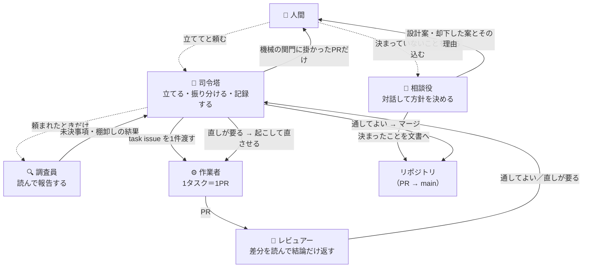
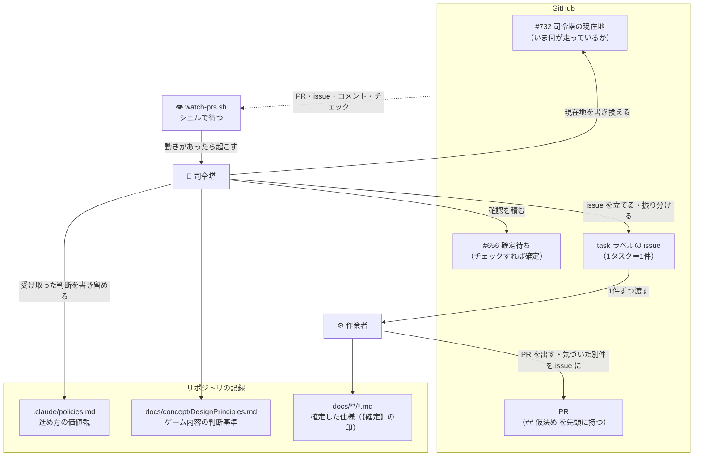
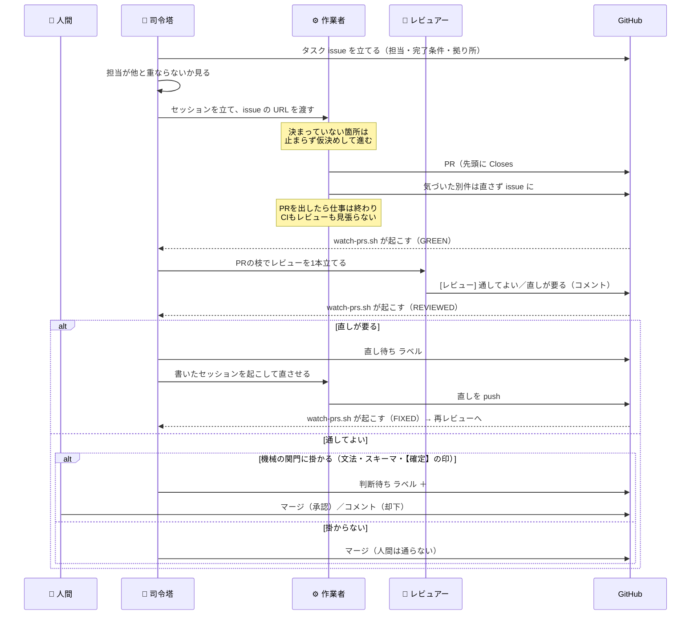
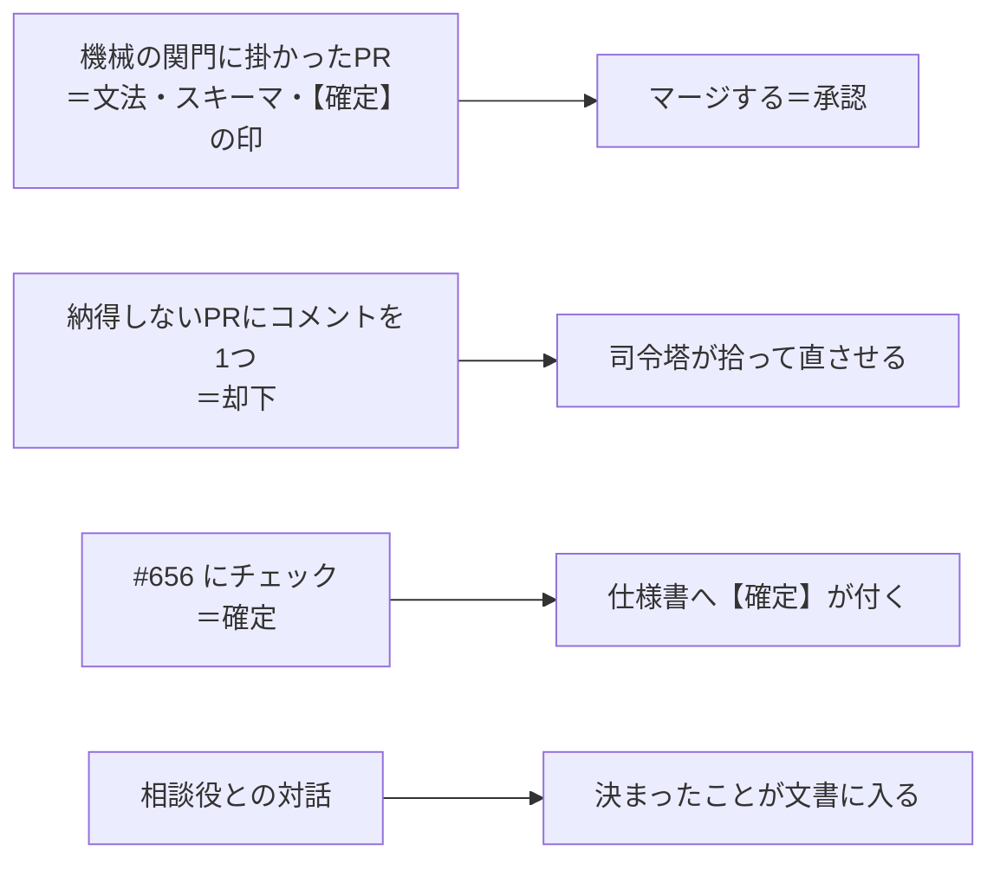
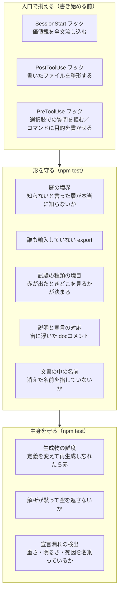

# 並列作業の全体像

**このゲームは、複数のAIエージェントが同時に開発しています。** この文書は、その仕組みが**何でできていて、何がどう流れるのか**を人間の読み手へ示します。

**規則そのものは [`.claude/parallel-work.md`](../.claude/parallel-work.md) が持ちます。** あちらはエージェントが従う取り決めで、こちらは全体像だけを扱います——同じ説明を二度書かないため、細かい条件はあちらへのリンクに留めます。

**この形へどうやって辿り着いたかは [`HowWeGotHere.md`](./HowWeGotHere.md)。** 作り方は6週間で4回変わっており、**並列作業はそれ以前の段が作ったもの全部の上に立っています。**
ただし**その多くは、並列のために作ったものではありません**——試験も、画面を確かめる道も、絵の
自動化も、1人のエージェントに書かせる時点で要ります。

## 1. 何が要るのか

1人で書くなら要らないものが4つ要ります。

- **衝突しないこと。** 同時に書く相手が居るので、担当が重なると互いの足元を壊します。
- **判断を集めること。** 決めるのは人間ですが、**人間の手数を最小にしないと使われなくなります**——指示はスマホから来ます。
- **品質が揃うこと。** 書き手が毎回違うので、**放っておけば揃いません**（10節）。人間なら「前もこう書いたから」で揃うところが、セッションは毎回まっさらです。
- **失敗が見えること。** 取りこぼしは「気づけないこと」として現れるので、放っておくと**成功と区別が付きません。**

**以下の登場人物と仕組みは、全部この4つのために在ります。** 逆に言えば、**この4つに効かないものは置いていません。**

## 2. 登場人物 — エージェントは5種類

**コードを書くのは1種類だけです。** 残りの4種は、決める・調べる・振り分ける・読む役で、どれも実装しません。

**点線は「引き金が無い」経路です**——人間が口で頼まないと立ちません（下の要改善点）。

| 種類 | 何をするか | 何を出すか | どうやって立つか |
| --- | --- | --- | --- |
| 🧭 **司令塔** | issue を立てて振り分け、PRを振り分け、判断を記録する。**自分では書かない** | issue・マージ・記録 | 人間が [#732](https://github.com/gooyyu1/UnmappedIsland/issues/732) のURLを貼る |
| 💬 **相談役** | 人間と直接やりとりして、決まっていないことを決める。**訊かれたら実装ではなく設計案を返す** | 設計案と、決まったことを書いた文書 | **人間が直接頼む** |
| 🔍 **調査員** | 読むだけ。未決事項の洗い出し、人間が書いた issue の棚卸し | 報告（[#656](https://github.com/gooyyu1/UnmappedIsland/issues/656) へ積む材料・書き換えた issue）。**PRは出さない** | **人間が頼む**（棚卸しだけは `board.sh` の `## 未整理` が司令塔に気づかせる） |
| ⚙️ **作業者** | task issue を1件実装する | PR1本 | 司令塔が [`dispatch-task.sh`](../scripts/agent/dispatch-task.sh) |
| 🔬 **レビュアー** | PR1本の差分と、その外まで読む。**直さない** | PRへのコメント1つ | 司令塔が [`dispatch-review.sh`](../scripts/agent/dispatch-review.sh) |

**「読むだけか、書くか」で分かれています。** 書く役（作業者）だけが別セッション＝別ブランチ＝1PRに閉じ、読む役は成果物を持たないので何本立てても衝突しません。

### 要改善: 相談役と調査員には引き金が無い

**5種のうち2種は、自動化の枠組みの外に居ます。** 作業者とレビュアーは投入の条件が機械で決まる（着手できる `task` がある／PRが出た）のに対し、**相談役と調査員は人間が思い出して頼むまで立ちません。**

- **相談役** — 決まっていないことに人間が気づいたときにしか始まりません。
- **調査員** — 「何が決まっていないか」を洗い出す役なのに、**その起動自体が人間の気づき待ち**です。棚卸しだけは `board.sh` の `## 未整理` に並ぶので司令塔が気づけますが、見張りの合図としては出ません（8節）。

**引き金の無い仕組みは、使われなくなった時点で無いのと同じになります**（11節）。ここは塞げていません。

### どこに何が残るか

**司令塔は自分では書きません。** 書くのは作業者で、司令塔がやるのは**issue を立てる・振り分ける・PRを振り分ける・記録する**の4つです。**差分も読みません**（6節）。

## 3. issue は3種類あり、役割が違う

**同じ「issue」でも、中身も寿命も読み手も違います。**

| 種類 | 例 | 何のためか | 誰が書き換えるか |
| --- | --- | --- | --- |
| **司令塔の現在地** | [#732](https://github.com/gooyyu1/UnmappedIsland/issues/732) | **いま何が走っていて、何があなた待ちか。** 新しい司令塔セッションはこのURLを貼れば引き継げる | 司令塔（本文を書き換える。PRもコミットも作らない） |
| **確定待ち** | [#656](https://github.com/gooyyu1/UnmappedIsland/issues/656) | **チェックを付けるだけで答えになる**問いを1件ずつ積む場所 | 司令塔が積み、人間がチェックする |
| **タスク** | `task` ラベル | **1件＝1セッション＝1ブランチ＝1PR。** 担当ファイル・完了条件・拠り所を書く | 司令塔かセッションが立てる |

**現在地を issue の本文に置くのは、PRにすると写しの履歴で埋まるからです。** 1日に何度も動く情報は、レビューの通り道に載せません。

### 人間が立てた issue は、翻訳されてから task になる

**人間は自分の言葉で issue を書きます。** 担当も完了条件も付きません——**書式を覚えることは判断ではないので、型を人間の側へ要求しません。**

そのまま投入すると、**PRの範囲が宣言されていない**まま差分が返り、司令塔は範囲外へ伸びたかを機械的に判定できず、全部が判断待ちに落ちます。そこで**調査員が棚卸しして task の型へ翻訳します**（そのまま／分解／束ねる、の3つの出口。原文は消さずに残します）。翻訳前のものは `board.sh` の `## 未整理` に並びます。

### 確定待ちは「断定文」で書く

**「どうしますか」とは書けません。** 決まっていない箇所は仮決めして進むのが既定なので、具体的な案は常に手元にあります。だから**太字の1文が、そのまま仕様書へ書ける形**になっていて、人間は**同意するものにチェックを付けるだけ**で済みます。

**チェックが無いことは「否」ではありません**（見ていない・今は決めない、も同じ）。暫定が既定なので、放置されたままで何も壊れません。

## 4. 1つのタスクが流れる道

**PRを出したセッションは、そこで仕事が終わりです。** CIもレビューも見張らせません——見張らせると、自分を起こす道具が要り、**それらは自動承認できないので、そのまま人間のタップに化けます。** 待つのは、シェルで待てる司令塔の仕事です。

**直すのは、レビュアーではなく元を書いた作業者です。** 文脈を持っているのはそちらで、レビュアーが push すると1つのPRを2つのセッションが握ることになります。

**マージから後片付けまでは1回で済ませます**（[`merge-and-close.sh`](../scripts/agent/merge-and-close.sh)）——マージ → `Closes` の issue が閉じたかの確認 → 書いたセッションを畳む → 本体のチェックアウトを新しい `main` へ進める。**どれにも判断が無いのに、別々に叩くと司令塔の文脈を1往復ずつ食います。**

## 5. 人間へ回るのは、司令塔が決められなかったときだけ

**規則の上ではPRを承認するのは人間ですが、実際にはほとんど回ってきません。** 直近25本（2026-08-29 の実測）のうち、司令塔が手を止めて人間へ回したPRは **0本**でした。**毎回そこを通る関門ではなく、司令塔が自分では決められないと分かったときの最後の1回**です。

だから、**回すかどうかを司令塔の裁量にはしていません**（6節）——裁量にすると、越えられる関門は越えます。

**上の3つは、どれも1タップか1行で済みます。** 手数の多い入口は使われなくなり、**使われない仕組みは無いのと同じ**だからです（11節）。4つ目の対話だけは手数が掛かりますが、そこで扱うのは**まだ形になっていない判断**なので、短くはできません。

**却下がコメントなのは、GitHubのレビュー機能が使えないからです。** セッションは人間の資格情報で push するので、**PRの作者が全部その人になり**、自分のPRには Approve も Request changes も出せません。

**理由まで書かなくて構いません**——「−5 で」だけで足ります。足りなければ司令塔が訊きます。

## 6. 止める線は機械が引き、差分はレビュアーが読む

**PRの先頭には必ず `## 仮決め` 節があります。** 「なし」と書くのも仕事のうちで、**書かせないと「仮決めが無かった」のか「書き忘れた」のかが区別できません。**

**ただし、申告だけでは止める線になりませんでした。** 直近25本（2026-08-29 の実測）で `## 仮決め` に中身のあったPRは **22本**。全部を人間へ回せば**タップを1回増やすだけの関門**になり、本当に判断が要るものが埋もれます。実際に付いた `判断待ち` は **0本**——受け取る側が使えていませんでした。

そこで、判定を3つに割ってあります。

| 何を見るか | 誰が見るか | 越え方 |
| --- | --- | --- |
| **PRが触ったファイルの線**（宣言文法・スキーマ）**と `【確定】` の印の増減** | 機械（[`needs-user-review.sh`](../scripts/agent/needs-user-review.sh)） | **司令塔には越えられません。** 人間の許可を引いて越え、**許可を受けたことがPRのコメントに残ります** |
| **差分の中身**（原因の深さ・同じ誤りの兄弟・不要になった旧コード・名前と現実のずれ・担当の範囲） | 🔬 レビュアー（PR1本につき1セッション） | 「直しが要る」なら、元を書いた作業者が直す |
| **決めきれなかった問い** | 人間 | — |

**司令塔は差分を読みません。** 多数のPRを受け取るので、**読むほど文脈が埋まって後の判断が痩せます。** 読むこと自体はセッションを1本立てれば済み、司令塔が受け取るのは「通してよい」か「直しが要る」かと理由の数行だけで足ります。

**機械の線は取りこぼします**（ここに挙げていないファイルで文法に相当することをする道はあります）。それでよい、としています——**既に壊した実績のある操作は、取りこぼしが残っても機械で止める**。促す仕組みではなく止める仕組みなので、申告ではなく機械が引きます。

**決めきれなかった問いも `## 仮決め` に書かせます。** セッションは司令塔を起こせないので、**書かなければその問いは誰の目にも触れずに消えます**——実際に一度、「日暮れ後の戻り道に窯まで要求してよいか」という問いが最後の要約にだけ残り、そのまま入りました。

## 7. 衝突は「担当の列挙」で避ける

**タスク issue には担当ファイルを書き、触ってはいけないファイルは書きません**——列挙で補集合が決まります。

**1ファイル重なることは、直列にする理由になりません。** 変える箇所が別なら並列に流し、触らない箇所を指示で名指しします。重なりの度合いを見ずに直列へ落とすと、鎖が伸びた分がそのまま遅れになります。

領域の地図（`src/domain` / 生成とローダ / カードとUI / ウィンドウ / ゲーム組み立て / 解析と図鑑の6分割）は [`.claude/parallel-work.md`](../.claude/parallel-work.md) の「所有権の地図」にあります。

## 8. 待つ仕組み

司令塔は [`watch-prs.sh`](../scripts/agent/watch-prs.sh) をバックグラウンドで走らせ、**動きがあった瞬間に1回だけ起きます。**

| 合図 | 意味 | 司令塔がすること |
| --- | --- | --- |
| `GREEN` | CIが通った | レビューを1本立てる |
| `RED` | CIが落ちた | 書いたセッションを起こして直させる |
| `CONFLICT` | `main` と衝突していて、解消するまでマージできない | 自分で `main` を取り込んで解消し、push する |
| `REVIEWED` | レビューの結論が付いたまま、まだ動いていない | 「通してよい」ならマージ、「直しが要る」なら差し戻す |
| `FIXED` | 差し戻した先から、直しが載って戻ってきた | ラベルを外して振り分け直す |
| `GONE` | 見張っていた issue が閉じた | そのセッションを畳む／次を投入する |
| `COMMENT` | PRか issue にコメントが付いた | 却下として拾う |
| `CHECKED` | 確定待ち（#656）の本文にチェックが付いた | 該当節へ `【確定】` を付け、一覧から消す |
| `TASK` | 知らない issue が現れた | 拾うか、把握済みとして脇へ置く |
| `STALLED` | 動いておらず、PRも出していないセッションがある | 最後を見て、起こすか畳むかを決める |

**`REVIEWED` と `FIXED` が答えるのは「今それは誰の手番か」で、「この5分に何が起きたか」ではありません。** 比べる相手をPR自身の状態から取ります（結論のコメントと最後のコミットの前後、差し戻しのラベルを付けた時刻と最後のコミットの前後）。**見張りの起動時刻と比べてはいけません**——起動より前に起きたことが永久に出なくなるので、見張りを立て直すたびに、その谷間で起きたことが丸ごと落ちます。実際に、レビューの結論2件が2時間放置されました。

**待ちを終える条件は「動いているものが終わること」ではなく「やることが無いこと」です。** 前者だと、投入した全部が判断待ちで止まった瞬間に**何も起こらなくなり**、その間に積まれた仕事も誰の目にも触れません。

### 見張りに出ないものは、盤面で見る

**チェックは出来事ではなく状態です。** `CHECKED` が出すのは起動時からの増分だけなので（基準を取らないと、見張りは起きるたびその場で終わります）、見ていない間に付いたチェックはそこから二度と現れません。**拾われるまで残り続けるものは、状態を出す側＝盤面**（[`board.sh`](../scripts/agent/board.sh)）が持ちます。

盤面は**開いているPR・`task` issue・翻訳前の `## 未整理`・畳んでいないセッション・確定待ちのチェック**を、突き合わせた1つの表にして出します。**依存（`blockedBy`）と「もう投入したか」を必ず引く**のが要点で、手で `gh` を叩くとその2つが省かれ、**塞いでいた issue が閉じても誰も気づかない／同じ issue へ二重に投入する**ことになります。

## 9. 受け取った判断は、その場で書き留める

**人間の考えは人間の頭の中にしかありません。** 同じことを二度訊かずに済むよう、**受け取った価値観はその場で記録し、次のセッション以降の既定にします。**

| 記録するもの | 置き場 | いつ読まれるか |
| --- | --- | --- |
| 進め方・設計・レビューの価値観 | [`.claude/policies.md`](../.claude/policies.md) | **セッション開始時に全文が自動で読み込まれる** |
| ゲーム内容の判断基準 | [`DesignPrinciples.md`](./concept/DesignPrinciples.md) | ゲーム内容の判断をするとき |
| 確定した個別の仕様 | 該当する仕様書（`【確定】` の印） | その領域を触るとき |

**書くのは「場面（AとB）・選ぶ方・重視していること」です。** 結論だけでは、字面の違う場面に効きません。

**記録するのは着手前です。** 着手後や応答の最後では、会話が要約された時点で判断の文脈が失われた後になります。

## 10. 品質を一定にするために要った仕組み

**書き手が毎回違うので、揃えなければ揃いません。** 人間なら「前もこう書いたから」で揃うところが、
セッションは毎回まっさらです。**放っておくとばらつく所を1つずつ塞いだ結果**が、次の3層です。

### 何がばらつくので、何を置いたか

| ばらつく所 | 置いた仕組み | 無いとどうなるか |
| --- | --- | --- |
| **何を大事にするか** | セッション開始時に価値観を全文読み込む | 同じ問いに毎回違う答えが出て、**前回の判断を毎回訊き直す** |
| **書き方**（整形・命名・コメント） | 書いた瞬間に整形するフック、名前とコメントの規約を記録 | 差分が整形の揺れで埋まり、**中身の変更が読めなくなる** |
| **構造**（層・輸出・試験の置き場） | 到達可能性で見る3つの検査 | 「知らないはず」の層が知り始め、**赤が出てもどこを見ればよいか決まらない** |
| **説明と実装のずれ** | 宙に浮いた docコメント、消えた名前を指す説明を検出 | **動いている実装が仕様として読まれ**、次の変更がその誤読の上に積まれる |
| **生成物の鮮度** | 定義から作り直して比べる／入力の指紋を突き合わせる | 生成物と手書きの写しが**互いにだけ一致**し、どちらも今を映さなくなる |
| **宣言の漏れ** | 重さ・明るさ・死因を名乗っていない定義を検出 | 漏れたまま動くので、**漏れた定義がそのまま正しいことになる** |
| **判断の伝わり方** | PRの `## 仮決め` 節、確定待ちの issue、記録の置き場 | 判断が**セッションの中だけに残って消える** |
| **差分の読まれ方** | PR1本につきレビュアーを1本立てる | 司令塔がPRの本数だけ差分を読み、**文脈が埋まって後の判断が痩せる** |
| **見た目の可否** | `src/game/**`・`src/assets/**` を触ったPRに `## 見た目` 節と画面を要求する | **文章からは判定できない**ので、判断のたびに人間がブランチを引いて動かすことになる |

### 先回りできたものと、後から要ったもの

**同じ形で並べます。** 効いている仕組みほど失敗として現れないので、**踏んだ失敗だけを並べると、
うまくいっている側が全部消えます。**

| 仕組み | いつ作ったか |
| --- | --- |
| 層の境界・輸出・docコメントの検査 | **先回り。** 全数調査で「今どれだけ腐っているか」を数え（12件・14件）、直すのと同時に見張りを置いた |
| 試験の種類の境目 | **先回り。** 3種類に分ける決まりを先に置き、境目を検査で固定した |
| 価値観の読み込みと記録のフック | **先回り。** 同じ問いを二度訊かない形を、並列を始める前に作った |
| 担当ファイルの列挙・1タスク1PR | **先回り。** 衝突は起きてからでは戻せないので、起きない形から始めた |
| 生成物の鮮度の検査 | **後から。** 生成物と手書きの定数が互いにだけ一致していたのを、実際に踏んでから塞いだ |
| 解析が空を返さないことの検査 | **後から。** 表が丸ごと消えたのに `npm test` が緑のままだったのを踏んで足した |
| 見張りが `GONE` / `COMMENT` / `TASK` を出すこと | **後から。** PRが出ないまま終わった場合・却下のコメント・新しく積まれた仕事が、それぞれ届かなかった |
| 見張りが `CONFLICT` / `STALLED` / `CHECKED` を出すこと | **後から。** 衝突したPRが埋もれ、止まったセッションが3時間誰にも見えず、付いたチェックがどの経路にも乗らなかった |
| レビュアーを立てること・機械の関門 | **後から。** 申告は動いていたのに（22/25本）、受け取る側が使い切れず `判断待ち` が0本だった |
| 手順をスクリプトへ畳むこと | **後から。** 司令塔の文脈が1応答あたり平均553kトークンまで伸び、**首位は Bash の688回**だった——大きな出力が数個ではなく、小さいものが688個 |

**分かれ目は「失敗の形を先に名指しできたか」です。** 層の腐りや説明の取り残しは**数えれば見える**ので
先に塞げました。**見えないものは、一度踏むまで形が分かりません。**

### だから、見張りを足したら赤くなるのを見る

**「緑」は「壊れていない」と「見ていない」のどちらでもありえます。** 見張りが失敗する形は
「気づけないこと」なので、**効いていない見張りは、緑であることと区別が付きません。**

**入力をわざと壊して赤くなるのを見てから報告する**、という決まりがあるのはこのためです。

## 11. 使われない仕組みは、無いのと同じ

**人間に回す部分は最小にして、自己完結させます。**

- **人が関与せずに回る形にできるなら、そちらを選びます。** 関与が要るのは判断そのものだけです。
- **判断を仰ぐときは、リポジトリを開かずに答えられるだけの文脈を添えます。** 手元にあるからと省くと、**答えが返ってきません。**
- **タップを1回増やすだけの関門は、無いのと同じにします。** だから進捗の写しにはPRを作らず、判断が動かないPRは司令塔が通します。

**同じことが、司令塔自身にも効きます。** 手で `gh` を叩く手順は、省ける確認から順に省かれます——**省かれた確認は、省かれたことすら見えません。** そこで、決まりきった並びは [`scripts/agent/`](../scripts/agent/) に畳んであります。

| 何をするとき | 打つもの | 畳んだ中に必ず入る確認 |
| --- | --- | --- |
| 盤面を見る | [`board.sh`](../scripts/agent/board.sh) | 依存（`blockedBy`）と、もう投入したか |
| 投入する | [`dispatch-task.sh`](../scripts/agent/dispatch-task.sh) / [`dispatch-review.sh`](../scripts/agent/dispatch-review.sh) | issue（PR）が開いているか・空の箱で起動していないか・**指示が化けずに届いたか** |
| 決着を待つ | [`watch-prs.sh`](../scripts/agent/watch-prs.sh) | 8節の10種の合図 |
| 直列に並べた次を待つ | [`wait-for-issues.sh`](../scripts/agent/wait-for-issues.sh) | **issue が閉じたかではなく、その変更が `main` に入ったか** |
| マージして片付ける | [`merge-and-close.sh`](../scripts/agent/merge-and-close.sh) | 機械の関門・issue が閉じたか・セッションを畳んだか・本体の追随 |
| 画面を貼る | [`push-screenshot.sh`](../scripts/agent/push-screenshot.sh) | 証跡を `main` にも消える枝にも置かないこと |

**畳んだのは往復だけではありません。** 1サイクル10〜14回だった `gh` の呼び出しが5〜7回になったのは結果で、狙いは**省かれていた確認が必ず通ること**です。判断が要るのは**差分を読むところ**と**指示文を書くところ**の2つだけなので、そこは畳んでいません。
