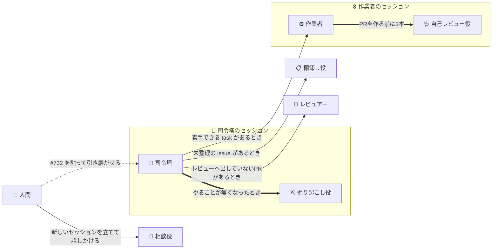
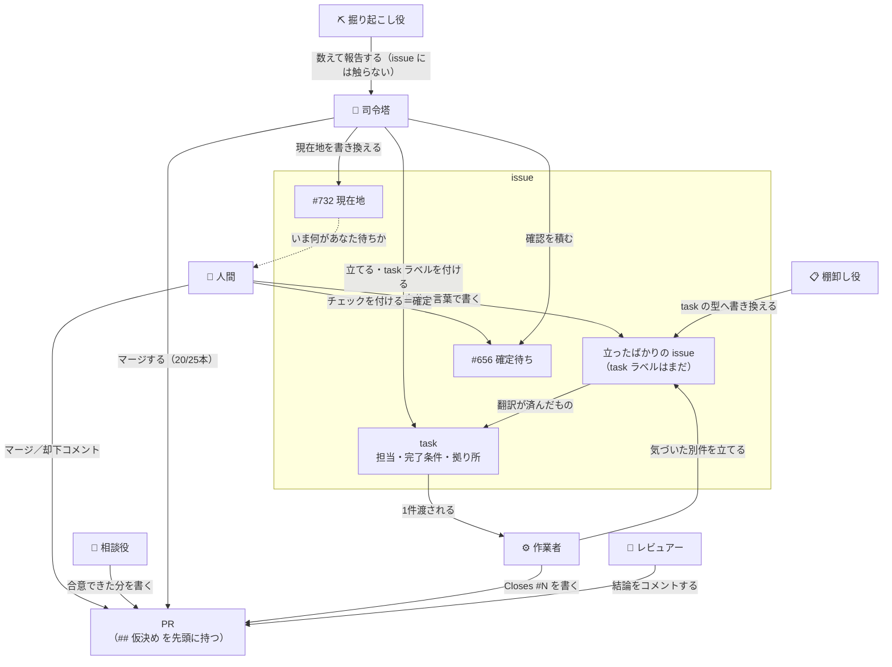
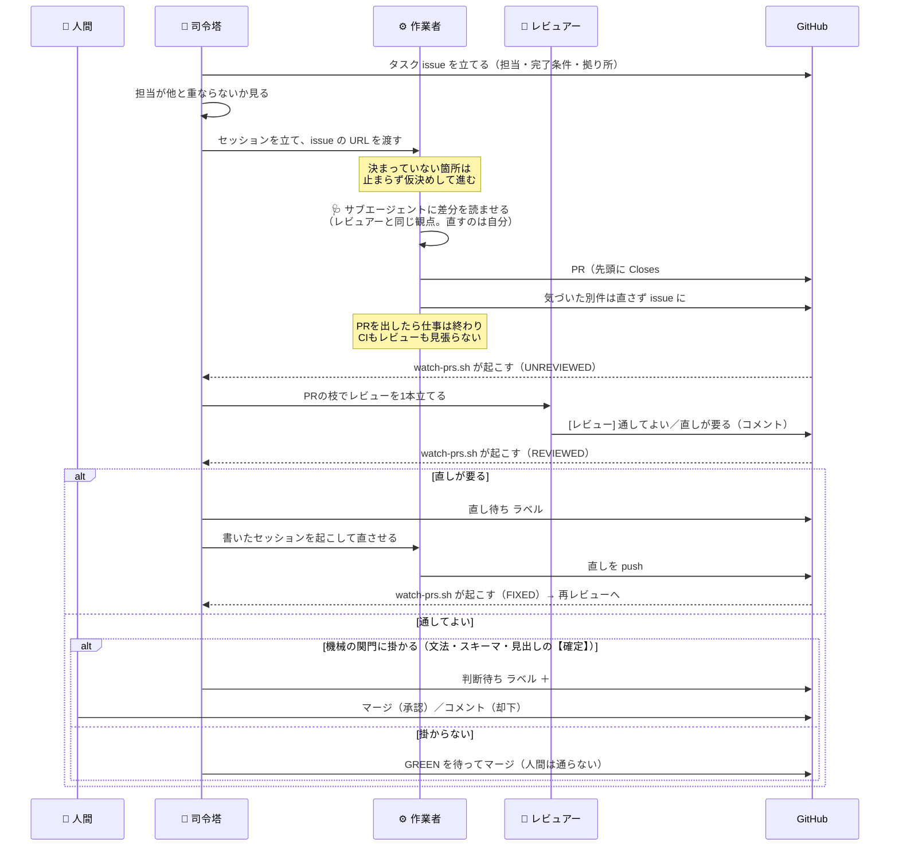
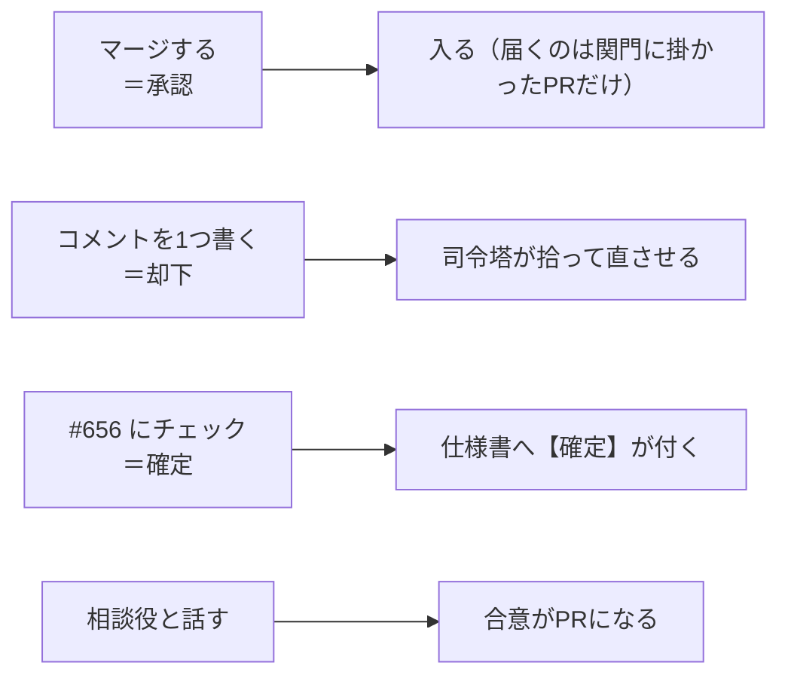
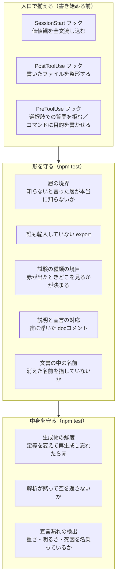

# 並列作業の全体像

**このゲームは、複数のAIエージェントが同時に開発しています。** この文書は、その仕組みが**何でできていて、何がどう流れるのか**を人間の読み手へ示します。

**規則そのものは [`.claude/parallel-work.md`](../.claude/parallel-work.md) が持ちます。** あちらはエージェントが従う取り決めで、こちらは全体像だけを扱います——同じ説明を二度書かないため、細かい条件はあちらへのリンクに留めます。

**この形へどうやって辿り着いたかは [`HowWeGotHere.md`](./HowWeGotHere.md)。** 作り方は7週間で5回変わっており、**並列作業はそれ以前の段が作ったもの全部の上に立っています。**
ただし**その多くは、並列のために作ったものではありません**——試験も、画面を確かめる道も、絵の
自動化も、1人のエージェントに書かせる時点で要ります。

## 1. 何が要るのか

1人で書くなら要らないものが4つ要ります。

- **衝突しないこと。** 同時に書く相手が居るので、担当が重なると互いの足元を壊します。
- **判断を集めること。** 決めるのは人間ですが、**人間の手数を最小にしないと使われなくなります**——指示はスマホから来ます。
- **品質が揃うこと。** 書き手が毎回違うので、**放っておけば揃いません**（10節）。人間なら「前もこう書いたから」で揃うところが、セッションは毎回まっさらです。
- **失敗が見えること。** 取りこぼしは「気づけないこと」として現れるので、放っておくと**成功と区別が付きません。**

**以下の登場人物と仕組みは、全部この4つのために在ります。** 逆に言えば、**この4つに効かないものは置いていません。**

## 2. 登場人物 — エージェントは7種類

**役を分けている基準は、やっていることではなく「何に書けるか」と「何で立つか」です。** 掘り起こし役と棚卸し役はどちらも読んで報告する役ですが、**issue を書き換えられるのは棚卸し役だけ**で、立つきっかけも違います。**下の表の4列目（どう走るか）は基準ではありません**——「何に書けるか」から出てくる帰結です（「立ち方は『何に書けるか』が決めている」）。

### 誰が誰を立てるか

**点線は1本だけで、そこが入口です**——司令塔は人間が #732 を貼るまで立ちませんが、入口なので誰かが始めるほかありません。**残りは全部、条件が出た瞬間に立ちます。** 相談役の条件は「**人間が相談したくなったこと**」で、そのとき人間はもうそこに居るので、機械の引き金を置いても待つだけになります。

**太い矢印の2本が、セッションではなくサブエージェントです**（下の「立ち方は『何に書けるか』が決めている」）。どちらも**どこにも書かず、親へ結論を返すだけ**の役です。

| 種類 | 何をするか | **何に書けるか** | **何で立つか** | どう走るか |
| --- | --- | --- | --- | --- |
| 🧭 **司令塔** | 振り分けと記録。**自分では実装せず、PRの差分も読まない** | issue（立てる・書き換える・ラベル）、マージ、価値観の記録 | 人間が [#732](https://github.com/gooyyu1/UnmappedIsland/issues/732) のURLを貼る | セッション |
| 💬 **相談役** | 人間と直接やりとりして、決まっていないことを決める。**訊かれたら実装ではなく設計案を返す** | PR（合意できた分だけ） | **人間が新しいセッションを立てて話しかける** | セッション |
| ⛏️ **掘り起こし役** | 完成の定義に照らして、**まだ issue になっていない残りを数える** | **どこにも書かない。** 報告を受けた司令塔が、**やると決まっているものは `task` issue へ、やるかどうかから訊くものは [#656](https://github.com/gooyyu1/UnmappedIsland/issues/656) へ**振り分ける | 司令塔が、**配れる `task` も開いているPRも無くなったとき** | **司令塔のサブエージェント** |
| 📋 **棚卸し役** | 人間の言葉で書かれた issue を、task の型へ翻訳する | **issue の本文**（原文は `## 元の報告` として残す） | 司令塔が `board.sh` の `## 未整理` を見て投入する | セッション |
| ⚙️ **作業者** | task issue を1件実装する | PR1本 ＋ 気づいた別件の新しい issue | 司令塔が [`dispatch-task.sh`](../scripts/agent/dispatch-task.sh) | セッション |
| 🩺 **自己レビュー役** | **これから出す差分**を、レビュアーと同じ観点で読む。**直さない** | **どこにも書かない。** 指摘を受けた作業者が、直すか理由を書くかして PR本文の `## 自己点検` へ載せる | 作業者が、**PRを作る前**に1本（立てられない環境では、理由を1行書いて同じ観点を自分で通す） | **作業者のサブエージェント** |
| 🔬 **レビュアー** | PR1本の差分と、その外まで読む。**直さない** | **PRへのコメント1つだけ**（issue も立てない） | 司令塔が [`dispatch-review.sh`](../scripts/agent/dispatch-review.sh) | セッション |

**PRを出すのは2種だけ**（作業者・相談役）で、どちらも**1セッション＝1ブランチ＝1PR**に閉じます。**棚卸し役・レビュアーは作業ツリーへ書かない**ので、何本立てても互いの足元を壊しません。掘り起こし役は司令塔のチェックアウトを、自己レビュー役は作業者のチェックアウトをそのまま使いますが、どちらも**読むだけ**なので同じです。掘り起こし役が収支表も作り直さずに読むのは、これが理由です（下の「探すのではなく、数える」）。司令塔は記録を直接書きますが、**同時に1本しか走らない**ので相手が居ません。

**掘り起こし役に issue を書かせないのは、報告と反映を同じ役に持たせないためです。** 何を積むかを決めるのは司令塔で、掘り起こし役が出すのは材料だけです。棚卸し役だけが issue の更新権限を持ちますが、**書き換えるのは型であって中身ではありません**（原文を消させない）。

### 立ち方は「何に書けるか」が決めている

**別セッションにするかサブエージェントにするかは、役の性質ではなく、上の表の「何に書けるか」から出てきます。**

**どこかに書く役は、別セッションです。** 書く先で理由が2つに分かれます。

- **ファイルへ書く**（作業者・相談役）— 専用の作業ツリーが要ります。同じチェックアウトを共有すると、整形のフックや git の状態を互いに壊します。
- **GitHubへ書く**（レビュアー・棚卸し役）— **書いたものが記録として残り、それが次を動かす合図になります**（`REVIEWED`・`## 未整理`）。司令塔は自動コンパクションを跨いで何時間も回り続けるので、**親と運命を共にするサブエージェントには置けません。**

**どこにも書かない役だけが、サブエージェントにできます。** 報告の行き先が親しかないので、渡し方を決める余地がそもそもありません。**読んだ量は子の文脈に留まり、親へ返るのは結論だけです。**

**「読むだけならサブエージェント」ではありません。** レビュアーも棚卸し役も読む仕事ですが、どちらも別セッションです。**書いているものが何を買っているかで決まります。**

| 役 | 書いているものが買っているもの |
| --- | --- |
| 🔬 レビュアー | **保証。** レビューへ出していないPRを [`watch-prs.sh`](../scripts/agent/watch-prs.sh) が `UNREVIEWED` として毎周出し続けるのは、**レビューへ出したかどうかがPRの外から見える形で残っている**からです（結論のコメントと、`review-<番号>` のセッションの2つで黙ります）。作業者の自己レビューへ移すと、この行が出せる情報がゼロになります |
| 📋 棚卸し役 | **司令塔が書かなくて済むこと。** 成果は issue の本文そのもので、分解を通れば1件が3件になります。報告に作り替えると、その全部が親の文脈へ入り、書く手間も司令塔へ戻ります |
| ⛏️ 掘り起こし役 | **何も買っていません。** 報告を使うのは親だけです |
| 🩺 自己レビュー役 | **何も買っていません。** 指摘を使うのは親だけで、**素通しした事実はどこにも残りません**——だから往復の回数は削れても、レビュアーの代わりにはなりません |

### 💬 相談役 — 人間が立て、合意した分だけをPRにする

**引き金は「人間が相談したくなったこと」で、それは既にあります。** 機械が先回りして立てても、人間が来るまで待つだけなので、取りこぼしはありません。**新しいセッションを立てて話しかけてください。**

- **担当を宣言しません**（7節）。担当の列挙が守っているのは**PRの範囲が読めること**で、相談役のPRの範囲は**対話した人間自身が知っている**からです。残るのは実際の衝突だけで、コストはリベース1回です。
- **PRは合意できた分だけ**です。議論の途中では書きません。**マージ前に合意が増えたら、同じPRへ足します**（1セッション＝1ブランチ＝1PRを崩しません）。マージされた後に続きが出たら、新しいセッションを立ててください。
- **合意が仕様書の節へ落ちるPRは、`判断待ち` になります。** `【確定】` の印が増えるので、機械の関門（6節）に掛かるためです。**これは正常で、そのマージが「差分への承認」にあたります**——チャットで合意したのは文面で、まだ差分は見ていません。**運用そのものの合意には、今この経路がありません。** [`needs-user-review.sh`](../scripts/agent/needs-user-review.sh) の射程は `docs/` 配下の `.md` なのでこの文書も入りますが、**印を置くのは仕様書だけ**という運用なので、ここに落ちた合意では印が動かず、関門も鳴りません。`.claude/**` は射程の外です。

### ⛏️ 掘り起こし役 — 探すのではなく、数える

**「仕事を探せ」とは言いません。** そう言われたエージェントは必ず何か見つけるので、出力の質が観点の質と同じになり、**観点を毎回考える人が要る**ことになります。司令塔は差分も読まない役なので、その材料を持っていません。

> **完成の定義に載っているもの － 既に issue になっているもの ＝ 掘り起こすもの。**

**探索は無限ですが、定義に照らした穴は有限です。** だから残りは減っていき、**ゼロになったら「もう無い」と言えます。** 観点を毎回変える必要はありません——同じものを数えても、残りが減るので出力は毎回変わります。

数えるのは、**残りの作業量を答えられるもの**だけです（[`.claude/policies.md`](../.claude/policies.md)「未実装のものの扱い」。「無くても完成を宣言できるもの」は [`Someday.md`](./Someday.md) に分けてあります）。

- `未決事項`・`今後の検討課題` の節
- `【未実装】` の印
- 収支の穴。**生成済みの `stats/balance.yaml` を読みます**——`npm run stats:balance` は表を作り直して書き出すので、司令塔のチェックアウトが `DIRTY` になり、[`merge-and-close.sh`](../scripts/agent/merge-and-close.sh) の追随が止まります。表は `main` への push のたびに workflow が作り直すので、読むだけで足ります。**コンテンツ不足が本命のボトルネック**です（[`.claude/parallel-work.md`](../.claude/parallel-work.md) の「コンテンツを後回しにしない理由」）

**出口は2つあり、司令塔が振り分けます。** 全部を確定待ち（#656）へ積むと、**この役を起こしても盤面が動きません**——引き金が「配れる `task` が無くなったとき」なのに、`task` が1件も増えないからです。

- **やると決まっているもの**（段0を通った `【未実装】`・収支の穴）→ **`task` issue**。盤面へ戻ります。
- **やるかどうかから訊くもの**（未決事項）→ **[#656](https://github.com/gooyyu1/UnmappedIsland/issues/656)**。**未決は「まだ決めていないこと」であって「やると決めたこと」ではない**ので、そのまま `task` にすると乗り気でないものが実装されて戻ってきます（[`.claude/policies.md`](../.claude/policies.md)「未決事項の受け取り方」）。

**「残り0件」は失敗ではなく、正しい報告です。** 人間が知りたいのは「ゴールが近いのか」で、それに答えられるのは数だけです。

**印にも測定にも載らないもの——「面白さが足りない」の類——は、掘り起こし役には見つかりません。** それは相談役の領分です。**掘り起こし役は完成の定義に照らして残りを数え、相談役は完成の定義そのものを動かします。** 前者は数えるだけなので機械が起こせて、後者は人間が要ります。

### 誰が issue とPRに触るか

**判断も仕事も issue の上に載ります。** 誰がどこへ書けるかは、上の表の「何に書けるか」がそのまま現れます。

**司令塔と作業者は、リポジトリの記録にも書きます**——司令塔が受け取った価値観を [`.claude/policies.md`](../.claude/policies.md) と [`DesignPrinciples.md`](./concept/DesignPrinciples.md) へ、作業者が確定した仕様を `docs/**` へ（9節）。

**司令塔は実装しません。** やるのは**issue を立てる・振り分ける・PRを振り分ける・記録する**の4つで、**PRの差分も読みません**（6節）。

## 3. issue は3種類あり、役割が違う

**同じ「issue」でも、中身も寿命も読み手も違います。**

| 種類 | 例 | 何のためか | 誰が書き換えるか |
| --- | --- | --- | --- |
| **司令塔の現在地** | [#732](https://github.com/gooyyu1/UnmappedIsland/issues/732) | **いま何が走っていて、何があなた待ちか。** 新しい司令塔セッションはこのURLを貼れば引き継げる | 司令塔（本文を書き換える。PRもコミットも作らない） |
| **確定待ち** | [#656](https://github.com/gooyyu1/UnmappedIsland/issues/656) | **チェックを付けるだけで答えになる**問いを1件ずつ積む場所 | 司令塔が積み、人間がチェックする |
| **タスク** | `task` ラベル | **1件＝1セッション＝1ブランチ＝1PR。** 担当ファイル・完了条件・拠り所を書く | 司令塔かセッションが立てる |

**現在地を issue の本文に置くのは、PRにすると写しの履歴で埋まるからです。** 1日に何度も動く情報は、レビューの通り道に載せません。

### 人間が立てた issue は、翻訳されてから task になる

**人間は自分の言葉で issue を書きます。** 担当も完了条件も付きません——**書式を覚えることは判断ではないので、型を人間の側へ要求しません。**

そのまま投入すると、**PRの範囲が宣言されていない**まま差分が返り、司令塔は範囲外へ伸びたかを機械的に判定できず、全部が判断待ちに落ちます。そこで**棚卸し役が task の型へ翻訳します**（そのまま／分解／束ねる、の3つの出口。原文は消さずに残します）。**`task` ラベルを付けるのは司令塔です**——棚卸し役が付けると、依存（`blockedBy`）を張る前に着手できる仕事として配られます。翻訳前のものは `board.sh` の `## 未整理` に並びます。

### 確定待ちは「断定文」で書く

**「どうしますか」とは書けません。** 決まっていない箇所は仮決めして進むのが既定なので、具体的な案は常に手元にあります。だから**太字の1文が、そのまま仕様書へ書ける形**になっていて、人間は**同意するものにチェックを付けるだけ**で済みます。

**チェックが無いことは「否」ではありません**（見ていない・今は決めない、も同じ）。暫定が既定なので、放置されたままで何も壊れません。

## 4. 1つのタスクが流れる道

**PRを出したセッションは、そこで仕事が終わりです。** CIもレビューも見張らせません——見張らせると、自分を起こす道具が要り、**それらは自動承認できないので、そのまま人間のタップに化けます。** 待つのは、シェルで待てる司令塔の仕事です。

**直すのは、レビュアーではなく元を書いた作業者です。** 文脈を持っているのはそちらで、レビュアーが push すると1つのPRを2つのセッションが握ることになります。

**マージから後片付けまでは1回で済ませます**（[`merge-and-close.sh`](../scripts/agent/merge-and-close.sh)）——マージ → `Closes` の issue が閉じたかの確認 → 書いたセッションを畳む → そのPRのレビューのセッションを畳む → 本体のチェックアウトを新しい `main` へ進める。**どれにも判断が無いのに、別々に叩くと司令塔の文脈を1往復ずつ食います。**

### 司令塔が管理しているのは、セッションではなく開いているPR

**人間は、司令塔を通さずにセッションを立てます**（相談役がそうですし、思いついた仕事を直接頼むこともあります）。**それでも仕組みから外れません。** どの経路で立ったセッションでも、**PRを出した瞬間に上の道へ載ります。**

- **司令塔はそのPRに気づきます。** `UNREVIEWED` は番号指定と関係なく、開いている全PRから出ます（8節）。
- **レビューが立ちます。** [`dispatch-review.sh`](../scripts/agent/dispatch-review.sh) はPR番号だけで立ち、誰が書いたかを見ません。
- **差し戻す相手が分かります。** PR本文の末尾にセッションのURL（`https://claude.ai/code/session_…`）が自動で入り、[`merge-and-close.sh`](../scripts/agent/merge-and-close.sh) はまずそこから引きます。**タイトルでは引きません**——同じ issue へ2回投入したとき、古いほうを畳んでしまうからです。

**だから、立てる前に司令塔へ申告する必要はありません。** PRを出す前のセッションに対して司令塔がすることは、投入も畳みも衝突判定も含めて何もないからです。**申告を要求すると、思いついたときに立てる気楽さがそこで消えます**——そして申告し忘れた分は静かに落ちます。

穴は1つだけ残ります。**本文を書き直した拍子に脚注が落ちると、宛先が消えます**（PR #1083・#1177 で実際に落ちました）。脚注が無いとき `merge-and-close.sh` は `Closes #N` から `task-<番号>` のタグを組んで引き直しますが、**そのタグを付けるのは [`dispatch-task.sh`](../scripts/agent/dispatch-task.sh) なので、人間が直接立てたセッションには付いていません。** どちらでも引けなければ `NOSESSION` が出るので、司令塔が新しいセッションを立てて直させます（作業者のときと同じ既定）。

**人間が直接立てたセッションを、司令塔は畳みません。** 話している最中かもしれないからです。**ただし差し戻しの `send_message` は割り込ませます**——それは判断の取り消しではなく、中身が正しいかの話で、`[司令塔]` の印が付くので出どころを取り違えません。

## 5. 人間が受け持つのは、判断そのものだけ

**規則の上ではPRを承認するのは人間ですが、全部が回ってくるわけではありません。** 回るかどうかは**司令塔の裁量ではなく、機械が引いた線に触ったかどうか**で決まります（6節）——宣言文法・スキーマ・**見出しに付いた** `【確定】` の印。実測（2026-08-29）では**直近25本のうち5本**が止まり、そこに**倍率がゲームへ入った3本すべて**が入りました。残る20本は司令塔が通します。

**線は「司令塔には決めさせないもの」を機械が名指ししたものです。** 司令塔が自分の裁量で「これは通してよい」と判断できる形にすると、**越えられる関門は越えます**。人間が受け持つのは、その線に触った分だけです。

**マージ・コメント・チェックの3つは、どれも1タップか1行で済みます。** 手数の多い入口は使われなくなり、**使われない仕組みは無いのと同じ**だからです（11節）。**相談役との対話だけは手数が掛かります**が、そこで扱うのは**まだ形になっていない判断**なので、短くはできません。そのPRが関門に掛かるかどうかは、合意がどこへ落ちたかで決まります（2節）。

**却下がコメントなのは、GitHubのレビュー機能が使えないからです。** セッションは人間の資格情報で push するので、**PRの作者が全部その人になり**、自分のPRには Approve も Request changes も出せません。

**理由まで書かなくて構いません**——「−5 で」だけで足ります。足りなければ司令塔が訊きます。

## 6. 止める線は機械が引き、差分はレビュアーが読む

**PRの先頭には必ず `## 仮決め` 節があります。** 「なし」と書くのも仕事のうちで、**書かせないと「仮決めが無かった」のか「書き忘れた」のかが区別できません。**

**ただし、申告だけでは止める線になりませんでした。** 直近25本（2026-08-29 の実測）で `## 仮決め` に中身のあったPRは **22本**。全部を人間へ回せば**タップを1回増やすだけの関門**になり、本当に判断が要るものが埋もれます。実際に付いた `判断待ち` は **0本**——受け取る側が使えていませんでした。

そこで、判定を3つに割ってあります。

| 何を見るか | 誰が見るか | 越え方 |
| --- | --- | --- |
| **PRが触ったファイルの線**（宣言文法・スキーマ）**と見出しに付いた `【確定】` の印の増減** | 機械（[`needs-user-review.sh`](../scripts/agent/needs-user-review.sh)） | **司令塔には越えられません。** 人間の許可を引いて越え、**許可を受けたことがPRのコメントに残ります** |
| **差分の中身**（原因の深さ・同じ誤りの兄弟・不要になった旧コード・名前と現実のずれ・担当の範囲） | 🔬 レビュアー（PR1本につき1セッション） | 「直しが要る」なら、元を書いた作業者が直す |
| **決めきれなかった問い** | 人間 | — |

**司令塔はPRの差分を読みません。** 多数のPRを受け取るので、**読むほど文脈が埋まって後の判断が痩せます。** 読むこと自体はセッションを1本立てれば済み、司令塔が受け取るのは「通してよい」か「直しが要る」かと、コメントの `## 司令塔へ` 節だけで足ります。**例外は、確定節の射程に変更が掛かったPRで、そのときは司令塔がその節の差分だけを見ます**——実測では大半が「`【未実装】` を外して実装した」もので、確定した中身は動いていませんでした。**全部を止めると、またタップを1回増やすだけの関門になります。**

**機械の線は取りこぼします**（ここに挙げていないファイルで文法に相当することをする道はあります）。それでよい、としています——**既に壊した実績のある操作は、取りこぼしが残っても機械で止める**。促す仕組みではなく止める仕組みなので、申告ではなく機械が引きます。

**今の取りこぼしの1つが、文書単位の確定宣言です**（[`DocumentStyle.md`](./DocumentStyle.md) 6.2 節）。機械が数えるのは見出しに付いた印なので、**印を1つも持たないまま全体が確定になる文書は素通りします。**

**決めきれなかった問いも `## 仮決め` に書かせます。** セッションは司令塔を起こせないので、**書かなければその問いは誰の目にも触れずに消えます**——実際に一度、「日暮れ後の戻り道に窯まで要求してよいか」という問いが最後の要約にだけ残り、そのまま入りました。

## 7. 衝突は「担当の列挙」で避ける

**タスク issue には担当ファイルを書き、触ってはいけないファイルは書きません**——列挙で補集合が決まります。

**1ファイル重なることは、直列にする理由になりません。** 変える箇所が別なら並列に流し、触らない箇所を指示で名指しします。重なりの度合いを見ずに直列へ落とすと、鎖が伸びた分がそのまま遅れになります。

領域の地図（`src/domain` / 生成とローダ / カードとUI / ウィンドウ / ゲーム組み立て / 解析と図鑑の6分割）は [`.claude/parallel-work.md`](../.claude/parallel-work.md) の「所有権の地図」にあります。

**列挙を要求しているのは作業者だけです。** 担当が守っているのは衝突そのものではなく（衝突のコストはリベース1回）、**PRの範囲が司令塔から読めること**——宣言があるから、触ったファイルの一覧と担当の**集合の交わり**を見るだけで済み、**判断ではなく計算になります**（この計算をするのは司令塔で、[`needs-user-review.sh`](../scripts/agent/needs-user-review.sh) は担当を見ません）。**相談役のPRには、その判定をする相手が居ません**（範囲を知っているのは対話した人間自身です）。だから宣言させず、重なったときはリベース1回を払います。

## 8. 待つ仕組み

司令塔は [`watch-prs.sh`](../scripts/agent/watch-prs.sh) をバックグラウンドで走らせ、**動きがあった瞬間に1回だけ起きます。**

| 合図 | 意味 | 司令塔がすること |
| --- | --- | --- |
| `GREEN` | 全チェックが成功した | **`判断待ち` が付いていなければマージする**（[`merge-and-close.sh`](../scripts/agent/merge-and-close.sh)） |
| `RED` | チェックが落ちた | 書いたセッションを起こして直させる |
| `CONFLICT` | `main` と衝突していて、解消するまでマージできない | 自分で `main` を取り込んで解消し、push する |
| `UNREVIEWED` | 最後のコミット以降、レビューへ出していない | **レビューを1本立てる**（[`dispatch-review.sh`](../scripts/agent/dispatch-review.sh)） |
| `REVIEWED` | レビューの結論が付いたまま、司令塔がまだ動いていない | 「通してよい」ならマージ、「直しが要る」なら差し戻す |
| `FIXED` | 差し戻したPRへ、その後の新しいコミットが載った | ラベルを外して振り分け直す |
| `GONE` | 見張っていた issue が閉じた | そのセッションを畳む／次を投入する |
| `COMMENT` | 見張り始めてから、PRか issue にコメントが付いた | 却下として拾う |
| `CHECKED` | 確定待ち（#656）の本文にチェックが付いたまま、司令塔がまだ拾っていない | 答えの行き先を `## 下ろした項目` に書いて、一覧から消す（`【確定】` は待たない） |
| `RELAY` | マージ済みPRの `## 司令塔へ` が、まだ下ろされていない（`司令塔へ` ラベルが残っている） | 中身を下ろして（issue を立てる・`blockedBy` を張る・#732 へ積む）ラベルを外す |
| `TASK` | 着手できる `task` がある（把握済みの一覧にもPRにも無く、依存も片付いている） | 拾うか、把握済みとして脇へ置く |
| `STALLED` | 動いておらず、PRも出していないセッションがある | 最後を見て、起こすか畳むかを決める |

**出来事を出す合図と、状態を出す合図があります。** `COMMENT` は「見張り始めてから何が起きたか」を出す窓ですが、**`UNREVIEWED`・`REVIEWED`・`FIXED`・`CHECKED`・`RELAY`・`TASK` が答えるのは「今それは誰の手番か」**で、比べる相手をPRや issue 自身の状態から取ります（結論のコメントと最後のコミットの前後、差し戻しのラベルを付けた時刻と最後のコミットの前後、本文に残っている `[x]`、マージ済みPRに残っている `司令塔へ` ラベル、依存とPRの `Closes`）。

**手番を起動時刻と比べてはいけません**——起動より前に起きたことが永久に出なくなるので、見張りを立て直すたびに、その谷間で起きたことが丸ごと落ちます。実際に、レビューの結論2件が2時間放置され、**ユーザーがタップした答え13件が誰にも届きませんでした**。窓の側（`COMMENT`）は比べる相手が無い（「読んだ」がどこにも残らない）ので窓のままです。

**合図が1件でもあれば見張りはそこで終わる**ので、増分の窓にすると谷間はさらに広がります。1周目で他の合図が出た起動は増分を一度も出さずに終わり、次の起動がその間に付いたぶんを基準として飲み込みます——**忙しい局面ほど落ちる**形で、13件はこれで消えました。**`CHECKED` が黙るのは、その項目が確定待ちの一覧から下りたとき**——起き直しても同じ行が返るのは、答えがまだ待たれているからです。

**待ちを終える条件は「動いているものが終わること」ではなく「やることが無いこと」です。** 前者だと、投入した全部が判断待ちで止まった瞬間に**何も起こらなくなり**、その間に積まれた仕事も誰の目にも触れません。

### 起こされていない司令塔は、盤面で現在地を訊く

**見張りが起こすのは、動きがあったときだけです。** 引き継いだ直後の司令塔は誰にも起こされないので、自分から現在地を訊く道具が要ります。それが盤面（[`board.sh`](../scripts/agent/board.sh)）で、**確定待ちのチェックは見張りと同じ判定**（[`checked-items.sh`](../scripts/agent/checked-items.sh)）から出します——起こす側と読む側で判定が違うと、片方にしか出ない項目ができるためです。

盤面は**開いているPR・`task` issue・翻訳前の `## 未整理`・畳んでいないセッション・確定待ちのチェック**を、突き合わせた1つの表にして出します。**依存（`blockedBy`）と「もう投入したか」を必ず引く**のが要点で、手で `gh` を叩くとその2つが省かれ、**塞いでいた issue が閉じても誰も気づかない／同じ issue へ二重に投入する**ことになります。

## 9. 受け取った判断は、その場で書き留める

**人間の考えは人間の頭の中にしかありません。** 同じことを二度訊かずに済むよう、**受け取った価値観はその場で記録し、次のセッション以降の既定にします。**

| 記録するもの | 置き場 | いつ読まれるか |
| --- | --- | --- |
| 進め方・設計・レビューの価値観 | [`.claude/policies.md`](../.claude/policies.md) | **セッション開始時に全文が自動で読み込まれる** |
| ゲーム内容の判断基準 | [`DesignPrinciples.md`](./concept/DesignPrinciples.md) | ゲーム内容の判断をするとき |
| 確定した個別の仕様 | 該当する仕様書（`【確定】` の印） | その領域を触るとき |

**書くのは「場面（AとB）・選ぶ方・重視していること」です。** 結論だけでは、字面の違う場面に効きません。

**記録するのは着手前です。** 着手後や応答の最後では、会話が要約された時点で判断の文脈が失われた後になります。

## 10. 品質を一定にするために要った仕組み

**書き手が毎回違うので、揃えなければ揃いません。** 人間なら「前もこう書いたから」で揃うところが、
セッションは毎回まっさらです。**放っておくとばらつく所を1つずつ塞いだ結果**が、次の3層です。

### 何がばらつくので、何を置いたか

| ばらつく所 | 置いた仕組み | 無いとどうなるか |
| --- | --- | --- |
| **何を大事にするか** | セッション開始時に価値観を全文読み込む | 同じ問いに毎回違う答えが出て、**前回の判断を毎回訊き直す** |
| **書き方**（整形・命名・コメント） | 書いた瞬間に整形するフック、名前とコメントの規約を記録 | 差分が整形の揺れで埋まり、**中身の変更が読めなくなる** |
| **構造**（層・輸出・試験の置き場） | 到達可能性で見る3つの検査 | 「知らないはず」の層が知り始め、**赤が出てもどこを見ればよいか決まらない** |
| **説明と実装のずれ** | 宙に浮いた docコメント、消えた名前を指す説明を検出 | **動いている実装が仕様として読まれ**、次の変更がその誤読の上に積まれる |
| **生成物の鮮度** | 定義から作り直して比べる／入力の指紋を突き合わせる | 生成物と手書きの写しが**互いにだけ一致**し、どちらも今を映さなくなる |
| **宣言の漏れ** | 重さ・明るさ・死因を名乗っていない定義を検出 | 漏れたまま動くので、**漏れた定義がそのまま正しいことになる** |
| **判断の伝わり方** | PRの `## 仮決め` 節、確定待ちの issue、記録の置き場 | 判断が**セッションの中だけに残って消える** |
| **差分の読まれ方** | PR1本につきレビュアーを1本立てる | 司令塔がPRの本数だけ差分を読み、**文脈が埋まって後の判断が痩せる** |
| **同じ指摘で何周も返ること** | PRを出す前に、**レビュアーと同じ観点**をサブエージェントへ1回通させる | 手前で拾えるものが外で見つかり、**1件につきセッション1本ぶんの往復**を使う |
| **見た目の可否** | `src/game/**`・`src/assets/**` を触ったPRに `## 見た目` 節と画面を要求する | **文章からは判定できない**ので、判断のたびに人間がブランチを引いて動かすことになる |

### 先回りできたものと、後から要ったもの

**同じ形で並べます。** 効いている仕組みほど失敗として現れないので、**踏んだ失敗だけを並べると、
うまくいっている側が全部消えます。**

| 仕組み | いつ作ったか |
| --- | --- |
| 層の境界・輸出・docコメントの検査 | **先回り。** 全数調査で「今どれだけ腐っているか」を数え（12件・14件）、直すのと同時に見張りを置いた |
| 試験の種類の境目 | **先回り。** 3種類に分ける決まりを先に置き、境目を検査で固定した |
| 価値観の読み込みと記録のフック | **先回り。** 同じ問いを二度訊かない形を、並列を始める前に作った |
| 担当ファイルの列挙・1タスク1PR | **先回り。** 衝突は起きてからでは戻せないので、起きない形から始めた |
| 生成物の鮮度の検査 | **後から。** 生成物と手書きの定数が互いにだけ一致していたのを、実際に踏んでから塞いだ |
| 解析が空を返さないことの検査 | **後から。** 表が丸ごと消えたのに `npm test` が緑のままだったのを踏んで足した |
| 見張りが `GONE` / `COMMENT` / `TASK` を出すこと | **後から。** PRが出ないまま終わった場合・却下のコメント・新しく積まれた仕事が、それぞれ届かなかった |
| 見張りが `CONFLICT` / `STALLED` / `CHECKED` を出すこと | **後から。** 衝突したPRが埋もれ、止まったセッションが3時間誰にも見えず、付いたチェックがどの経路にも乗らなかった |
| レビュアーを立てること・機械の関門 | **後から。** 申告は動いていたのに（22/25本）、受け取る側が使い切れず `判断待ち` が0本だった |
| PRを出す前の自己レビュー | **後から。** PR #1298 が11周、#1345 が9周のレビューを重ね、直近の指摘はどれも観点の一覧に載っている形（**同じPRの中で説明と実装がずれている**）だった |
| 手順をスクリプトへ畳むこと | **後から。** 司令塔の文脈が1応答あたり平均553kトークンまで伸び、**首位は Bash の688回**だった——大きな出力が数個ではなく、小さいものが688個 |

**分かれ目は「失敗の形を先に名指しできたか」です。** 層の腐りや説明の取り残しは**数えれば見える**ので
先に塞げました。**見えないものは、一度踏むまで形が分かりません。**

### だから、見張りを足したら赤くなるのを見る

**「緑」は「壊れていない」と「見ていない」のどちらでもありえます。** 見張りが失敗する形は
「気づけないこと」なので、**効いていない見張りは、緑であることと区別が付きません。**

**入力をわざと壊して赤くなるのを見てから報告する**、という決まりがあるのはこのためです。

## 11. 使われない仕組みは、無いのと同じ

**人間に回す部分は最小にして、自己完結させます。**

- **人が関与せずに回る形にできるなら、そちらを選びます。** 関与が要るのは判断そのものだけです。
- **判断を仰ぐときは、リポジトリを開かずに答えられるだけの文脈を添えます。** 手元にあるからと省くと、**答えが返ってきません。**
- **タップを1回増やすだけの関門は、無いのと同じにします。** だから進捗の写しにはPRを作らず、判断が動かないPRは司令塔が通します。

**同じことが、司令塔自身にも効きます。** 手で `gh` を叩く手順は、省ける確認から順に省かれます——**省かれた確認は、省かれたことすら見えません。** そこで、決まりきった並びは [`scripts/agent/`](../scripts/agent/) に畳んであります。

| 何をするとき | 打つもの | 畳んだ中に必ず入る確認 |
| --- | --- | --- |
| 盤面を見る | [`board.sh`](../scripts/agent/board.sh) | 依存（`blockedBy`）と、もう投入したか |
| 投入する | [`dispatch-task.sh`](../scripts/agent/dispatch-task.sh) / [`dispatch-review.sh`](../scripts/agent/dispatch-review.sh) | issue（PR）が開いているか・空の箱で起動していないか・**指示が化けずに届いたか** |
| 決着を待つ | [`watch-prs.sh`](../scripts/agent/watch-prs.sh) | 8節の11種の合図 |
| 直列に並べた次を待つ | [`wait-for-issues.sh`](../scripts/agent/wait-for-issues.sh) | **issue が閉じたかではなく、その変更が `main` に入ったか** |
| マージして片付ける | [`merge-and-close.sh`](../scripts/agent/merge-and-close.sh) | 機械の関門・issue が閉じたか・セッションを畳んだか・本体の追随 |
| 画面を貼る | [`push-screenshot.sh`](../scripts/agent/push-screenshot.sh) | 証跡を `main` にも消える枝にも置かないこと |

**畳んだのは往復だけではありません。** 1サイクル10〜14回だった `gh` の呼び出しが5〜7回になったのは結果で、狙いは**省かれていた確認が必ず通ること**です。判断が要るのは**差分を読むところ**と**指示文を書くところ**の2つだけなので、そこは畳んでいません。
