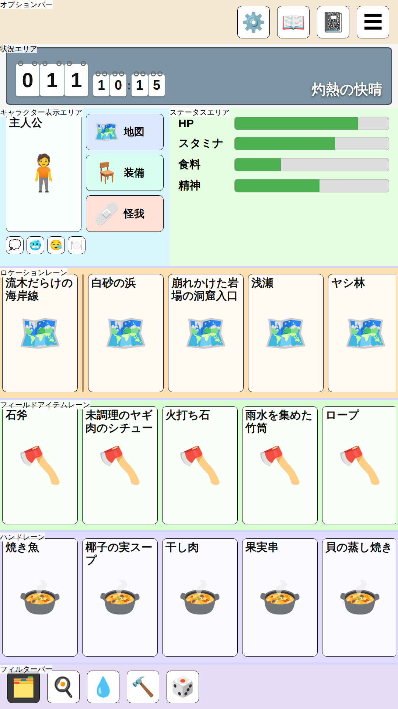
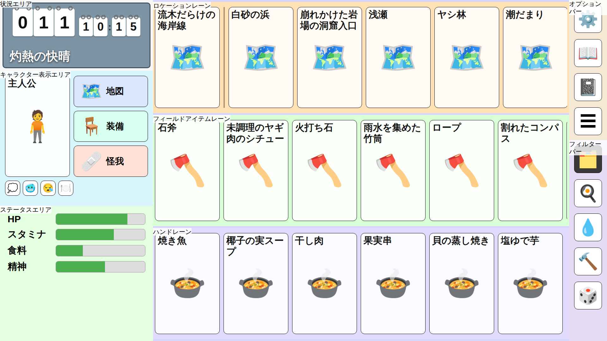

# 画面レイアウト検討

UnmappedIsland のゲーム画面レイアウトを検討するためのモックです。
縦型・横型両対応のレスポンシブなスタンドアロン HTML モックで、画面の向きに応じてレイアウトが切り替わります。

## 設計原則

- **カード基準レイアウト**: 画面を等分して領域を作るのではなく、カード寸法を基準に各エリアの
  寸法を積み上げて決める。カードのアスペクト比は**ブリッジ版のトランプ（57:89）**に合わせ、205×320u
  （= 41:64、比率 0.6406）とする。枠の画像（`src/assets/card_frame.png`、410×640）も同じ比率で、
  引き伸ばしによる歪みが出ないようカードのちょうど 2 倍の解像度で作ってある。
- **絵は u の 2 倍で描く**: `u` は短辺 ÷ 1080 なので、短辺 2160px の端末で 2 になる。それより大きい
  端末は現実的に無いため、2 倍より大きく描いても縮小されるだけ。u 上の寸法が決まっている絵
  （カードの枠・日時の桁・区切りの帯・ボタンのアイコン）はすべてこの倍率で作る。
- **短辺基準の単位**: 寸法は `u`（= 画面短辺 ÷ 1080、CSS では `vmin` ベース）で定義する。
  縦型・横型どちらも短辺を基準にするため、同一端末ならカードの実寸が画面の向きによらず一致する。
  ただし**縦型は 9:16 の画面（1080×1920u）を設計の基準**としており、それより正方形に近い画面
  （4:3 など）では短辺基準のままだと縦に積み切れない。その場合は `u` を長辺 ÷ 1920 まで縮める
  （「3 レーンは必ず確保する」）。
- **フィールドエリア最優先**: ゲームの中心エリアであるフィールドエリアのカードサイズを最大化する。
  カード 205×320u・レーン高 352u はフィールドエリア 3 レーンが横型の画面高（1080u）に
  ちょうど収まる最大値。
- **画面全体は4領域のグリッド**: オプションバー・ダッシュボード・フィールド・フィルターバーの
  4 領域を、向きによらず同じ要素のまま `grid-template-areas` の違いだけで配置し直す。
  縦型は 1 列の縦積み（オプション→ダッシュボード→フィールド→フィルター）、横型は
  ダッシュボード｜フィールド｜右列（オプション／フィルター）の 3 列（右列だけ上下 2 段）。
  これにより、フィールドエリアが横型より狭くなる縦型で、他のエリア（特にキャラクターエリア）が
  間延びしないよう、フィルターバー分の高さをキャラクターエリアから差し引ける。
- **画面を無理に使い切らない**: 縦型でエリアを積んだ余りは、引き伸ばして埋めるのではなく、
  オプションバーの上に余白として残す。スマートフォンでは画面上端に指が届きにくく、そこまで
  使い切る価値が薄いため（「縦長の画面の余り」節）。
- **キャラクターカードはフィールドカード基準**: ポートレイトカードはあくまで補助的な表示なので、
  フィールドカードと同じサイズ（205×320u）とし、縦型・横型で共通にする。
- **親指到達圏**: 縦型では頻繁に操作するフィールドエリアを画面下部に置く。低頻度のオプション
  ボタンをまとめるオプションバーは、通常のフロー内で他のエリアと重ならないよう配置する。縦型では
  画面最上部に固定し、横型ではフィールドエリア右のサイドバー上段に置く。**押す頻度が高い日時が
  最上部に来るのは承知のうえ**で、時間経過の選択自体は画面下部から開くボトムシートで行うため、
  親指圏から外れるのは入口だけに留まる。
- **レーンは横スクロール**: フィールドエリアはスクロール可能なので、レーンに収まらないカードは
  横スクロールで送ればよく、視界に何枚入るかは厳密に揃える必要はない。縦型では約 4.8 枚、
  横型では約 5.4 枚が視界に入る（端のカードを見切らせてスクロール可能なことを示す）。
- **現在地カードのピン留め**: 現在地カードは設置物レーン左端に固定表示し、区切り線を挟んで
  右に設置物を並べる。ピン留めはレーンの中身ではなくレーンの見出しで、区切り線がその境目。
  現在地は常にフィールドカードと同サイズでフィールドエリア内に表示される。
- **空は情報エリアの最上部**: 状況エリア（＝空を映す 1 枚の窓）を情報エリアの先頭に置く。
  外の様子は見上げるものなので、画面でも一番上に来るのが自然で、向きによる例外も要らない。
  縦型ではフィールドエリアの直上がキャラクターエリアになる。
- **日時は空の中に吊り下げる**: 経過日数（3 桁）と時刻は、卓球のスコアボードのように
  一桁ずつ独立したフリップカードで表示し、空の窓の中に置く。各カードは上部の留具のみで
  吊り下げられ、台紙のような外枠は持たない。経過日数と時刻は上下ではなく左右に並べ、
  **背の低い時刻の桁は日数の桁と下端で揃える**（中央で揃えると小さい桁が宙に浮いて見える）。
  縦型・横型でサイズは共通。タップすると休憩・睡眠など時間経過アクションを選ぶ
  ボトムシートが画面下部から開く。入口の位置によらず、選択操作自体は親指圏で行える。
  **経過日数の側に単位のラベルは置かない**。日数の桁（64×88u）は時刻の桁（44×60u）より大きく、
  時刻の側だけが「:」を持つので、大小と区切りだけで読み分けられる。文字を持たなければ翻訳も要らず、
  表示幅も設計値だけで決まる（唯一の文字である「:」も、字幅がフォントで変わらないよう 10u 固定で
  場所を取り、はみ出しは前後の桁間 8u が吸収する）。
- **ボタンはポートレイトの右へ縦積み**: キャラクター表示エリアで最も背の高いポートレイト
  カード（320u）の高さを地図・装備・怪我のボタンが使い切る。下へ積むより 1 つあたりを
  大きく取れるうえ、余った高さが残らない。条件はその下に 1 行。縦型・横型で同じ組み方に
  なるので、向きによる分岐を持たない。条件・地図・装備・怪我はいずれもポートレイトカードに
  重ねず、通常のフロー内に配置する。
- **押す頻度と大きさを対応させる**: 地図・装備・怪我はよく使うので、アイコンの右に
  「地図」「装備」「怪我」の固定ラベルを添えた大きなボタン（幅は列いっぱい、高さは
  ポートレイトの 1/3）にする。アイテム名は表示せず、タップ先の子ウィンドウで確認する。
  一方、条件は今の状態を示しているだけ（タップで詳細を開くが頻度は低い）なので、
  ラベルなしの 48×48u に留める。並びは持ち物の近さの順で、地図と装備は身につけているもの、
  装備と怪我は開く子ウィンドウの形が同じ。押す頻度が最も低い地図が端に来る。
  キャラクター表示エリア自体にも内側の余白（16u）を確保し、要素が端に張り付かないようにする。
- **ステータスエリアのバーは上寄せ**: 表示するステータスは常に全種類ではなく、`status` タグが
  付いたもののうち安全域を外れたもの（と固定表示にしたもの）だけを並べる可変長リスト。中央寄せに
  すると表示件数が変わるたびにバー群の位置が上下に動いてしまうため、上端に揃えて件数が変わっても
  位置が安定するようにする。

## 寸法トークン

| 要素 | 寸法 (u) |
|------|----------|
| カード | 205 × 320（ブリッジ版 57:89 に相当） |
| レーン高 | 352（カード + 上下 15） |
| カード間ギャップ | 12 |
| レーン間・外周マージン | 6 |
| エリアの区切りの帯 | 高さ 12（レーン間マージンの 2 倍。中央半分が区切り、上下 3 ずつは隣へかぶる） |
| スクロールバー | 高さ 8、送られるカードの下端との間隔 3（カードの下の余白 16 の中に置く）、つまみの最小長 48 |
| 情報エリアの余白 | フィールドエリア側 32、それ以外の辺 24（背景のページの縁を避ける） |
| オプション・フィルターボタンの間隔 | 20（カード間ギャップより広めに確保し、隣接ボタンの誤タップを防ぐ） |
| 状況エリア高 | 縦型 156、横型 224（横型は幅が日時 1 つ分しかなく、天候名を別の段へ分けるため高い） |
| 空の窓 | 状況エリアから余白（縦型は左右 16・上 28・下 8、横型は 8）を引いた残り。内側の余白は縦型 24×16・横型 20×16 |
| ダッシュボード列幅（横型） | 478（日時のフリップカード 406 + 左右パディング 20×2 + 紙の余白 32） |
| 日時フリップカード | 日数の桁（3 桁）64×88、時刻の桁 44×60、「:」の確保幅 10、桁間 2、日数と時刻の間 14（縦型・横型共通） |
| オプションバー高・フィルターバー高（縦型、内容量に応じた自動、共通） | 約 120（アイコンボタン 88 + 上下パディング 16×2） |
| 右サイドバー幅（横型、オプション／フィルター共有） | 120（バー厚みと同じ。アイコンボタン 88 + 左右パディング 16×2） |
| ポートレイトカード | 205 × 320（フィールドカードと同サイズ、縦型・横型共通） |
| キャラクター表示エリア高 | 余白 16 + ポートレイト 320 + ギャップ 12 + 条件の行 48 + 下の余白。縦型 444（下 48）、横型 412（下 16） |
| キャラクター表示エリアの内側余白 | 16（縦型の下だけ 48。この辺が背景のページの下端＝表紙の縁に当たるため） |
| アイコンボタン | 88 × 88（最小タップ領域。オプションボタン・フィルターボタンも共用） |
| 地図・装備・怪我ボタン | 高さはポートレイト 320 をギャップ 12×2 込みで 3 等分（≒98）、幅は列いっぱい |
| 地図・装備・怪我ボタンのアイコンの欄 | 64 × 64（絵でも絵文字でもこの大きさ。左の余白 20、ラベルとの間 12） |
| 条件ボタン | 48 × 48 |
| 探索ウィンドウのプログレスバー | 高さ 72、幅はウィンドウ幅（フィールドエリアと同程度）から内側余白 32×2 を引いた残り |

## エリア名称定義

### 情報エリア (Information Area)

フィールドエリアの**左（横型）・上（縦型）**にまとまっている、状況エリアとキャラクターエリアの
全体です。**オプションバーは含みません**（本の外側に置き、縦型ではページの上端に接します）。

**背景は 1 枚の本のページ**（`src/assets/information_background.png`）で、内訳の各エリアは自前の
背景色を持たず、このページの上に直接載ります。

- 絵は**9patch**（Phaser の NineSlice）として敷きます。四隅と縁はそのまま、中央の紙だけが引き伸ばされる
  ので、1 枚で任意の大きさを賄えます。縦型は同じ絵を 90 度回して、表紙の縁を下へ向けます。
- 絵は**1px = 1u**（短辺 1080u のときの原寸）で描かれています。9patch の縁は絵から原寸で切り出される
  ため、絵全体を u 倍して敷き、縁の太さを画面の大きさによらず一定の u に保ちます。
- 反対側（横型の左・縦型の上）は**画面外へはみ出す前提**です。極端な画面比で絵が届かない場合に備え、
  下地に紙の色（`COLOR.informationPaper`）の背景板を敷きます。
- フィールドエリア側の縁 48u のうち、外側の 16u は**透過のグラデーション**で、ページがフィールドエリアへ
  落とす影です。この 16u 分だけフィールドエリアへ食い込ませて置き、影が全部フィールドエリアの上に
  落ちるようにします。縁 48u・影 16u は**絵が従うべき寸法**で、絵はこれに合わせて切り出します
  （`tools/comfyui/recipes/information_background.json`）。
- レーンの区切りの帯より**後（＝手前）**に置きます。ページの縁が帯に途切れさせられないようにするため
  です。背景板はレーンからはみ出したカードを隠す役目も兼ねます。

**中身は紙の内側に収めます**（`informationContent`）。内訳の各エリアはこの範囲へ配置し、エリア自身の
パディングはその内側でさらに効きます。余白は辺によって決め方が違います。

| 辺 | 余白 | 決め方 |
|----|------|--------|
| フィールドエリア側（横型は右・縦型は下） | 32u | 縁の幅（48u）から食い込ませる幅（16u）を引いた残り |
| それ以外（横型は上下・縦型は左右） | 24u | 縁が角でカーブしていて幅が一定でないため、絵から導かず見た目の余白として置く |

この制約が 2 つの寸法を決めています。

- **横型のダッシュボード列幅 478u**: 日時のフリップカード（406u）＋左右パディング 20u×2 ＋紙の余白 32u。
- **縦型のキャラクター表示エリアの下パディング 48u**: このエリアの下端は背景のページの下端
  （表紙の縁）に接しているので、紙の余白をここが受け持ちます。**紙の余白（32u）より広く取る**のは、
  縁ぎりぎりに置くと中身が縁に載って見えるためです。状況エリア（156u）との和が 600u ちょうどで、
  これ以上広げると 9:16 の端末でフィールドエリアが 1080u を割ってしまいます（＝3 レーンが
  収まらなくなる）。横型の縁は右辺にあり、情報エリアの中身の幅が既に引いているので、
  下は通常のパディング（16u）で足ります。

#### 3 レーンは必ず確保する

**フィールドエリアの 3 レーン（1080u）は、どの画面比でも必ず確保します。** 3 レーンが無いと手持ち・
足元・現在地のどれかが見えず、プレイ自体が成り立たないためです。

縦型に必要な高さは、オプションバー 120 + 情報エリア 600 + フィールドエリア 1080 + フィルターバー
120 = **1920u** です。9:16 より正方形に近い画面ではこの高さが短辺基準の `u` で入り切らないので、
`u` を**長辺 ÷ 1920** まで縮めて全体を小さくします（`ScreenMetrics`）。カードは小さくなりますが、
レーンが欠けるよりは読めます。

横型は短辺が高さそのもので、フィールドエリアの高さが常に 1080u になるため、この調整は要りません。
画面が 16:9 より正方形に近い場合に狭くなるのは横幅で、そちらはレーンの横スクロールが吸収します。

#### 縦長の画面の余り

**キャラクターエリアは内容量ぶん（444u）だけ確保し、引き伸ばしません。** 9:16 より縦長の端末で
余った高さは、**オプションバーの上に余白として残し**、画面外の色（`COLOR.outsideScreen`、Phaser の
キャンバスの地の色と同じ）で塗り潰します。

スマートフォンでは画面上端に指が届きにくく、そこまで使い切る価値が薄いためです。余白は情報エリアの
外側なので、はみ出した背景のページごと塗り潰します。

#### 情報エリアの区切り線

背景が 1 枚の紙になり、エリアごとの塗り分けが無くなったため、意味のまとまりの境目だけを線で示します。
見た目は現在地カードの右の区切り線と同じ（太さ 4u・黒 35%）です。

状況エリアとの境目には引きません。空の窓が自分の縁を持っていて、それが境目を兼ねるためです。

| 向き | 位置 |
|------|------|
| 横型 | ステータスエリアの上（キャラクター表示エリアとの境目） |
| 縦型 | ステータスエリアの左（同上） |

### キャラクターエリア (Character Area)

**キャラクター表示エリア**と**ステータスエリア**で構成します。
両者は縦型では左右、横型では上下に隣接します。

#### キャラクター表示エリア (Character Display Area)

**縦型・横型で同じ組み方**です（横型は幅だけが列いっぱいに広がります）。いずれもポートレイト
カードに重ねず、通常のフロー内に配置します（ボタンの仕様は設計原則を参照）。

- 1 行目: 左にポートレイトカード（205×320u）、右に地図・装備・怪我のボタンを縦積み。ボタンの
  高さはポートレイトの高さをギャップ込みで 3 等分するので、列の下端はポートレイトと揃います。
- 2 行目: 条件ボタンを左詰めで 1 行。両列にまたがるので、ポートレイトの幅に縛られません。

##### ボタンのアイコンの絵

地図・装備・怪我のアイコンは **`src/assets/icons/<アイコンの識別子>.png`** に置きます。識別子は
`map`・`equipment`・`injury` で、コード側への登録は要りません（`src/game/ui/iconArt.ts`）。

- **識別子はドメインではなく UI が決めます。** カードの絵と違い、これらは特定の `object_def` では
  なく画面に固定で置かれるボタンだからです。
- 絵は**アイコンの欄（64×64u）いっぱい**に描き、背景は透過にします。ボタンの地の色はボタン自身が
  持ちます。寸法は他の絵と同じく u の 2 倍（**128×128px**）です（設計原則「絵は u の 2 倍で描く」）。
- **アイコンの欄は絵の有無によらず同じ大きさを取ります。** 絵文字の字幅でラベルの位置が動くと、
  3 つのラベルの左端が揃わないためです。
- 絵がまだ無いものは**絵文字で代用**します。絵は少しずつ増える前提なので、両者が混ざった状態を
  正常とします。
- 一覧はビルド時に作ります（`import.meta.glob`）。ファイル名がコードの引く識別子と食い違うと絵は
  黙って使われないままになるので、自動テスト（`tests/game/iconArt.test.ts`）が検査します。理由は
  [カードの絵](#カードの絵)と同じです。

条件のアイコンはまだ絵にできません。**ドメイン側に条件そのものがなく、絵のファイル名にする識別子が
無い**ためです（`PlayScreenView.conditions` は固定の絵文字）。条件が入ったら、同じ規約で置けます。

#### ステータスエリア (Status Area)

キャラクターのプロパティのうち、**`status` タグ**（プロパティのタグ、
[GameElementDefinition.md](../engine/GameElementDefinition.md) 6.7 節）が付いたものだけをバーで表示
します。何を常時見せるかは YAML 側の宣言で決まり、UI は種別を一切知りません。`status` は健康・栄養と
いったカテゴリと**重ねて**付けます（満腹度は `status` であり `nutrition` でもある）。

件数は可変です。上端に揃えて表示し、件数が変わってもバー群の位置が動かないようにします。
残りのプロパティはポートレイトカードから開くプロパティウィンドウ（前項）で見ます。

**バーの値は、アクション・combination・探索のたびに書き換えます。** 中身だけを差し替えるのは、バーを
作り直すと画面の表示順が変わり、後から置かれた子ウィンドウの覆いより手前へ出てしまうためです。同じ理由で
**バーは全プロパティ分を画面の組み立て時に作っておき**、以後は見せ方と位置だけを変えます（出す行は
行動のたびに変わるため、あとから作るとその瞬間に開いている子ウィンドウを突き抜けます）。

##### 域による出し分け

各ステータスがどの域にあるかは、YAML 側の `stages.alert`
（[GameElementDefinition.md](../engine/GameElementDefinition.md) 6.4 節）が宣言します。UI は域ごとに
見せ方を変えるだけで、どのステータスがいつ危ないのかは一切知りません。

| 域 | 見せ方 |
|----|--------|
| 安全域 (`safe`) | 出さない（余裕があるものを並べても読み取る情報が無いため） |
| 留意域 (`watch`) | 出す |
| 要注意域 (`caution`) | 出す（留意域と同じ） |
| 危険域 (`danger`) | 出したうえで、バーの枠を黄色く明滅させる |
| 致命的域 (`fatal`) | 出したうえで、バーの枠を赤く明滅させ、**画面全体の内周も赤く明滅**させる |

**留意域と要注意域は今のところ同じ見せ方**です。留意域は「すぐどうこうはならないが、まったく見なくて
よくはない」程度で、要注意域はもう少し差し迫った状態を表します。今は区別して見せていませんが、深刻さの
違いを YAML 側の宣言として持っておくことで、後から見せ方を分けられます。

致命的域は、放置すると死に至るステータス（水分など）だけが持ちます。画面全体の枠まで使うのは、
ステータスエリアを見ていなくても手が止まるようにするためです。

**安全域から外れる（＝ステータスエリアに出る）のは、おおむね最大値の 80%** です（実際の値は
プロパティごとに `stages` が持ちます、`characters/`）。開始直後はどのステータスも満タン＝安全域
なので、ステータスエリアは空から始まり、値が減るにつれて行が現れます。

##### 固定表示と並び順

**ステータス名をタップすると、そのステータスの固定表示が切り替わります**（ステータスエリアでも
プロパティウィンドウでも同じ操作）。固定表示にしたものは安全域でも出続けるので、気にしている値を
自分で残せます。固定表示にすると名前の左に 📌 が付き、印の欄（34u）は印が無い間も空けておきます
（付け外しで名前の位置が動かないようにするため）。プロパティウィンドウにしか出ないプロパティ
（`status` タグを持たないもの）も、固定表示にすればステータスエリアへ出せます。どれを固定表示に
したかはセーブデータが持ち（[SaveDataManagement.md](../engine/SaveDataManagement.md) セーブデータの
スキーマ節）、切り替えるたびにそのスロットへ書き戻すので、開き直しても残ります。

並び順は次のとおりで、同じまとまりの中はプロパティの宣言順のままです。

1. 固定表示にしたもの
2. 危険域・致命的域のもの
3. 留意域・要注意域のもの

**行の位置が変わるときは、その位置まで動かして見せます**（0.25 秒）。出す行が入れ替わると並び順も
変わるため、いきなり別の値が現れたように見えないようにするためです。安全域へ戻った行・固定表示を
外した行はその場で消えます（動かす先が無いため）。

##### 変わった分の帯

**バーの値が変わるときは、変わる前の位置に帯を残し、少し遅れて（0.25 秒後から 0.7 秒かけて）追いつかせます。**
格闘ゲームの体力バーと同じで、塗りが一瞬で動くと「どれだけ変わったか」が見えないためです。追いつき切る前に
また変わった場合は、そのとき見えていた位置から続きます。

**動くのは変わる前の値の側だけで、今の値の側はすぐそこへ移ります。** 値そのものは待たせず、変化の量だけを
目で追わせるためです。帯と塗りのうち広い方が帯・狭い方が塗りになるので、向きで見え方が変わります。

| | 帯 | 塗り |
|---|---|---|
| 減ったとき | 減る前の位置に残り、遅れて縮む | すぐ今の値まで縮む |
| 増えたとき | すぐ今の値まで伸びる | 遅れて帯を満たしていく |

**良し悪しを表すのは帯の色だけです**（形は増減だけで決まります）。悪化した分は赤、好転した分は塗りを
薄めた色になるので、増えると悪いステータス（荷重）では**増えた分の帯が赤く**なります。

好転の帯を固定の 1 色にせず塗りから引く（`fadedFill`）のは、**これから満ちる分**を表すためです。
塗りの色はバーごとに違う（水は青、油は黄色）ので、固定色だと何が満ちる途中なのかが読めなくなります。
悪化の赤が塗りの色によらず同じなのは対照的ですが、失われたものはもう塗りではないので色を共有しません。

**1 回の行動の途中では帯を動かしません。** 長い行動は tick ごとに値が動きますが（時間経過の再生、
「時間経過のドーナツグラフ」節）、そのつど追いつかせると 1 tick 分ずつの帯にしか見えません。**行動が
終わってから動き始める**ことで、帯はその行動で変わった合計を示します。

この動きはバーの部品（`ProgressBar`）が持つので、増えるだけのバー（探索率）でも進んだ分が帯として出ます。

**出ていなかった行が現れるときは、その行動を始める前の値から見せ始めます。** 帯は「今この行動でどれだけ
変わったか」を見せるものなので、現れた行にもその行動での増減ぶんは帯で出ます。出ていない間（安全域だった間）
に変わった分まで足すと、現れた瞬間に満タンから大きく減ったように見えてしまうため、そこは含めません。

##### 増減の記号

**バーの右に、直前の行動での増減を三角で出します**（増えたら明るい緑の ▲、減ったら赤の ▼）。行動を
始める前と終わったときの値を比べたもので、変わらなかった項目には出しません。次の行動まで出したままに
するので、移動のようにフィールドエリアを作り直す行動でも記号は残ります。

**記号が消えるのは、時間が経過してなお値が動かなかったときだけです。** 時間を消費しない操作（箱へ
入れる、並べ替える）は行動の区切りではないので、そこで値が動かなくても直前の行動の記号を残します
——ステータスが動きようのない操作をしただけで記号が消えると、その操作が何かを変えたように見えるためです。
荷重のように時間を消費せずに動く項目もあるので、**動いた項目だけは上書き**します。

記号の欄（40u）は**記号が無い間も空けておきます**。出たり消えたりするたびにバーの長さが変わると、値が
動いたのか幅が変わったのかを取り違えるためです。

##### 増えると悪いステータス

負荷（`load`、[ContainerSystem.md](../engine/ContainerSystem.md) 2 節）のように**増えるほど悪い**プロパティも、
`status` タグを付けるだけで同じ行として並びます。**専用のバーをキャラクター表示エリアには置きません**——
空身の間も 0 のバーが出続けて「安全域は出さない」と食い違いますし、常に見ていたいプレイヤーは固定表示（📌）で
自分で残せます。荷造りの最中から見えている必要はあるので、それは留意域の閾値を低く取ることで満たします。

ただしバーの語彙は「満タンが良い」に寄っているため、向きだけが逆になります。**どちら向きが悪化かは
`stages` の `alert` から導きます**（`PropertyDef.alertDirection`）——段を下から上へ見て、深刻さが単調に
上がるなら増える側が悪い。どちらが危ないかは `alert` が既に宣言しているので、同じことを二度書かせません。
UI が切り替えるのは次の 2 点だけです。

| | 減ると悪い（満腹度など） | 増えると悪い（荷重） |
|---|---|---|
| 遅れて出る帯 | 塗りが先に縮み、帯が後から縮む | 帯が先に伸び、塗りが後から伸びる |
| 増減の記号 | ▲ 緑・▼ 赤 | ▲ 赤・▼ 緑（向きは値の増減のまま） |

帯の規約を「**悪化した分を遅れて見せる**」に一般化したもので、溜めと動きの時間（0.25 秒後から 0.7 秒）も、
1 回の行動の途中では動かさないことも、向きによらず同じです。並び順・明滅・固定表示も既存のままです。

##### 塗りの色は域が決める

**塗りの色は、域（`alert`）の深刻さで安全域の緑から致命的域の茶へ寄せます。** 満タンが良いバーと悪いバーが
同じ画面に並ぶ以上、塗りの**長さ**だけでは良し悪しが読めないためです。長さは「どれだけか」を、色は
「まずいのか」を表す、と役割を分けます。

- 引くのは値の位置ではなく**域**なので、まだ安全域なら満タンでなくても緑のままです。
- 域を持たないバー（探索率）は常に安全域で、緑のまま変わりません。
- **危険域・致命的域の明滅する枠は、暗い線を敷いた上に載せます。** 深刻な域ほど塗りが濃くなるので、
  明るい枠の色をそのまま置くと沈んで読めなくなるためです。

##### 両端が悪い量は、バーにしない

体温のように**高すぎても低すぎても悪い**量は、`range` を持つプロパティ（＝バーになるもの）としては
宣言できません（`alert` の深刻さが下から上へ単調でないため、ロード時エラー）。塗りの向きを
「良い方へ伸びる」とも「悪い方へ伸びる」とも決められないからです。

この種の量は、**片側だけの度合いを別のプロパティとして見せます**——体温そのものではなく、熱中症の度合い・
低体温症の度合いを、どちらも「増えるほど悪い」ステータスとして並べる形です。高いほど良いのか低いほど
良いのかが読み取れないバーを作らずに済み、プレイヤーが対処すべき事柄（冷やす／温める）とも一対一で対応します。

### 状況エリア (Situation Area)

**空を映す 1 枚の窓**で、日時と天候の名前をその上に載せます（`WeatherPanel`）。情報エリアの
最上部——縦型はオプションバーの直下、横型はダッシュボード列の最上段（設置物レーンの左隣）——に
置きます。紙に貼った写真に見えるよう、状況エリアの四辺を少し残して敷き、角を丸めて縁を描きます。

**天候はアイコンではなく絵と名前で表します。** 絵だけでは晴天どうしを区別できないので名前は
必ず出しますが、アイコンを添えると名前と同じことを二度言うことになるため、絵に語らせて
アイコンは持ちません。名前は言語ごとの対応表の `symbol_texts` 節から引きます
（[Localization.md](../engine/Localization.md)）。

載せ物は**絵の主題（太陽・雲）を置く右上を必ず空けます**。

| 向き | 日時 | 天候名 |
|------|------|--------|
| 縦型 | 窓の左下 | 窓の右下（下端は日時と揃える） |
| 横型 | 窓の下端（左右中央） | 窓の左上 |

横型が上下に分かれるのは、ダッシュボード列の幅（446u）が日時のフリップカード（406u）で
ほぼ埋まり、名前を横に並べる余地が無いためです。そのぶん状況エリアは縦型より高くなります。

日時の各桁は白い紙の画像（`flip_digit.png`）に黒い数字を載せたもの。画像はカードの枠と同じ
生成テクスチャから組み立て、留具の穴・リング・落ち影まで描き込んである
（`tools/comfyui/recipes/flip_digit.json`）。**窓の下端に付ける**ので、桁の紙は絵の下側に重なります。
空の絵はここを白く抜かない約束なので（下記）、明るい空でも白い紙が沈みません。

#### 空の絵

置き場所は **`src/assets/weather/<天気の識別子>.png`** のみで、コード側への登録は要りません
（`src/game/ui/weatherArt.ts`）。天気の識別子は `light_rain` などのプロパティの値
（[ClimateSystem.md](../engine/ClimateSystem.md) 4.2 節）です。

- **1 枚の絵を縦型・横型それぞれの窓へ cover で敷きます。** 切り出される範囲は向きによって
  大きく違う（縦型は横長、横型は正方形に近い）ので、絵は横長のパノラマ 1 枚で描き、
  **主題は右上へ寄せます**。
- **右上の角を合わせて、はみ出す側（左・下）を切り落とします。** 中央で合わせると、向きが
  変わって切り出しの比率が変わったときに主題ごと落ちてしまうためです。
- **絵は空だけで、海も陸も入れません。** 土地の眺めはレーンの背景が受け持っているので、ここに海や
  岸が映ると、土地が変わっても空だけ別の場所に見えます。
- **日時と天候名が載る場所を、白く抜かないようにします。** 桁の紙も天候名も白いので、そこが白いと
  沈みます。太陽を大きく描く天気ほどここが危うくなるので、光は右上へ寄せて逃がします。
- 絵がまだ無い天気は**単色の板**になります（`COLOR.weatherPanel`）。絵は少しずつ増える前提なので、
  絵のある天気と無い天気が混ざった状態を正常とします。板は天気そのものを表しませんが、白い天候名と
  白い桁の紙がどちらも読める暗さにしてあります。
- 一覧はビルド時に作ります（`import.meta.glob`）。ファイル名が実在の天気かどうかは自動テスト
  （`tests/game/weatherArt.test.ts`）が検査します。理由は[カードの絵](#カードの絵)と同じです。
  天気は土地と違って移動を待たずに変わるため、遅延ロードはせず起動時に読み切ります。
- 絵は `tools/comfyui/recipes/weather_<識別子>.json` から作り直せます（7 枚で 2.6MB）。

### オプションバー (Options Bar)

設定・図鑑・日記・メニューのアイコンボタン 4 個を置くバーです。低頻度の操作なので、
通常のフロー内で他のエリアと重ならない位置に固定します。縦型では画面最上部
（キャラクターエリアの直上）に横長バーとして置きます。高さはフィルターバーと同じ
上下パディング 16u を確保した自動サイズ（約 120u）にし、ボタンの上下の余白がフィルター
バーより狭く見えないようにしています。横型ではフィールドエリア右のサイドバー上段に置き、
アイコンボタンを縦に並べます（下段はフィルターバー、サイドバーの詳細は次項）。ボタンの
間隔はカード間ギャップ（12u）より広い 20u とし、隣接ボタンを誤タップしにくくしています。

### フィールドエリア (Field Area)

カードを配置する主要な描画領域です。上から**設置物レーン**・**アイテムレーン**・
**ハンドレーン**の 3 レーン（各 352u 高）で構成し、各レーンは独立に横スクロールできます。

#### 空の演出

外の様子をフィールドエリアそのものへ映します。状況エリアの窓は情報エリアの端にある小さな絵なので、
**カードの並ぶ場所が映す**方が早く伝わるためです。演出は3つあり、それぞれ別のものを見ています。

| 演出 | 見ているもの | 実装 |
|---|---|---|
| 翳り・輝き | `sunlight`（日射） | `src/game/ui/skyTint.ts` |
| 雨 | `weather`（天気） | `src/game/ui/rainStyle.ts` |
| 陽炎 | `ambient_temperature`（気温） | `src/game/ui/heatHaze.ts` |

##### 明るさは日射が決める

**天気ではなく `sunlight` を見ます。** 日射は時間帯と天気の寄与を1つに畳んだ実効値で、夜は天気に
よらず0へクランプされる（[ClimateSystem.md](../engine/ClimateSystem.md)）ので、**真夜中の快晴が
明るくなる**ような取り違えが起きません。雨が暗いのも同じ仕組みで表せます——雨雲が陽を遮ることは、
天気から日射への寄与として既に書かれているので、雨の側に暗さを持たせる必要がありません。

翳りも輝きも足さない基準は**曇りの日中**（日射7）です。そこから暗いほど青みのある翳りが濃くなり、
明るいほど暖色の輝きが強くなります。輝きは加算合成にします——普通に重ねると白く濁って、明るくならずに
褪せて見えるためです。

**暗さは、光が少し減っただけで大きく効かせます。** 日中の嵐と曇りの日射の差は2しかありませんが、
目には曇りよりずっと暗く映るためで、翳りは日射が下がり始めた側で速く濃くなります。

##### 雨

雨が強いほど、多く・長く・速く・斜めになります。小雨は鉛直に近く数も少なく、大雨は少し斜めで量が
増え、嵐は更に斜めで、雨粒より長く薄い**風の筋**が混じります。傾きは向きだけでなく落ちる向きでも
あり、筋の向きと落ちる向きは常に一致させます——斜めに降る雨が縦に伸びていると、風の向きが読めない
ためです。

- **雨はカードより手前、隣接エリアより奥に降ります。** カードの上に降っていないと、雨が背景の絵の
  一部に見えてしまいます。一方でフィールドエリアの外へは出さないので、情報エリアやバーには掛かりません。
- **入力は遮りません。** 降っている間もカードの操作は変わりません。
- **雨は敷き詰めた1枚の絵（TileSprite）で描き、フィルタは使いません。** 敷き詰めた絵は自分の矩形の
  外へ描かないので、はみ出しを切り抜く必要がそもそもありません。フィルタで切り抜くと画面サイズの
  描画バッファを使ってしまいます（[DesignNotes.md](../engine/DesignNotes.md)）。絵は上下左右で
  繋がるように描き、縦横それぞれ1周ぶん送っては戻すので、継ぎ目も折り返しも見えません。

##### 陽炎

暑い季節の日中だけ、**レーンを1枚の熱い空気ごしに見せます**（Phaserの変位フィルタ）。

- **フィールドエリアの3レーンすべてに立てます。** 暑いのは画面の一部ではないので、外の地面（設置物・
  アイテム）だけを揺らして手持ちのレーンを止めておくと、そこだけ熱が届いていないように見えます。
- **1つのレーンに見えているものは、すべて歪ませます。** 地面の絵だけでなく、その上のカード、現在地
  カードとその背景、区切り線まで含みます。一部だけを止めると、そこに境目が見えます。
- **ゆらぎはレーンの上の位置で決めます。** 表示物ごとに別々のフィルタを掛けることになりますが、
  どれもレーンの矩形を1枚の空気として見るので、同じ位置なら同じだけ揺れます。設置物レーンで背景が
  固定と可動に分かれていても、境目に段差は出ません。カードを送っても空気は動かず、カードがその中を
  通っていきます。
- **砂だけでは足りません。** まっすぐな輪郭が無く、ゆらいでいることが読み取れないためです。カードの
  縁という直線が一緒に波打って、初めて陽炎に見えます。
- **ここだけはフィルタを使うので、立っている間は描画バッファを使います**（[DesignNotes.md](../engine/DesignNotes.md)）。
  歪ませる以上は避けられないコストなので、そのぶん立つ条件を狭く取っています。掛ける対象は多いものの、
  どれもレーンの矩形を写すためバッファは使い回され、**レーンを増やしても消費は増えません**。
- **カードの名前が読める範囲に留めます。** 大きく歪むと、陽炎ではなく描画の壊れに見えます。
- **天気ではなく気温を見ます。** 陽炎が立つのは地面が焼けているからで、灼熱という天気の名前そのもの
  ではないためです。気温は日射と季節から決まるので、乾季後半の晴天でも立ちます。

##### 対応表はUI側が持つ

3つとも、強さの対応表はUI側にあります。WorldCodexは表示に関わる値を持たない方針
（[Localization.md](../engine/Localization.md)）で、液体の色
（[LiquidContainerSystem.md](../engine/LiquidContainerSystem.md) 4.1節）のようにドメインが意味を持つ値でも
ないためです。**表に無い天気では降らせません**。天気が増えても画面は壊れず、表へ足すまで降らないだけです。

#### スクロールバー

各レーンの下端に、送り具合を示す半透明のスクロールバーを重ねます（`src/game/ui/ScrollIndicator.ts`）。
端のカードを見切らせるだけでは「まだ右にカードがある」ことに気付きにくく、視界に入る枚数が少ない
縦型のハンドレーンで特に見落とされるためです。

- **中身が可視域に収まるレーンには出しません。** 送れないレーンにバーを出しても意味を持たないためです。
- つまみの長さは中身に対する可視域の割合、位置は送り具合そのものです。中身が長いとつまみが
  見えない細さまで痩せるので、最小の長さ（48u）で下限を切ります。
- 置き場所は**送られるカードの真下**（下端から 3u）で、横は送られる範囲だけです。ピン留めのある
  設置物レーンでは、ピン留めは送られないので区切り線より右だけに置きます。
- **カードの下には常に 16u の余白**（レーン高 352u とカード高 320u の差の半分）**を置き、バーはその中の
  上寄せ**に入れます。バーが出るかどうかでカードの位置が動かないよう、余白は送る必要が無いときも
  空けたままにします。レーンではこの余白に区切りの帯がかぶる 3u も収まるので、バーはカードにも帯にも
  重なりません。
- **暗いトラックに明るいつまみ**を重ねます。レーンの背景の絵は明るいものも暗いものもあり、どちらの
  上でもつまみが読める必要があるためです。
- **送っている間だけ濃くし、止まれば控えめな濃さへ戻りますが、消えはしません。** 「まだ先がある」ことは
  操作していない間こそ伝わる必要があるためです。

同じバーを、横スクロールする他の場所——スロットの子ウィンドウ（レーンそのもの）と探索ウィンドウの
発見物の枠——にも同じ規約で置きます。発見物の枠にはレーンのような余白が無いので、カードの下に
同じ 16u を足します（そのぶんウィンドウが縦に伸びます）。

#### カードの絵

カードの絵は **`src/assets/objects/<object_def の識別子>.png`** に置きます。ファイル名が識別子そのもので、
コード側への登録は要りません（`src/game/ui/objectArt.ts`）。

- **種別のプレフィックス・サフィックスは付けません。** 識別子は Codex 全体で一意なので不要ですし、
  アイテムから設置物へ移したときにファイル名を変えずに済みます。
- 絵は**枠と同じ寸法**（205:320）で作り、枠の上にそのまま重ねます。背景は透過にします。
- **土地そのもののカード**（設置物レーンの左端、押すと探索ウィンドウが開くカード）も同じ規約で
  絵を持ちます。ただしこれは景色なので、絵をカード全面に敷いて**透過させません**——空や海が紙へ
  置き換わると景色にならないためで、[設置物のカードの背景](#背景の絵)と同じ理由です。
- 絵がまだ無い object_def は、`PlayScreenView` が種別ごとに割り当てた**絵文字で代用**します。
  絵は少しずつ増える前提なので、両者が混ざった状態を正常とします。

一覧はビルド時に作ります（`import.meta.glob`）。実行時に総当たりで読みに行くと、絵をまだ用意していない
object_def のぶんだけ 404 が出るためです。ファイル名の綴りが object_def と食い違っていると絵は黙って
使われないままになるので、実在の識別子かどうかは自動テスト（`tests/game/objectArt.test.ts`）で検査します。

#### 背景の絵

レーンの全面に敷く絵と、設置物のカードの地に敷く絵をまとめて背景と呼びます。置き場所は
**`src/assets/backgrounds/`** 直下のみで、ファイル名がそのまま「どの土地の・どの用途の絵か」を
表します（`src/game/ui/backgroundArt.ts`）。

| 用途 | ファイル名 | 何を描くか |
|------|-----------|-----------|
| 設置物レーン | `<土地の object_def の識別子>_fixture.png` | その土地の眺め |
| アイテムレーン | `<土地の object_def の識別子>_item.png` | その土地の地面 |
| 設置物のカード | `<土地の object_def の識別子>_card_background.png` | その土地の眺め（カードの縦長） |
| ハンドレーン | `hand.png` | プレイヤーの手 |

上の 3 つは**現在地の土地ごとに差し替わります**。ハンドレーンはプレイヤー自身なので土地によりません。

- **用途でディレクトリを分けません。** 土地を 1 つ足すと上の 3 つが対で必要になるため、1 か所に
  集めた方が「何を描き足せばよいか」が一覧で分かります。用途はファイル名の接尾辞が表します。
- **土地を用途より先に置きます。** ファイル名一覧で同じ土地の絵が隣り合うためです。
- **識別子そのものをファイル名にしません。** 他の用途の絵（カードの絵など）と同名になり、
  ディレクトリが違っても紛らわしいためです。用途の接尾辞は必ず付けます。
- 絵がまだ無い土地は、レーンなら**レーンの背景色で塗り**、カードなら**紙がそのまま地になります**。
  絵は少しずつ増える前提なので、絵のある土地と無い土地が混ざった状態を正常とします。

一覧はビルド時に作り、ファイル名が実在の土地かどうかを自動テスト（`tests/game/backgroundArt.test.ts`）で
検査します。理由はカードの絵と同じです。

**レーンの背景**は次の規約に従います。

- 絵は**レーン高（352u）へ合わせて縦横同率で拡大縮小**します。原寸は問いませんが、レーン高より
  低い絵は拡大されるので、高さは 2 倍の 704px を目安にします（設計原則「絵は u の 2 倍で描く」）。
- 横方向は**繰り返して並べる**ので、左右の端が繋がるように描きます。
- 背景はカードと同じだけ横へ送ります。カードが地面の上に置かれているように見せるためです。

**設置物のカードの背景**は、枠と絵の間に敷きます。持ち歩けるアイテムと違い、設置物はその土地から
切り離せないもので、カード自体が土地の一部として見えるべきだからです。道のカードもここに含みます。

- **敷くかどうかはオブジェクトの種類ではなく、設置物レーンに並ぶカードかどうかで決めます。**
  背景が表すのは「今その土地に在るもの」であって、そのオブジェクトが何であるかではないためです。
  探索ウィンドウの発見物の枠に出るカードは、レーンのカードの写しなので背景も一緒に付いてきます。

- 寸法・角の丸めはカードの絵と同じ規約に従いますが、背景は**透過させません**。空や海が紙へ
  置き換わると景色にならないためです。代わりに縁だけを内側へ向けて薄くし、カードの枠へ馴染ませます。

絵は ComfyUI で生成し、油絵風にぼかしてから横方向をシームレスに繋いでいます。プロンプト・
ワークフロー・後処理の設定は [`tools/comfyui/`](../../tools/comfyui/README.md) に置いてあり、
レシピ 1 つで作り直せます。

#### カードの状態バー

カードの絵に重ねて、そのカードが映しているものの状態をバーで出します。**どちらも「その値を持つ
カードにだけ出る」**ので、値を持たないカードの見た目は変わりません。実装は `src/game/ui/Card.ts` で、
バーの部品（`ProgressBar`）はステータスエリアと共通です。

| | 何を映すか | 置き場所 | 高さ |
|---|---|---|---|
| 耐久度バー | `durability` プロパティの `range` に対する残り | 紙の下端の縁に接する | 6u |
| 中身のバー | 中身（代表）の量が、入っている容器の `capacity` をどれだけ満たしているか | 絵の下、下端から 72u 浮かせる | 15u |

- **耐久度バーはステータスバー（36u）とは比べ物にならない細さにします。** 道具を持ち歩いている間
  ずっと出ているものなので、見に行けば読めるが視界には入らない、という控えめさに留めます。**トラックの
  枠線も描きません**——数 px の太さでは枠線が大半を占め、塗りが読めなくなるためです。左右は角の丸み
  （16u）ぶん詰めて、丸めた角に掛からないようにします。
- **中身のバーはカードの下端へ付けません。** 何がどれだけ入っているかは容器カードの主要情報で、
  絵と同じくらい見に行く先だからです。耐久度より太くし、絵の下・下端との間を空けた位置に置きます。
- **中身のバーは、量として存在する中身（`quantitative`）が代表（`represented_by`）に居るカードに
  出ます。空の容器には出ません**——バーが映すのは中身の状態であって、容器の属性ではないためです。
  空の容器は代表が自分自身になる（`LiquidContainerSystem.md` 3 節）ので、この 1 つの条件だけで
  「空なら出ない」まで決まり、UI 側は容器のスロット名を知りません。飲み干せばバーは消え、注がれれば
  現れます。
- **どちらのバーも、変わった分を帯として残して遅れて追いつかせます**（ステータスエリアの「変わった分の
  帯」節と同じ動き・同じ時間で、1 回の行動の途中では動かさないところまで同じ）。バーは作り直さず
  値だけを差し替えるので、飲んだ量・溜まった量がそのまま帯として読めます（中身が消えた瞬間だけは、
  追いつく相手ごと無くなるのでバーも消えます）。
- スタックにまとまったカードは**代表の状態**を出します。名前も絵も操作も代表のものなので、状態だけを
  別の個体から採ることはしません。

##### 耐久度バーの色

**満タンの緑から、尽きる直前の赤へ寄せます**（`durabilityColorFor`）。ステータスバーと違って
域（`alert`）ではなく値そのものから引くのは、耐久度は「どれだけ残っているか」がそのまま深刻さで、
段を分けても同じ順序にしかならないためです。緑と赤の中間は琥珀を通します——両端を直接混ぜると
中間が濁った茶になり、致命的域のステータスバーと見分けが付かなくなるためです。

##### 中身のバーの色は液体が宣言する

**中身の色は液体自身が `color` プロパティ（`0xRRGGBB`）として宣言します**（水は青、茶は茶緑、油は
黄色、`liquid_containers.yaml`）。何色に見えるかはその液体の性質なので、容器側にも UI 側にも
持たせません。

**UI 側に対応表を持ちません。** 表を持つと、後から足された液体——MOD や新しい YAML——が必ず
「色の分からない液体」になり、YAML を書くだけでは画面に出せなくなるためです。UI が知っているのは
「`color` という名前のプロパティが塗りの色である」ということだけで、液体の種類は一切知りません。
色を宣言していない液体は灰色で出ます（中身があること自体は見えます）。宣言の抜けは自動テスト
（`tests/worldCodex/liquidContainersYaml.test.ts`）が捕まえます。

**空の容器にも割合 0 のバーを出します。** 空であることも中身の情報で、バーが消えてしまうと
「空なのか、そもそも液体を入れられないものなのか」が見分けられなくなるためです。

#### エリアの区切り

エリアの境目には木の梁の帯（**`src/assets/separator.png`**）を敷きます。敷く場所は 2 種類です。

- **レーンの区切り**: 設置物レーンの上・レーンの間 2 か所・ハンドレーンの下の 4 本。フィールド
  エリアを枠で囲う見え方になります。
- **オプションバーの下**（縦型のみ）: オプションバーと情報エリア（背景のページ）の境目。横型の
  オプションバーは右サイドバーで情報エリアと接していないため、置きません。
- **右サイドバーの左**（横型のみ）: フィールドエリアと右サイドバーの境目。ここだけ縦向きなので、
  **同じ絵を反時計回りに 90 度回して**敷きます（回した別ファイルは持ちません）。縦型はこの 2 つが
  上下に並ぶため、置きません。

**帯は中央半分だけが区切りそのもので、上下 1/4 ずつは隣のエリアへかぶせます。** そのため帯の高さは
レーン間マージン（6u）の 2 倍の 12u を取り、**境目の線に対して上下対称に**置きます。レーンの区切りで
かぶる 3u ぶんはレーン内側のカード上下の余白（15u）に収まるので、カードには重なりません。

- 絵は帯の高さへ合わせて縦横同率で拡大縮小し、横方向は繰り返して並べます（左右の端が繋がるように
  描きます）。
- 原寸は **192×24px**（高さ 12u の 2 倍）です。
- **入力は遮りません。** 隣のエリアへかぶせて置くため、下のエリアのタップやドラッグを奪わないように
  しています。
- レーンの区切りは、隣接エリア（状況エリア・フィルターバー）の背景板を描き終えた**後**に敷きます。
  上端・下端の帯はフィールドエリアの外へ 3u はみ出すので、先に敷くと隣接エリアに覆われてしまうため
  です。オプションバーの下の帯も同じ理由で、オプションバーを描き終えた後に敷きます。

#### 設置物レーン (Fixture Lane)

現在地の**設置物**（`fixtures` スロット）を表示します。道・木・建物・家具など、**持ち歩けないもの**が
すべてここに入ります。道も設置物の一種なので、木や建物と同じ並びに置かれます。

左端には現在地カードをピン留めし、区切り線を挟んで右に設置物を並べます。ピン留めはレーンの中身では
**レーンの見出し**で、タップすると探索ウィンドウ（次項）が開きます。横型では画面の横幅を活かし、
カード 5 枚（ピン留め含む）強が視界に入ります。

**道のカードは、道そのものではなく行き先の土地の名前と絵を出します。** 道は「どこへ繋がっているか」
だけが意味を持ちますし、土地の景色と別々に描いた道の絵は、どの景色に載せても人の目には不自然に
映るためです。地に敷く景色は他の設置物と同じで、今いる土地のものです。

**そのぶん、道であることは紙の左下の右向き矢印だけが示します。** 名前も絵も行き先のものなので、
矢印が無いと現在地のカードや他の設置物と見分けが付きません。大きさは名前の文字（30u）の 2 倍ほど
（68×60u）取り、カードを縮めて並べても一目で道と分かるようにします。**白い塗りに黒い細い縁**に
するのは、明るい絵の上でも暗い絵の上でも輪郭が残るようにするためです。縁が名前の縁取り（4u）より
細い（2u）のは、名前が文字の隙間を埋めないよう縁取りを太らせるのに対し、矢印は一続きの塗りなので、
太らせると形そのものが鈍るためです。

**紙の角からは、角の丸み（16u）ぶん空けます。** 絵は紙の縁の内側 12u をかけて薄くなっていくので
（[カードの絵](#カードの絵)の縁の処理）、名前と同じ 8u では絵の薄い帯と重なって輪郭が濁ります。
16u 空ければ、丸めた角でも縁までの距離が 12u を下回りません。

矢印は**絵文字（➡）ではなく図形で描きます**。字を持たないフォントでは豆腐になりますし、絵文字として
描かれると環境ごとに色も形も変わってしまうためです。線ではなく塗り潰した矢羽根にするのは、細い線だと
カードを縮めて並べたときに何の形か読み取れなくなるからです。

設置物は持ち歩けないので手持ちへ送る端の操作を持ちませんが、**同じレーンの中でなら並べ替えられます**。
地形をどう捉えているかはプレイヤーごとに違うので、並び順はプレイヤーが決めます。

#### 探索ウィンドウ (Exploration Window)

現在地カードから開く子ウィンドウで、上から**発見物の枠**・探索率の横長プログレスバー（高さ 72u、
中央に百分率）・補足の 1 行・「探索する」「閉じる」ボタン（高さ 88u）を置きます。

**横幅は発見物の 4 枠ぶん**（カード 4 枚＋ギャップ＋左右パディング）で決めます。フィールドエリアの
幅に合わせて広げると、横型では 4 枠が離れて散らばり、ウィンドウが横に間延びして見えるためです。
入りきらない画面ではその範囲まで絞り、枠のほうを縮めます。

**位置はフィールドエリアの中央**です。画面の中央に置くと、縦型では状況エリアの時計を覆ってしまいます。
このゲームでは日時が重要なので、時計は子ウィンドウを開いている間も読めるようにします。

探索率が 100% でも探索は続けられる（[ExplorationSystem.md](../engine/ExplorationSystem.md) 2 節）ため、
ボタンは常に押せます。100% で変わるのは「隠された道がもう見つからない」ことだけなので、バーの下の
1 行で伝えます。

##### 発見物の枠

直前の探索で見つかったもの（spawn されたアイテムと、発見された道の両方）を、カードとして並べます。
枠は常に 4 個表示し、見つかっていない分は破線の空枠のままにします。カードは**レーンと同じ寸法**
（205×320u）で描きます——何を見つけたかは探索の結果そのものなので、縮めて読みにくくしません。
**4 件を超えた分は横スクロール**で送ります。枠からはみ出したカードはレーンと違って背景板では
隠せないため、マスクで切り抜きます。送り具合は[スクロールバー](#スクロールバー)で示します。

##### 探索にかかる実時間

「探索する」を押すと、そのアクションの `duration` が進めるゲーム内時間の分だけ**実時間をかけて**
進みます（**ゲーム内 15 分＝現実 0.5 秒**。探索は 1 tick＝15 分なので 0.5 秒）。

- 押した瞬間: 発見物の枠が空へ戻り、「探索する」は押せなくなります。
- その間: フィールドエリアの中央に**時間経過のドーナツグラフ**（次項）が出て、状況エリアの時計が
  15 分刻みで進みます。
- 経過し切った時点: グラフが消え、見つかったカードが枠へ入り、探索率・各レーンが更新されます。

ワールド自体は押した瞬間に変わっていて、実時間をかけるのは見せ方だけです。連続で探索したときに
「前回の結果が残ったまま次の結果に入れ替わる」ことがないよう、いったん空へ戻してから埋めます。

#### 時間経過のドーナツグラフ (Progress Ring)

`duration` を持つアクションの実行中、フィールドエリアの中央に重ねて出す輪です。`duration` 全体を
100% として、経過ぶんを真上から時計回りに塗ります。カードや子ウィンドウより手前に出し、下が透ける
濃さで描きます。

割合は一定の速さでは進めず、**区切りごとに一拍置きます**。区切りの前半で次の目盛りまで進み、後半は
止まります。ゲーム内の変化が起きるのは tick 境界だけなので、滑らかに増やすより実際の進み方に合います。

**目盛りへ向かう間は、加速して動き出し減速して止まります。** 一定の速さで動いて急に止まると、目盛り
ごとに動きが切れて見えるためです。加速に使うのは進む側の実時間の 35% で、残りの 65% を減速に使います
——止まり方のほうが目に付くので、そちらへ時間を多く割きます。一拍置く作りそのものは変えていません。

**目盛りは「実際に tick が回る瞬間」に置きます。** すなわち絶対時刻が `minutes_per_tick`（15 分）の
倍数になる瞬間で、`WorldSession.AdvanceWorldTime` が tick を回すタイミングそのものです。そのため
区切りの長さは一定とは限りません。

- 00:00 から 45 分: 目盛りは 00:15 / 00:30 / 00:45 の 3 つ。区切りはすべて 15 分。
- 07:10 から 45 分: 目盛りは 07:15 / 07:30 / 07:45、そして経過し切る 07:55 の 4 つ。
  最初の区切りは 5 分、最後の区切りは 10 分と短くなります（最後だけ tick を伴いません）。

**状況エリアの時計も同じ区切りで動きます。** 塗りが目盛りへ届いた瞬間に、その時刻へ飛びます。
塗りと時計が食い違って見えないよう、どちらも同じ区切りから導いています。

#### 経過中に起きた変化の再現

**経過中の tick で起きた変化は、その tick の目盛りに届いた瞬間に見せます。** 45 分かかるアクションの
15 分目に食べ物が腐ったなら、実時間でもその 15 分の位置でカードが入れ替わります。時間をかけて見せて
いるのに変化だけ最後にまとめて現れると、何がいつ起きたのか読み取れないためです。

ワールドは操作した瞬間に経過し切っています（[探索にかかる実時間](#探索にかかる実時間)と同じ）。そこで
**各 tick 時点の表示内容を控えておき、実時間の経過に合わせて再生します**。控える時刻は tick が回る
絶対時刻なので、ドーナツグラフの目盛りと定義上一致します。控えたものを見せる動きは通常の差し替えと
同じ経路（[カードの移動アニメーション](#カードの移動アニメーション)）なので、壊れた道具はその瞬間に
消え、湧いたものはその瞬間に現れます。

変わった分の帯（ステータスエリア）も tick ごとに動きます。増減の三角は「行動開始からその時点まで」の
差で、経過が進むにつれて確定していきます。

行動そのものの結果（`combinations` の成果物、探索の発見物）は経過し切った時点で出ます
（[ActionSystem.md](../engine/ActionSystem.md) 2 節の順序が、効果を時間経過の後に置いているため）。
掴んで離したカードが手元へ戻るのも同じ時点です。

**演出中は子ウィンドウを開けません。** カードのタップ・現在地カード・ポートレイト・装備／怪我／地図の
ボタンは、経過を見せている間と場面転換の間は反応しません。画面に出ているのは再現中の過去の時点なので、
そこから開いたウィンドウは既に古い対象を指しており、そのアクションを実行させるわけにいかないためです。

#### アイテムレーン (Item Lane)

現在地に落ちている**アイテム**（`items` スロット）を表示します。**持ち歩けるもの**だけがここに入り、
下端 1/6 を押すと手持ちへ移ります（次項）。横型では設置物レーンと同様にカード 5 枚分強が視界に
入ります。

同種のアイテムは手持ちと同じく 1 枚のカード（スタック）にまとまります。**2 個以上をまとめている
カードは、右上に丸で囲んだ数字で個数を出します**（手持ちのカードも同じです）。

レーンの中身は `items` スロットそのもので、どの隙間へでも落とせます。

#### ハンドレーン (Hand Lane)

プレイヤーの手持ち（`character` の `hand` スロット）を表示します。上限は 6 枚のため、横型で
レーン幅が広がってもカードは引き伸ばしません。`hand` は固定枠スロット
（[SlotSystem.md](../engine/SlotSystem.md) 3 節）で枠の位置が動かないため、空いている枠は
破線の枠だけのカードをプレースホルダーとして常に 6 枚分並べます。カードは上端 1/6 を押すと
アイテムレーンへ戻ります。

#### スロットの子ウィンドウ (Slot Window)

**1 つのスロットの中身をカードで並べる子ウィンドウ**です。装備ボタン・怪我ボタンから開きます。今後の
コンテナ（箱・かご）の中身も同じウィンドウで見せる想定なので、「どのスロットか」だけが違う共通の部品
（`SlotWindow`）にしています。中身の並びはレーン（`CardLane`）そのものなので、横スクロール・
ドラッグ＆ドロップ・並べ替えはレーン間とまったく同じ仕組みで動きます。

- 見た目は探索ウィンドウに揃えますが、**プログレスバーは持ちません**（見出し・中身・「閉じる」だけ）。
- 枠数は固定ではありません。横幅は中身の枚数で決め（最低 4 枚ぶん、領域の幅が上限）、**入りきらない
  分は横スクロール**で送ります。
- カードを受け入れるスロットでは、**並びの末尾に受け皿の空枠を 1 つ**出します（次項）。
- **位置はハンドレーンを覆わない領域**（フィールドエリアからハンドレーンを除いた範囲）の中央です。
  開いている間も手持ちとカードをやり取りするため、手持ちは見えていて操作できる必要があります。
  同じ理由で、背景を暗くする覆いもこの領域の中だけに敷きます（画面全体を覆うと手持ちが押せなくなります）。
- 同時に開けるのは 1 つだけです。別のスロットを開くと入れ替わります（手持ちの端が指す先が 1 つに
  定まらなくなるため）。

**開いている間、手持ちの上端（▲）はそのウィンドウのスロットを指します。** ウィンドウの中のカードの
下端（▼）は手持ちを指します。カードをやり取りする相手が画面に出ているなら、端を押す操作もその相手を
指すのが自然だからです。ウィンドウが受け取れないスロット（怪我）のときは、▲ は元どおりフィールドを
指します。

##### 末尾の受け皿（前詰めのレーン）

**前詰めのスロットでカードを受け入れるレーンは、並びの末尾に破線の空枠を 1 つ出します。**
アイテムレーンと、受け入れるスロットの子ウィンドウ（装備・今後のコンテナ）が対象です。

前詰めのスロットは中身が空だと 1 枚も描かれず、そこがドラッグ＆ドロップを受け付ける場所なのかが
見て分かりません。末尾の空枠はその受け皿を示すもので、ここへ落とすと並びの末尾へ入ります。
落とし先の枠も、隙間を示す細い縦帯ではなく**この空枠そのもの**を塗って示します。

固定枠のスロット（手持ち）は空き枠が常に見えているので、この空枠は出しません。受け入れないスロット
（怪我）にも出しません——出せば「落とせる」と誤って伝えることになるためです。

##### 装備と怪我

どちらも中身はスロットで、**装備に固有の処理はありません**（`characters/` のスロット定義だけです）。
怪我はそこに「プレイヤーは出し入れも並べ替えもできない」という制限が加わるだけで、同じウィンドウを
使います。カードが移動・並べ替えの操作を持たないことでそれを表します。

この制限は UI 側のもので、エンジンは強制しません（スロットに「触れない」を表す語彙がまだないため）。
怪我を付け外しするのはワールド側の効果だけ、という運用で担保します。

##### コンテナの中身

`container` タグを持つアイテム（編み籠など、`containers.yaml`）は、**カードを押すと中身の子ウィンドウが
開きます**。装備・怪我と同じウィンドウで、タイトルだけがそのアイテムの名前になります。カードを押して
開くのがオブジェクトの子ウィンドウ（次項）ではなくこちらなのは、中身を見て出し入れすることが
入れ物のカードの主な用途だからです。

装備と違うのは「場所がインスタンスごとに違う」点だけです。籠が 2 つあれば中身も 2 つあるため、場所は
型ではなく**そのインスタンス**で見分けます。それ以外——出し入れ・並べ替え・末尾の受け皿・手持ちの端が
指す先の切り替え——はすべて装備と同じ経路を通ります。

入れ物を自分自身の中へ入れることはできません（自分の中に入っている入れ物の中へも入れられません）。

#### オブジェクトの子ウィンドウ (Object Window)

**カードを押すと開く、そのオブジェクトのウィンドウ**です（コンテナのカードを除く。前項）。左にカード、
右にそのオブジェクトの名前と説明文を置き、その下に**実行できるアクションをボタンとして横に並べます**。
カード 1 枚で完結する操作（[ActionSystem.md](../engine/ActionSystem.md) 1 節の `actions`）の入口は
ここだけで、カードを重ねる combination（ドラッグ）と対になります。

- 並ぶのは、そのカードの**操作対象（`represented_by` の代表）が持つアクション**です。中身入りの水筒の
  カードには、中の水の「飲む」が出ます。
- ボタンの行の末尾は「閉じる」です。アクションを持たないオブジェクトでは、この行が「閉じる」だけに
  なります。
- **アクションのボタンは、長押しの間だけ説明文とかかる時間を吹き出しで出します**（ドラッグ中の
  吹き出しと同じ部品）。ボタンには名前しか載らないので、実行する前に「何が起きるか・どれだけ時間を
  取られるか」を確かめられるようにするためです。長押しで見せたときは、指を離しても実行しません。
  かかる時間の行は `duration` を持つアクションにだけ出します（0 分と出しても意味が無いため）。
- **今の状況で実行できないアクションは、押せない見た目にします**（`conditions` を満たしていない、
  [GameElementDefinition.md](../engine/GameElementDefinition.md) 14 節）。押している間は、その要件が
  宣言している理由（14.6 節の `reason`）を同じ吹き出しに出します——**こちらは長押しを待たず押した瞬間**に
  出します。実行できないボタンには待たせる理由が無いためです。理由の宣言が無い要件で落ちている場合は
  「今はできない。」とだけ出します。
- **落ちた条件をステータスエリアで指し示すことはしません。** 実行できない理由は明るさ・道具の有無など、
  画面に出ていないものでもありうるので、指せる場合と指せない場合が混在します。
- **アクションを押した時点でウィンドウを閉じます。** 実行すればワールドが変わり、そのカードが消える
  ことも別の場所へ移ることもあるためです。
- 説明文は `locale` の `description` です（[Localization.md](../engine/Localization.md)）。まだ書かれて
  いないオブジェクトには、代わりの 1 行を薄い文字で出します。
- 読み取り専用のウィンドウなので、覆いは**画面全体**に敷きます（プロパティウィンドウと同じ）。開いて
  いる間はワールドが変わらないので、画面を作り直したあとも同じカードのまま開き直します。

道のカードから「移動する」を実行すると現在地が変わります。このときはレーンの中身だけでなく現在地
カードもレーンの背景の絵も入れ替わるため、カードの差し替え（`CardMotion`）ではなくフィールドエリアを
作り直します。

##### 移動の場面転換

**作り直しはフィールドエリアを暗転させた裏で行い、終わったら明転させます**（0.32 秒）。作り直しは
一瞬で終わるので、そのまま行うと前の土地から次の土地へ画面が飛びます。

暗転は移動にかかる時間の経過（時計とドーナツグラフ）と**並行して**進みます。そのため場面転換のぶん
待たされることはありません。ワールド自体は押した瞬間に変わっている
（[探索にかかる実時間](#探索にかかる実時間)と同じ）ので、移動を伴う行動かどうかはその時点で分かり、
時間が経ち切るのを待たずに暗転を始められます。

**暗転は 0.64 秒で落とし切り、残りは暗いまま経過を見せます。** 移動にかかる時間ぶんかけて少しずつ
落とすと、暗くなっていることに気付かないまま画面が入れ替わってしまうためです。明転（0.32 秒）より
長く取るのは、場面が変わる合図として落ちていく途中を見せたいためです。移動にかかる時間が 0.64 秒より
短ければ、その分だけで落とし切ります——作り直すのは経過し切ってからなので、暗転はそれまでに
終わっている必要があります。

暗くするのは**フィールドエリアだけ**で、情報エリア・オプション／フィルターバーはそのまま残ります。
時計とステータスバーも暗転の裏で移動後の値へ変わります。ドーナツグラフは暗幕より手前に出るので、
暗い間も時間の経過が見えます。

前の土地に紐づくもの（探索ウィンドウ・直前の発見物・置いてきたコンテナの中身のウィンドウ）は
持ち越さず、移動の時点で手放します。移動先には無いものを見せてしまうためです。

#### プロパティウィンドウ (Property Window)

**キャラクターのプロパティをカテゴリごとにバーで並べる子ウィンドウ**です。ポートレイトカードを押すと
開きます。ステータスエリアには一部しか出さないため（次項）、残りを含めて見るための画面です。

- タブが 1 つのカテゴリ（プロパティのタグ、
  [GameElementDefinition.md](../engine/GameElementDefinition.md) 6.7 節）に対応し、**タブの並び順は
  `property_tags` の宣言順**です。キャラクターがそのタグのプロパティを 1 つも持たないタブは出しません。
- 1 行は「名前＋バー」で、ステータスエリアと同じ部品（`StatusBar`）です。`range` を持たず割合を
  定義できないプロパティは、バーの代わりに値そのものを出します。増減の記号（ステータスエリア節）は
  出しません——開いている間はワールドが変わらないためで、右の欄は空いたままになります。
- **名前をタップすると固定表示が切り替わります**（ステータスエリア節）。ステータスエリアに出ない
  プロパティも、ここで固定表示にすればステータスエリアへ出せます。ウィンドウを開いたまま切り替え
  られるので、印（📌）はその場で付け外しされます。
- **ウィンドウの高さは、最も件数が多いタブに合わせて固定**します。タブを切り替えるたびに枠が伸び縮み
  すると、「閉じる」の位置が動いて押しにくくなるためです。
- 中身を出し入れしない読み取り専用のウィンドウなので、覆いは**画面全体**に敷きます（手持ちを操作
  できる必要があるスロットの子ウィンドウとは、ここが異なります）。

#### 地図ウィンドウ (Map Window)

**既知の土地のカードを、ユーザ自身がドラッグで並べて自分だけの地図を作る全画面の子ウィンドウ**です。
地図ボタンから開きます。実装は `src/game/ui/MapWindow.ts`。

- 出すのは**既知の土地**（現在地と、発見済みの道の行き先）と**発見済みの道**だけです。発見の状態は
  フラグではなく「path オブジェクトが `fixtures` スロットに出ているか」
  （[ExplorationSystem.md](../engine/ExplorationSystem.md) 3 節）から導出します。
- 土地のカードはレーンのカードの **0.5 倍**で描き、ドラッグで好きな位置へ置けます。**現在地の
  カードだけは太い黒枠で囲んで強調します**。まだ置いていないカードは下端の待機列に並びます。
  **置いた位置はセーブデータに残ります**
  （[SaveDataManagement.md](../engine/SaveDataManagement.md) の `mapCardPositions`。キーは地形生成の
  サイト index で、座標は画面に対する 0〜1 の正規化値。画面の向きが変わっても画面内に収まる）。
- 発見済みの道は、カードの中心同士を結ぶ**太めの点線の弧**（2 次ベジェ）で描きます。膨らむ向きは
  辺ごとに固定で、ドラッグに追従して描き直します。
- 背景は**古い海図風の下地**です。羊皮紙の薄茶に、ごく薄い線で円形に近い島の輪郭だけを描きます。
  これは実際の地形ではなく、カードを置くときの目安になる個性のない形です——実際の配置を写して
  しまうと、自分で地図を描き上げる遊びが成り立たないためです。
- **ピンチ（スマホ）・ホイール（PC）で等倍〜3 倍に拡大**できます（小さめのカードはスマホでは
  読みにくいため）。拡大中は背景のドラッグで見る範囲を動かせます。ズームとパンは描画の変換に
  閉じていて、保存されるカード位置（正規化座標）には影響しません。
- 全画面を覆う読み取り専用のウィンドウで（カードの配置は表示上のもので、ワールドは変わりません）、
  「閉じる」だけで閉じます。

#### カードの端によるレーン間の移動

隣り合う 2 つのレーンの間でアイテムを移す操作は、カードの端 1/6 に割り当てます。ハンドレーンは
アイテムレーンの下にあるので、フィールド側は下端（▼）、手持ち側は上端（▲）が
移動先の向きを表します。押している間だけ、その操作エリアに半透明のオーバーレイと矢印を重ねて
「今押しているのはどちら向きの移動か」を示します。手持ちが 6 枠とも埋まっている場合など、
移せなかったときは何も起きません。

#### カードのドラッグ＆ドロップ

同じ 2 つのレーンの間は、カードを掴んで運ぶこともできます。ドロップ先の意味は 3 通りです。

- **カードに重ねた**: そのカードとの `combinations`（[GameElementDefinition.md](../engine/GameElementDefinition.md)
  12 節）を実行します。移動にはなりません。複数の組み合わせがマッチしたときは宣言順の先頭を実行します。
- **隙間へ落とした**: 別のレーンならそこへ移動し、同じレーンなら並べ替えます（並べ替えは**スタックごと**、
  下記）。ハンドレーンは枠の位置が固定なので、落とした隙間へ既存の枠を押し出して場所を作ります
  （まず右方向、無理なら左方向。[SlotSystem.md](../engine/SlotSystem.md) 3 節）。
- **空いている枠へ落とした**: 他の枠を動かさずに、その枠そのものへ入ります。枠が見えている以上、
  狙うのは両隣の隙間ではなくその枠だからです。

カード同士の実際の隙間は 12u と狭く、移したいだけなのに `combinations` と判定されやすいため、
**カードの左右 1/8 も隙間側**として扱います。空いている枠には重ねる相手が居ないので、こちらは
枠の幅いっぱいが落とし先になります。

#### 並べ替えだけはスタックごと

レーンをまたぐ移動は常にカード 1 枚ぶん（スタックから 1 個）ですが、**同じレーンの中での並べ替えだけは
スタックを丸ごと動かします**。1 個だけ抜いて入れ直そうとすると、残った同種のスタックへの合流が位置指定より
優先されるため（[SlotSystem.md](../engine/SlotSystem.md) 3 節）、必ず元の位置へ戻ってしまい、
スタックしているカードの並べ替えが原理的にできないからです。

ドラッグしているのはあくまでカード 1 枚で、落とした先が同じレーンだったときにスタックごと動く、という
組み立てにしています。並べ替えで詰める向きは、スタックが抜けた跡の側を先に試します（そちらには必ず
空きがあるので、遠くの枠を動かさずに済みます）。自分の両隣の隙間へ落とした場合は何も動きません。

レーン自体も横ドラッグでスクロールするため、カードの上から始まったドラッグがどちらの操作なのかを
押した後に見分けます。**その場でのロングプレス**、または**明らかに縦方向の動き**ならカードを掴んだ
とみなし、それ以外の横方向の動きはレーンのスクロールになります。

押している間は、**カードの縁を太い黒線でなぞります**。掴む操作になった時点（またはタップとして
成立した時点）で消えるので、この線が出ている間が「まだどちらの操作か決まっていない」時間です。

掴んでいる間は、カードの分身がポインタに追従します。分身はレーンの外へも出るため、レーンの中ではなく
画面の最前面に描きます。**カードは半透明にしません**——分身も、掴まれて場所が空いた元のカードも、
そのままの濃さで残します。札が透けるのはカードゲームらしくないためです。

掴んだ瞬間に、**そのカードを受け入れられるカードすべてのふちを光らせます**（明滅する琥珀色の縁取り）。
どこへ持っていけば何かが起きるのかを、重ねてみる前に見せるためです。落としたときに何かが起きる位置に
いるときだけ、その行き先（重ねる相手のカード・入る隙間・入る空き枠）を緑の枠で示します。候補と現在の
落とし先で色相を分けているので、両者を取り違えません。何も起きない位置では枠を出さず、離しても何も
起きません。

カードに重ねている間は、そのまま離すと実行される `combinations` の**名前と説明を吹き出しで出します**。
`duration` を持つ組み合わせでは、続けて**かかる時間**も出します（次項の吹き出しと同じ部品）。
置き場所は掴んでいるカードの真上です。指はカードの中心にあるので、上へ逃がせば隠れません（画面の上端に
近くて入り切らない場合だけ下へ回します）。文字は指で操作する前提でカード名より大きく取ります。

#### カードの移動アニメーション

ワールドが変わったときは画面を作り直さず、レーンの中身だけを差し替えます。カードは作り直さずに
残したまま新しい位置へ動かすので、位置の変化がそのままアニメーションになります。

カードの同定には、そのカードが映しているインスタンスの ID を使います。1 枚が複数のインスタンス
（スタック）を表すことがあるため ID は集合で持ち、**差し替えの前後で 1 つでも重なるカード同士を
同じカード**とみなします。これだけで次の 4 つを区別できます。

| 起きたこと | ID 集合の関係 | 見せ方 |
|---|---|---|
| 移動・押し出し・詰め直し | 重なる | 新しい位置へ動く |
| スタックへの合流 | 消えた側が残ったカードに含まれる | 合流先へ飛んで**上に重なる**（薄れさせない。カードゲームなので札が重なるように見せる） |
| 探索・クラフトでの出現 | 差し替え前のどの ID とも重ならない | 操作したカード（探索なら現在地、`combinations` なら重ねた相手）から飛んでくる |
| 破棄 | 差し替え後のどの ID とも重ならない | **その場で即座に消える**（薄れさせない。掴んで離したカードが即座に消えるのと食い違って見えるため） |

掴んで離したカードだけは、元の枠ではなく**指を離した場所**から動き出します。手に持っていたカードは
そこに在るからです。重ねてもカード自身は動かない `combinations`（石を打ち割る等）も同じ扱いで、
差し替えの時点で指を離した場所から元の枠へ戻ります。同じレーンの中で並べ替えたときも同じで、指を
離した場所から新しい位置へ入ります。

時間のかかる `combinations` では、**経過を見せている間ずっと、そのカードは指を離した場所に置いた
ままです**。相手の札の上に置いた道具はそこに在るからで、経過し切った時点で元の枠へ戻ります——道具は
使い終わってから手元へ戻る、という見え方になります。元の枠が空くのは 1 つしか映していないカードの
場合だけで、スタックは残りがそこに居ます。

**詰め直しとして滑るのは、掴んでいなかったカードだけ**です。

レーンの境界をまたぐ間だけ、カードを画面最前面の層へ預けます。レーンからはみ出したカードは隣接エリアの
背景板に隠れる設計のため、レーンの中に置いたままでは境界を越えられないからです。この層は探索ウィンドウ
よりも手前に置き、ウィンドウを開いたまま探索したときに、見つけたものが覆いに隠れないようにしています。

### フィルターバー (Filter Bar)

フィールドエリアに表示するカードをタグで絞り込むボタン列です。タグは「すべて・料理・水・
クラフティング・娯楽」（モック時点の例）。ボタンはオプションボタンと同じアイコンのみの
正方形ボタン（アイコンボタン、88×88u）を再利用し、ラベルは付けません。選択中のタグは
背景色を反転させて強調します。縦型ではフィールドエリア直下に置き、ボタンを横スクロール
可能な 1 行に並べます。横型ではオプションバーと同じ右サイドバーに同居し、サイドバー
下段でボタンを縦に並べます。ボタンの間隔はオプションバーと同じ 20u です。

| エリア | サイズ (u) |
|--------|-----------|
| オプションバー | 1080 × 約 120（情報エリアの上、幅いっぱい） |
| 状況エリア | 1032 × 156 |
| キャラクターエリア | 1032 × 444 |
| フィールドエリア | 1080 × 1080（カード 4.8 枚分の横幅） |
| フィルターバー | 1080 × 約 120（最下部） |

画面が 9:16 より縦長の端末では、**余剰の高さはオプションバーの上に余白として残します**
（下記「縦長の画面の余り」）。左右が 1080u ではなく 1032u なのは、背景のページの縁を避けるためです
（「情報エリア」節）。

## 横型レイアウト（1920×1080u）

左にダッシュボード列、中央にフィールドエリア、右に幅 120u のサイドバー（オプション／
フィルター）を置きます。オプションバーをダッシュボード列からサイドバーへ移した分で、
フィールドエリアにカード 6 枚分の横幅（1322u）を確保できます。サイドバー幅はバー自体の厚み（アイコンボタン 88 + 左右
パディング 16×2）と同じ 120u にし、ボタン左右の余白が広くなりすぎないようにしています。

| エリア | サイズ (u) |
|--------|-----------|
| ダッシュボード列 | 478 × 1080（上から状況エリア・キャラクター表示・ステータス） |
| ダッシュボード列の中身 | 446 × 1032（背景のページの縁を避けた範囲） |
| フィールドエリア | 1322 × 1080（カード 6 枚分の横幅） |
| 右サイドバー | 120 × 1080（上段: オプションバー、下段: フィルターバー） |

ダッシュボード列内の状況エリア（224u）とキャラクター表示エリア（412u）は固定の高さで、残りを
ステータスエリアが吸収します（オプションバーがサイドバーへ移ったことで空いたスペースも
この吸収分に含まれる。表示件数が可変なため、余白が見えても問題ない）。`.dashboard-column` は
`min-width: 0` を指定し、キャラクター
表示エリアなどの内容量で横幅が突っ張らないようにしている点に注意（`flex: 1` な列が中身の
最小幅で止まってしまう既知の挙動の回避）。ダッシュボード列と右サイドバーは幅が固定なので、
画面が 16:9 より横長の端末では、余剰の幅をフィールドエリアが吸収します（設計原則
「フィールドエリア最優先」のとおり、広がった分はカードの表示枚数に回る）。

## エリア構成まとめ

```
画面（[縦型] 上から）
├── オプションバー（アイコンボタン×4）
├── 状況エリア（空の窓: 左下に日時フリップカード、右下に天候名）
├── キャラクターエリア
│   ├── キャラクター表示エリア
│   │   ├── 1行目: ポートレイトカード｜地図・装備・怪我のボタン（縦積み）
│   │   └── 2行目: 条件ボタン（1行・左詰め）
│   └── ステータスエリア（バー×7）
├── フィールドエリア（カード 4.8 枚分）
│   ├── 設置物レーン（現在地ピン + 道・木・建物…）
│   ├── アイテムレーン
│   └── ハンドレーン
└── フィルターバー（アイコンボタン×5、横スクロール1行）

画面（[横型] 上から。ダッシュボード列・フィールドエリア・右サイドバーは左右並び）
├── ダッシュボード列
│   ├── 状況エリア（空の窓: 左上に天候名、下端に日時フリップカード）
│   ├── キャラクターエリア
│   │   ├── キャラクター表示エリア（縦型と同じ組み方。幅だけが列いっぱい）
│   │   └── ステータスエリア（バー×7）
├── フィールドエリア（カード 5 枚分強。ハンドレーンのみ上限 6 枚で余白を残す）
│   ├── 設置物レーン（現在地ピン + 道・木・建物…）
│   ├── アイテムレーン
│   └── ハンドレーン
└── 右サイドバー
    ├── オプションバー（アイコンボタン×4、上段）
    └── フィルターバー（アイコンボタン×5、下段）
```

## 実装

Phaser 側の実装は `src/game/PlayScene.ts`（エリアの寸法計算は `src/game/layout/PlayScreenLayout.ts`、
探索ウィンドウは `src/game/ui/ExplorationWindow.ts`）。本ドキュメントの u 単位の寸法トークンをそのまま
用い、向きの変更時は画面を作り直して配置し直します（開いている子ウィンドウは組み立て直されます）。
アクションで表示内容が変わったときは画面を作り直さず、レーンの中身を差し替えます。移動で現在地が
変わったときだけは、フィールドエリアだけを作り直します（[移動の場面転換](#移動の場面転換)）。

表示する内容は `src/game/PlayScreenView.ts` が供給します。3 レーンと日時は実際のワールド状態
（現在地とそのスロットの中身・キャラクターの手持ちスロット・`world` の日時）から作ります。
アイテムの画像がまだ無いため、カードのアイコンは種別ごとの絵文字を仮に使っています。名前は
言語ごとの対応表（[Localization.md](../engine/Localization.md)）から引きます。条件のアイコンは
ドメイン側に条件そのものがまだ無いため、モックと同じ固定値を返すプレースホルダーのままです。

ワールド状態そのものの保存はまだ無いため、プレイ画面はセーブデータのシードから世界を作り直して
表示します（[SaveDataManagement.md](../engine/SaveDataManagement.md)）。

## HTML モック

- [レスポンシブ画面モック](./ScreenLayout_Mock.html)

> **表示方法**：スマートフォンブラウザで開くと、縦向き・横向きの切り替えに追従してレイアウトが変化します。  
> デスクトップブラウザでは、ウィンドウ比率を変更するか、DevTools のデバイスシミュレーターでご確認ください。

## スクリーンショット

### 縦型 1080×1920



### 横型 1920×1080



## デザインメモ

- 本モックは領域分割と寸法の検証を目的とし、装飾はカードの角丸程度に留める
- 各エリアとレーンには `position:absolute` のラベルを重ね、背景色を変えて境界を視認しやすくする
- ゲーム本体（Phaser）で実装する際も、本ドキュメントの `u` 単位の寸法トークンをそのまま用いる
