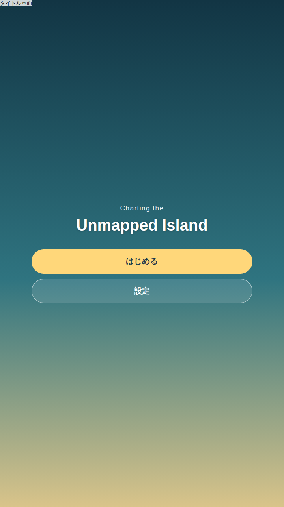
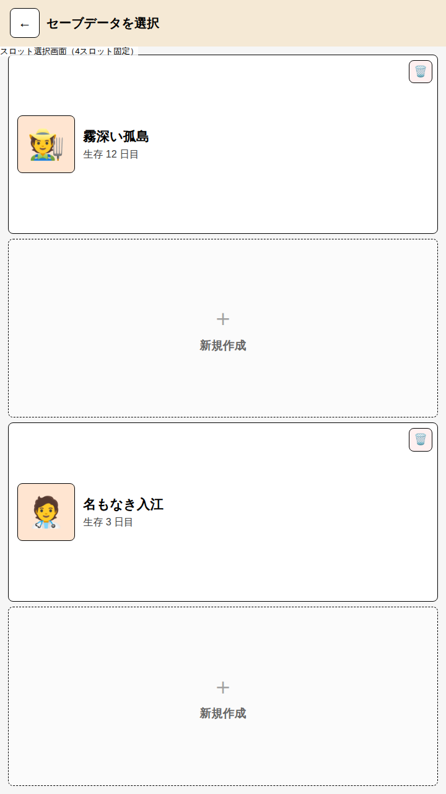
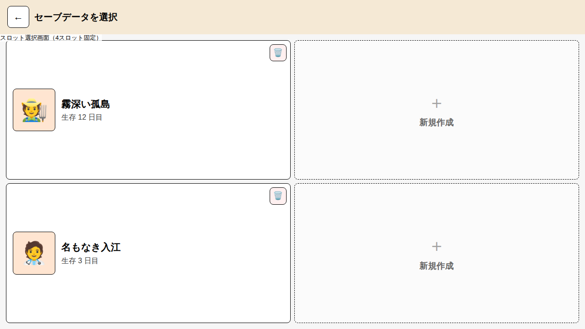
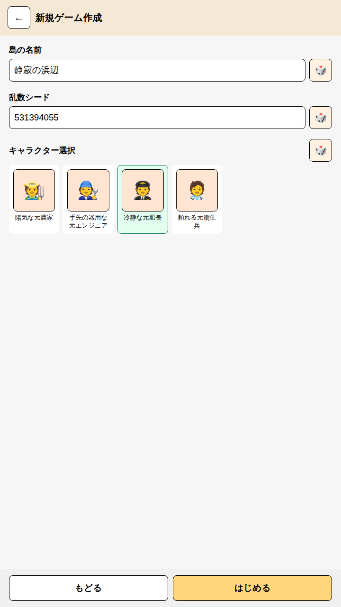
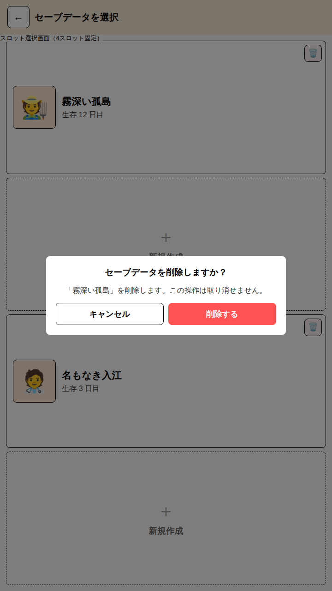

# スタート画面・セーブ選択画面

ゲーム起動時のタイトル画面、セーブスロット選択画面、新規ゲーム作成画面を検討するモックです。
[画面レイアウト検討](./ScreenLayout.md)と同じ `u`（= 画面短辺 ÷ 1080）単位・カード意匠を流用し、
縦型・横型両対応のレスポンシブなスタンドアロン HTML として作成しています。

セーブデータの保存先・スキーマ・削除の扱いなど、画面設計を超えた決定は
[セーブデータ管理](../engine/SaveDataManagement.md)を参照してください。本ドキュメントは画面構成のみを扱います。

## 画面構成

1. **タイトル画面**: ロゴと「はじめる」ボタン。「はじめる」はスロット選択画面へ遷移する
   （セーブの有無によらず常にスロット選択を経由する。1スロットに固定して自動継続する方式は採らない。
   複数スロットのうちどれを続けるか・どれを新規に使うかを毎回明示させるため）。
2. **セーブスロット選択画面**: 4スロット固定。空きスロットは新規ゲーム作成画面への入口、
   既存セーブは選択でそのまま再開（本モックでは再開後の画面は範囲外）。
3. **新規ゲーム作成画面**: 空きスロットを選んだときに開く。島の名前・乱数シード・
   キャラクター選択の3項目が最低限必要な入力で、いずれも横にランダム入力ボタン（🎲）を添える
   （手入力の手間を省くため。ランダムボタンは値を埋めるだけで、そのまま手直しもできる）。

## 設計原則

- **スロット数は4固定**: スロット追加のスクロールや可変長リストを考慮しない。空きスロットの判定は
  スロット配列の要素が存在するかどうかだけで行う（別途「空きフラグ」を持たない）。
- **画面の向きでスロットの並びだけが変わる**: 縦型はスロットカードを縦に4つ積む1列、
  横型は2×2グリッド。スロットカード自体のデザイン（ポートレート・島名・生存日数・削除ボタン）は
  向きによらず共通で、`.slot-grid` の `grid-template-columns`/`grid-template-rows` の
  違いだけで並びを切り替える（[画面レイアウト検討](./ScreenLayout.md)のグリッド切り替え方針を踏襲）。
- **削除は確認必須**: スロットカード右上の🗑️ボタンはモーダルで削除対象の島名と
  「取り消せない」旨を明示してから削除する。誤タップで進行データを失わせないための最低限の防御。
- **ランダム入力ボタンは値を埋めるだけ**: 生成後もテキストフィールドは編集可能なままにし、
  「ランダムに出た値を手直しする」という使い方を妨げない。
- **新規ゲーム作成画面はセーブ選択画面から独立した画面**: 入力項目が3つ（名前・シード・
  キャラクター選択）とまとまった量になるため、モーダルではなく専用画面として「もどる」で
  スロット選択へ戻れるようにする。

## 実装

Phaser 側の実装は `src/game/TitleScene.ts` / `SlotSelectScene.ts` / `NewGameScene.ts`。
セーブデータの読み書きは `src/save/SaveSlots.ts` が localStorage に対して行います。

モックと1点だけ挙動が異なります。モックはプレイ画面が範囲外だったため新規作成後に
スロット選択画面へ戻りますが、実装ではそのままプレイ画面
（[画面レイアウト検討](./ScreenLayout.md)）を開きます。

## HTML モック

- [スタート・セーブ選択モック](./StartScreen_Mock.html)

タイトル画面から「はじめる」→ 空きスロットのタップ → 新規ゲーム作成画面という一連の遷移、
および既存スロットの削除確認モーダルまで、実際にクリックして試せる簡易な画面遷移を
JavaScript で実装しています（永続化は行わず、モック内のメモリ上の状態のみ）。

## スクリーンショット

### タイトル画面

### セーブスロット選択画面（縦型・4つ縦積み）

### セーブスロット選択画面（横型・2×2グリッド）

### 新規ゲーム作成画面

### 削除確認モーダル

## デザインメモ

- キャラクターの選択肢は `character` タグを持つ `object_def` から作る（[プレイヤーキャラクタ](../world/Characters.md)）。
- **横が余る画面では入力欄とキャラクター選択を左右に分ける**: 分けるのは、札を原寸で並べたうえで
  入力欄に足る幅が残るときだけ。正方形に近い画面で無理に分けると札が原寸より小さくなるので、
  そのときは縦型と同じく上から順に積む。分けたときは縦が余るため、背の高い方の列に合わせて
  ヘッダーとフッターの間の中央へ置く。
- **キャラクターはどの画面でも札で見せる**: キャラクター選択もセーブスロット一覧も、プレイ中の
  ポートレイトと同じカード（`Card`）を置く。絵が用意されていなければ絵文字で代用するのも同じで、
  「同じ人物はどこでも同じ姿」になる。札は原寸を上限に、置ける幅・高さへ縮めて収める。
- **札に載せるのは名前だけで、人物像は選択肢の下へ出す**: 札の名前は本人の名前で、どういう人物か
  （肩書きと体の傾向）は選んでいる人物のぶんだけ選択肢の下に出す。狭い枠へ肩書きを詰め込まず、
  隠れた操作を覚えずに確かめられるようにするため。説明の高さは行数で固定し、選び替えで札が
  動かないようにする（札は説明とフッターに要る高さを除いた分まで縮む）。
- 島の名前のランダム生成ロジックは表示確認用の簡易実装。乱数シードの値域・地形生成との
  対応は[セーブデータ管理](../engine/SaveDataManagement.md)を参照。
